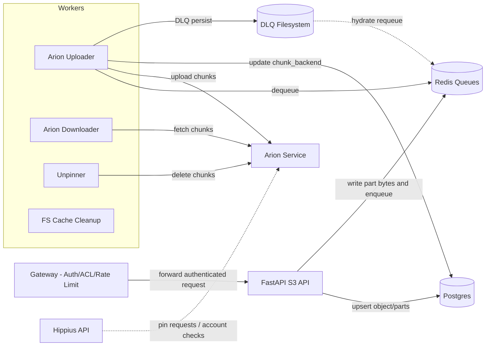

## Component Architecture

```mermaid
flowchart LR
    Gateway[Gateway - Auth/ACL/Rate Limit]
    API[FastAPI S3 API]

    subgraph Workers
        Uploader[Arion Uploader]
        Downloader[Arion Downloader]
        Unpinner[Unpinner]
        Janitor[FS Cache Cleanup]
    end

    Redis[(Redis Queues)]
    DLQFS[(DLQ Filesystem)]
    DB[(Postgres)]
    Arion[Arion Service]
    HippiusAPI[Hippius API]

    Gateway -->|forward authenticated request| API
    API -->|upsert object/parts| DB
    API -->|write part bytes and enqueue| Redis
    Uploader -->|dequeue| Redis
    Uploader -->|upload chunks| Arion
    Uploader -->|update chunk_backend| DB
    Uploader -->|DLQ persist| DLQFS
    Downloader -->|fetch chunks| Arion
    Unpinner -->|delete chunks| Arion
    HippiusAPI -.->|pin requests / account checks| Arion
    DLQFS -.->|hydrate requeue| Redis
```
