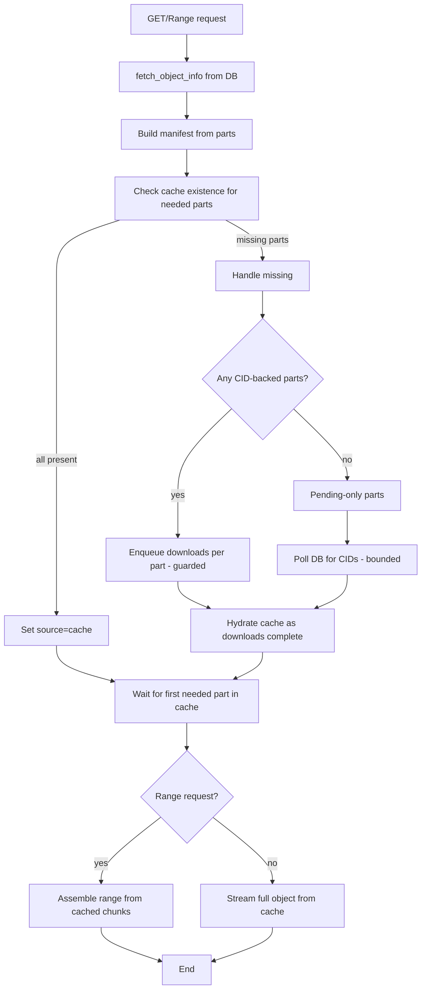

## ObjectReader Read Flow (cache-first with hydration)

```mermaid
flowchart TD
    Start[GET/Range request] --> Info[fetch_object_info from DB]
    Info --> Manifest[Build manifest from parts]
    Manifest --> CheckCache[Check cache existence for needed parts]

    CheckCache -->|all present| SourceCache[Set source=cache]
    CheckCache -->|missing parts| Missing[Handle missing]

    Missing --> CIDBacked{Any CID-backed parts?}
    CIDBacked -->|yes| EnqueueDL[Enqueue downloads per part - guarded]
    EnqueueDL --> Hydrate[Hydrate cache as downloads complete]
    CIDBacked -->|no| PendingOnly[Pending-only parts]
    PendingOnly --> PollCIDs[Poll DB for CIDs - bounded]
    PollCIDs --> Hydrate

    SourceCache --> Preflight[Wait for first needed part in cache]
    Hydrate --> Preflight

    Preflight --> RangeCheck{Range request?}
    RangeCheck -->|yes| StreamRange[Assemble range from cached chunks]
    RangeCheck -->|no| StreamFull[Stream full object from cache]

    StreamRange --> End
    StreamFull --> End
```
