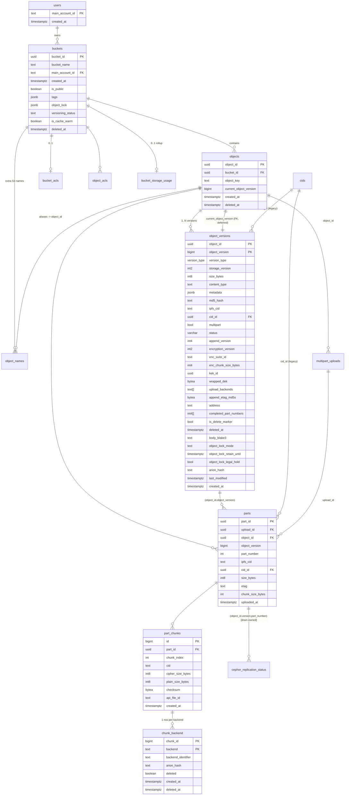

# 02 — Version-Native Storage Engine & Postgres Schema

> **⚠️ This documents the LIVE Python schema (86 dbmate migrations) as a reference — NOT the rewrite's
> target.** The greenfield rewrite uses its **own optimized schema** in
> [`12-schema-design.md`](./12-schema-design.md) (own DB, sqlx-owned migrations, no dbmate coexistence),
> is **HCFS-only** (no Ceph / `chunk_backend` / `cids` / `fs_cache_inventory` / read cache / janitor),
> and uses a **per-blob** DEK (not the per-version `wrapped_dek` here). Where this doc says "the Rust
> service inherits this DB" or recommends the `v5_requires_envelope` CHECK, that's superseded by doc 12
> (the constraint there is `committed_names_suite`, envelope moved per-blob). Read this as current-system
> + parity reference.

**Status:** code-anchored description of the **current Python** schema (reference for the rewrite).
**Source of truth:** this document reconstructs the *current* schema after all 86 dbmate
migrations in `hippius_s3/sql/migrations/` (through `20260916090000_rollup_verify_giant_buckets.sql`),
the runtime SQL in `hippius_s3/sql/queries/`, the repositories in `hippius_s3/repositories/`,
the models in `hippius_s3/models/`, and the prose in `object-versions.md`,
`docs/state-object-lifecycle.md`, `hippius_s3/sql/CLAUDE.md` and the top-level `CLAUDE.md`.

> **Hard constraint.** The Rust service must operate against the **same live database**. Every
> column name, type, PK, FK, unique constraint, CHECK, trigger and stored function below is a
> contract. The Rust code does not get to "clean up" the schema; it inherits it. Where the schema
> is quirky (retained tombstones, no INSERT trigger on `object_versions`, a lazily-created keystore
> table), the quirk is load-bearing and is documented as such.

---

## 0. Databases, schemas and migration ownership

There are **two physical databases**, and — inside the main one — **two independent migration
systems** plus **one lazily-created table**. Getting this wrong is the first way a Rust port breaks.

| DB | Env var | Contents | Who creates the schema |
|----|---------|----------|------------------------|
| **Main data DB** (`hippius`) | `DATABASE_URL` (default `postgres://localhost/hcfs`… in this repo it is set per-env) | All the app tables (`buckets`, `objects`, `object_versions`, `parts`, `part_chunks`, `chunk_backend`, `cids`, `users`, `multipart_uploads`, ACL tables, `sub_token_scopes`, usage/rollup tables, `fs_cache_inventory`, `purge_jobs`, `account_suspensions`, …) **plus** the drain crate's `cephor_*` tables. | Two systems — see below. |
| **Keystore DB** (`hippius_keys`) | `HIPPIUS_KEYSTORE_DATABASE_URL` (falls back to `DATABASE_URL` when unset — `config.py` ~L159 / L950) | **Two** tables: `encryption_keys` (legacy per-subaccount symmetric keys) and `bucket_keks` (per-bucket KEKs wrapped by the KMS master key — the v5 hierarchy). | Both created **lazily in application code** (`services/key_service.py`, `services/kek_service.py`), not by any migrator. |
| (read replica) | `DATABASE_READONLY_URL` | Same as main; replica for the plans-cacher only. Falls back to `DATABASE_URL`. | — (points at a replica of the main DB) |

Migration ownership **inside the main DB**:

1. **dbmate** owns the app schema — everything in `hippius_s3/sql/migrations/`. Run via
   `hippius_s3/scripts/migrate.py` → `dbmate up` with `DBMATE_MIGRATIONS_DIR` pointed at that
   directory and `DATABASE_URL` for the DSN. (See §5.)
2. **sqlx** owns the `cephor_*` tables — the drain service's own migrations in
   `crates/hippius-drain-core/migrations/` (`0001_…`.`0021_…`), applied by
   `sqlx::migrate!("./migrations").run(&pool)` (`crates/hippius-drain-core/src/store.rs:386`).
   In production the drain applies these; CI applies them with raw `psql` after dbmate. The storage
   engine **reads and writes** `cephor_replication_status` (the upload hand-off) but does **not own**
   its DDL.
3. **`encryption_keys`** and **`bucket_keks`** in the keystore DB are created by `CREATE TABLE IF
   NOT EXISTS` inside `key_service.py` / `kek_service.py` on first use (SQLSTATE `42P01`/advisory-lock
   guarded). No migration file defines them — the dbmate migrator targets `DATABASE_URL` (the main
   DB) only. The one migration that names them (`20251008000001`) is a **no-op placeholder** that
   merely documents a manual cross-DB copy.

> **Rust port note.** The Rust rewrite should decide explicitly whether it *coexists with* dbmate
> (keeps writing dbmate-format files, lets dbmate own `schema_migrations`) or *takes over*. The
> safe default is **coexist**: keep authoring dbmate `-- migrate:up/-- migrate:down` files so a
> mixed fleet (Python + Rust pods) sees one migration ledger. The `cephor_*` tables must keep being
> applied by the drain's sqlx migrator — do not fold them into the app migrator. The keystore table
> must keep its lazy-create behaviour (or be pre-created identically).

---

## 1. ER overview



**The spine of the read path** (GET/HEAD/LIST): `buckets → objects → object_versions (resolve the
serveable version) → parts (by object_id+object_version) → part_chunks → chunk_backend
(backend_identifier per backend)`. `cids` is a legacy CID side-table, mostly superseded by
`chunk_backend.backend_identifier`. `object_names` provides extra S3 keys that alias one
`object_id` (used by same-bucket CopyObject, which cannot mint a new `object_id` because the v5 AAD
binds `bucket_id+object_id`).

---

## 2. Core tables (current schema, after all 86 migrations)

All timestamps are `timestamptz` unless noted. Ordering of columns is not contractually meaningful
(the app never `SELECT *`s in a positional way except `list_parts_for_version.sql`), but names and
types are.

### 2.1 `users`  (main DB)

Replaced twice; the live shape is from `20250603000000_migrate_to_main_account.sql`.

| Column | Type | Notes |
|--------|------|-------|
| `main_account_id` | `text` | **PK**. SS58 address of the account. |
| `created_at` | `timestamptz NOT NULL DEFAULT now()` | |

- **PK:** `main_account_id`.
- **No `user_id`** column anymore (the original UUID `user_id` and `seed_phrase` shapes were dropped).
  `get_user_by_main_account.sql` still `SELECT user_id` — **caveat:** that query is stale against the
  current schema; the live read path uses `get_user_id_by_main_account.sql` /
  `get_or_create_user_by_main_account.sql` which project `main_account_id`. (Flagged in Open Questions.)
- **Referenced by:** `buckets.main_account_id` (`fk_buckets_main_account … ON DELETE CASCADE`).
- Get-or-create pattern (`get_or_create_user_by_main_account.sql`) is an `INSERT … ON CONFLICT DO
  NOTHING` union'd with a `SELECT`.

### 2.2 `buckets`  (main DB)

| Column | Type | Notes |
|--------|------|-------|
| `bucket_id` | `uuid` | **PK** |
| `bucket_name` | `text NOT NULL` | globally unique among **live** rows (partial unique index) |
| `main_account_id` | `text NOT NULL` | **FK** → `users(main_account_id) ON DELETE CASCADE`; owner |
| `created_at` | `timestamptz NOT NULL` | |
| `is_public` | `boolean DEFAULT false` | legacy; ACLs now carry public-read (migration `20251121`) |
| `tags` | `jsonb DEFAULT '{}'::jsonb` | bucket tagging |
| `object_lock` | `jsonb` | bucket-default Object Lock config (added `20260902090000`) |
| `versioning_status` | `text` | `NULL` = never enabled; else `'Enabled'` / `'Suspended'` |
| `is_cache_warm` | `boolean NOT NULL DEFAULT false` | ATS warm-cache flag |
| `deleted_at` | `timestamptz` | soft-delete; hard cleanup async via bucket reaper |

- **PK:** `bucket_id`.
- **Unique:** partial unique index `buckets_bucket_name_active_key ON (bucket_name) WHERE deleted_at
  IS NULL` (from `20260507000000`). The plain `buckets_bucket_name_key` UNIQUE was **dropped** in
  favour of this — a name becomes reusable the instant the prior bucket is soft-deleted (S3
  semantics). Global (not per-account) uniqueness among live rows.
- **CHECK `buckets_versioning_status_check`:** `versioning_status IS NULL OR IN ('Enabled','Suspended')`.
- **CHECK `ck_buckets_owner_not_sentinel` (NOT VALID):** `main_account_id` is non-null, non-blank,
  and not in `('anonymous','none','null','undefined')` (case-insensitive). NOT VALID — enforced on
  new writes only; legacy rows unscanned.
- **Indexes:** `idx_buckets_name_owner (bucket_name, main_account_id)`, `idx_buckets_main_account
  (main_account_id)`, partial `idx_buckets_is_cache_warm (bucket_id) WHERE is_cache_warm`, partial
  `idx_buckets_deleted_at_pending (deleted_at) WHERE deleted_at IS NOT NULL`.
- **`get_bucket_by_name.sql`** LEFT JOINs `bucket_acls` and filters `deleted_at IS NULL`.

### 2.3 `objects`  (main DB) — the key→object pointer, **version-native**

After `20251017000000_add_object_versions.sql` moved every per-content field to `object_versions`,
`objects` is a thin, mostly-immutable row: identity + which version is current + soft-delete.

| Column | Type | Notes |
|--------|------|-------|
| `object_id` | `uuid` | **PK** |
| `bucket_id` | `uuid NOT NULL` | **FK** → `buckets(bucket_id) ON DELETE CASCADE` (`fk_objects_bucket`) |
| `object_key` | `text NOT NULL` | the primary S3 key |
| `current_object_version` | `bigint NOT NULL DEFAULT 1` | pointer into `object_versions` |
| `created_at` | `timestamptz NOT NULL` | |
| `deleted_at` | `timestamptz` | whole-object soft delete |

- **PK:** `object_id`.
- **Unique:** `objects_bucket_id_object_key_key UNIQUE (bucket_id, object_key)` — one live+dead row
  per (bucket, key). **This is the ON CONFLICT target for every PUT** (`upsert_object_*`). Note:
  soft-deleted rows keep the key until promoted or renamed to `#deleted/<object_id>` — so uniqueness
  spans live and dead. Live-set S3-name uniqueness is *additionally* enforced by triggers (see §2.11).
- **Composite FK → `object_versions`:** `objects_current_version_fk FOREIGN KEY (object_id,
  current_object_version) REFERENCES object_versions(object_id, object_version) ON DELETE RESTRICT
  DEFERRABLE INITIALLY DEFERRED`. **Deferred** so a PUT can insert the objects row and its first
  version in one statement.
- **Planner stat override:** `ALTER … bucket_id SET (n_distinct = -0.0003)` — deliberate; do not
  ANALYZE it away. (Migration `20260909120000`.)
- **Indexes:** `idx_objects_bucket_prefix (bucket_id, object_key)`; partial
  `idx_objects_bucket_prefix_active (bucket_id, object_key) WHERE deleted_at IS NULL`; partial
  `idx_objects_bucket_created_desc_active (bucket_id, created_at DESC) WHERE deleted_at IS NULL`;
  partial `idx_objects_deleted (deleted_at) WHERE deleted_at IS NOT NULL`.
- **Triggers:** `objects_reject_duplicate_live_name` (BEFORE INSERT/UPDATE OF bucket_id,object_key,
  deleted_at) and the three storage-usage triggers (§4 / §2.14).

### 2.4 `object_versions`  (main DB) — **the heart of the engine**

Composite-keyed per-object version chain. Created in `20251017000000`; grown by many later
migrations. **Final live column set** (assembled from every ADD/DROP):

| Column | Type | Notes |
|--------|------|-------|
| `object_id` | `uuid NOT NULL` | **PK part**, **FK** → `objects(object_id) ON DELETE CASCADE` |
| `object_version` | `bigint NOT NULL` | **PK part**; monotonic per object |
| `version_type` | `version_type NOT NULL DEFAULT 'user'` | enum `('user','migration')` |
| `storage_version` | `int2 NOT NULL` | 1 = legacy single-chunk, 2 = chunked, 5 = v5 envelope |
| `size_bytes` | `int8 NOT NULL` | **plaintext** size |
| `content_type` | `text NOT NULL` | |
| `metadata` | `jsonb` | user metadata |
| `md5_hash` | `text` | S3 ETag (single-part) / used in serveable predicate |
| `ipfs_cid` | `text` | **dead relic** of pre-Arion manifests; still read by ops scripts via `COALESCE(c.cid, ov.ipfs_cid)` — **do not** write a BLAKE3 here (see `20260824120000`) |
| `cid_id` | `uuid` | **FK** → `cids(id)`; legacy single-CID pointer |
| `multipart` | `bool DEFAULT false` | |
| `status` | `varchar(50) DEFAULT 'publishing'` | see CHECK + §3 states |
| `append_version` | `int4 NOT NULL DEFAULT 0` | append CAS counter |
| `last_append_at` | `timestamptz NOT NULL DEFAULT now()` | |
| `last_modified` | `timestamptz DEFAULT now()` | |
| `created_at` | `timestamptz NOT NULL DEFAULT now()` | |
| `encryption_version` | `int2` | v5 envelope; NULL for legacy |
| `enc_suite_id` | `text` | v5 |
| `enc_chunk_size_bytes` | `int4` | v5 |
| `kek_id` | `uuid` | v5 KEK id |
| `wrapped_dek` | `bytea` | v5 wrapped data-encryption key |
| `upload_backends` | `text[]` | which backends this version targeted at write time; NULL ⇒ config default |
| `append_etag_md5s` | `bytea` | packed per-append md5s for multipart-style ETag of appended objects |
| `address` | `text` | main-account SS58 for the drain-gated promoter; NULL for legacy |
| `completed_part_numbers` | `integer[]` | subset of parts the client named in CompleteMPU; NULL ⇒ "all parts" |
| `is_delete_marker` | `boolean NOT NULL DEFAULT false` | S3 delete marker |
| `deleted_at` | `timestamptz` | per-version soft delete (versioned DELETE) |
| `body_blake3` | `text` | BLAKE3 of plaintext; surfaced as "Arion hash" in listings' Owner.ID |
| `object_lock_mode` | `text` | `NULL` / `'GOVERNANCE'` / `'COMPLIANCE'` |
| `object_lock_retain_until` | `timestamptz` | WORM retention expiry |
| `object_lock_legal_hold` | `boolean NOT NULL DEFAULT false` | independent of retention |
| `arion_hash` | `text` | BLAKE3 of ciphertext as registered on Arion; per-version rollup (NULL for multi-chunk) |

Columns **dropped** and gone from the live schema (do **not** recreate): `manifest_cid`,
`manifest_built_for_version`, `manifest_built_at`, `manifest_api_file_id` (all dropped `20260131000002`).

- **PK:** `object_versions_pkey (object_id, object_version)`.
- **FKs:** `object_id → objects(object_id) ON DELETE CASCADE`; `cid_id → cids(id)`.
- **CHECK `object_versions_status_check`:** `status IN ('publishing','pinning','uploaded','failed')`.
- **CHECK `object_versions_object_lock_mode_check` (validated):** `object_lock_mode IS NULL OR IN
  ('GOVERNANCE','COMPLIANCE')`.
- **CHECK `object_versions_object_lock_retention_pair_check` (validated):**
  `(object_lock_mode IS NULL) = (object_lock_retain_until IS NULL)` — mode and date travel together.
- **Referenced by:** `parts (object_id, object_version)` via `parts_object_version_fk ON DELETE
  CASCADE`; `objects (object_id, current_object_version)` via the deferred composite FK.
- **Live indexes** (after the Tier-1 cleanup migrations `20260528120x` dropped several):
  - `idx_object_versions_object_created_desc (object_id, created_at DESC)`
  - `idx_object_versions_object_type_created_desc (object_id, version_type, created_at DESC)`
  - partial `idx_object_versions_deleted (deleted_at, object_id, object_version) WHERE deleted_at IS NOT NULL` (janitor reap ring)
  - partial `idx_object_versions_locked (object_id, object_version) WHERE object_lock_retain_until IS NOT NULL OR object_lock_legal_hold`
  - **Dropped** (do not recreate): `idx_object_versions_ipfs_cid`, `idx_object_versions_kek_id`,
    `idx_object_versions_status`, `idx_object_versions_last_modified_desc`, and the manifest-builder
    partial index.
- **Triggers:** `object_versions_reject_duplicate_live` (BEFORE INSERT/UPDATE OF bucket_id/…),
  `object_versions_storage_delta_upd` (AFTER UPDATE, WHEN size/deleted_at/is_delete_marker changed),
  `object_versions_storage_delta_del` (AFTER DELETE). **There is deliberately NO INSERT trigger** on
  this table (see §4 — adding the "obviously missing one" double-counts storage).

### 2.5 `parts`  (main DB)

An object's bytes are laid out as parts (part 1..N for multipart; a single logical part for simple
objects). Historically 0-based, shifted to **1-based** in `20250924000002`.

| Column | Type | Notes |
|--------|------|-------|
| `part_id` | `uuid` | **PK** |
| `upload_id` | `uuid NOT NULL` | **FK** → `multipart_uploads(upload_id) ON DELETE CASCADE` |
| `object_id` | `uuid` | **FK** → `objects(object_id) ON DELETE CASCADE` |
| `object_version` | `bigint` | with `object_id` → **FK** `object_versions ON DELETE CASCADE` |
| `part_number` | `integer NOT NULL` | 1-based |
| `ipfs_cid` | `text` | **nullable** (since `20260131000000`); legacy CID |
| `cid_id` | `uuid` | **FK** → `cids(id)` |
| `size_bytes` | `int8 NOT NULL` | |
| `etag` | `text NOT NULL` | per-part MD5 (S3 ETag semantics) |
| `chunk_size_bytes` | `integer` | plaintext chunk size for this part; NULL ⇒ reader falls back to config |
| `uploaded_at` | `timestamptz NOT NULL` | part landing time; the replication-SLA clock |

- **PK:** `part_id`.
- **Unique:** `parts_object_version_part_unique (object_id, object_version, part_number)` — replaced
  the earlier `(object_id, part_number)` and the original `(upload_id, part_number)` (migration
  `20251017000000`). This is the constraint the part upsert conflicts on.
- **Indexes:** `idx_parts_object_version (object_id, object_version)`, `idx_parts_upload
  (upload_id)`, `idx_parts_upload_uploaded_at (upload_id, uploaded_at)` (MPU reaper activity gate).
- **FKs:** `upload_id`, `(object_id)`, composite `(object_id, object_version)`, `cid_id`. The
  `(object_id, object_version)` composite FK is why an aborted MPU's reserved version row must be
  **retained** (see §3 / `abort_cleanup_orphan_version.sql`).

### 2.6 `part_chunks`  (main DB) — one row per ciphertext chunk

The chunk is the unit of encryption and (forward-compatibly) of erasure-coding.

| Column | Type | Notes |
|--------|------|-------|
| `id` | `bigserial` | **PK** |
| `part_id` | `uuid NOT NULL` | **FK** → `parts(part_id) ON DELETE CASCADE` |
| `chunk_index` | `int NOT NULL CHECK (chunk_index >= 0)` | 0-based within the part |
| `cid` | `text` | legacy per-chunk CID; superseded by `chunk_backend.backend_identifier` |
| `cipher_size_bytes` | `int8 NOT NULL CHECK (>= 0)` | ciphertext length on the wire |
| `plain_size_bytes` | `int8 CHECK (>= 0)` | plaintext length |
| `checksum` | `bytea` | optional integrity hash |
| `api_file_id` | `text` | HCFS `/upload` file id for this chunk |
| `created_at` | `timestamptz NOT NULL DEFAULT now()` | |

- **PK:** `id`. **Unique:** `(part_id, chunk_index)` (the part-chunk upsert conflict target).
- **Index:** `part_chunks_part_idx (part_id)`. (`idx_part_chunks_created_at` and the old
  `idx_part_chunks_backend_count` were dropped; the `storage_backends_uploaded` counter column was
  removed by `20260130000000` in favour of `chunk_backend`.)

### 2.7 `chunk_backend`  (main DB) — where each chunk actually lives

Per-(chunk, backend) placement + soft-delete. Added `20260130000000`.

| Column | Type | Notes |
|--------|------|-------|
| `chunk_id` | `bigint NOT NULL` | **PK part**, **FK** → `part_chunks(id) ON DELETE CASCADE` |
| `backend` | `text NOT NULL` | **PK part**; e.g. `'ipfs'`, `'arion'`, backup backends |
| `backend_identifier` | `text` | backend-native handle (IPFS CID, HCFS file_id, …) |
| `arion_hash` | `text` | BLAKE3 of ciphertext as registered on Arion (added `20260915120000`) |
| `deleted` | `boolean NOT NULL DEFAULT false` | soft delete (unpin) |
| `created_at` | `timestamptz NOT NULL DEFAULT now()` | |
| `deleted_at` | `timestamptz` | |

- **PK:** `(chunk_id, backend)` — one row per backend per chunk; the upsert conflict target that
  **revives** soft-deleted rows on re-pin (`insert_chunk_backend.sql`).
- **Index:** partial `idx_chunk_backend_active_by_chunk (chunk_id) WHERE NOT deleted`.
  (`idx_chunk_backend_active_by_backend` was dropped `20260528120400`.)
- **Distinction to burn in** (`get_object_head_by_path.sql`, `insert_chunk_backend.sql`):
  `backend_identifier` for `backend='arion'` is the **HCFS file_id (path hash)**, used for our own
  `/download`/`/delete`. `arion_hash` is the BLAKE3 of the ciphertext, which is what Arion/the
  validator/the explorer look files up by. **They are not interchangeable.**

### 2.8 `cids`  (main DB) — legacy CID dedup side-table

| Column | Type | Notes |
|--------|------|-------|
| `id` | `uuid` | **PK** |
| `cid` | `text NOT NULL UNIQUE` | |
| `created_at` | `timestamptz DEFAULT now()` | |

- Referenced by `object_versions.cid_id` and `parts.cid_id`. Mostly legacy: modern reads resolve the
  backend handle from `chunk_backend`, falling back to `cids.cid`/`parts.ipfs_cid` only for old rows.

### 2.9 `multipart_uploads`  (main DB)

| Column | Type | Notes |
|--------|------|-------|
| `upload_id` | `uuid` | **PK** |
| `bucket_id` | `uuid NOT NULL` | **FK** → `buckets(bucket_id) ON DELETE CASCADE` |
| `object_key` | `text NOT NULL` | |
| `initiated_at` | `timestamptz NOT NULL` | |
| `is_completed` | `boolean DEFAULT false` | completed rows are never pruned |
| `content_type` | `text` | |
| `metadata` | `jsonb` | |
| `file_mtime` | `timestamptz` | |
| `object_id` | `uuid` | **FK** → `objects(object_id) ON DELETE SET NULL` |
| `key_existed_at_initiate` | `boolean NOT NULL DEFAULT false` | If-None-Match:* baseline at initiate |

- **PK:** `upload_id`. The original redundant `UNIQUE(bucket_id, object_key, upload_id)` was
  **dropped** (`20260528120600`).
- **Indexes:** `idx_multipart_uploads_bucket (bucket_id)`, `idx_multipart_uploads_object_id
  (object_id)`, partial `idx_multipart_uploads_initiated_at (initiated_at) WHERE
  COALESCE(is_completed,false)=false` (reaper), partial `idx_mpu_bucket_key_incomplete (bucket_id,
  object_key) WHERE is_completed=FALSE` (fast delete-cleanup — restored after the redundant-unique
  drop caused full-bucket scans).
- **No version column** — a **fresh `object_version` is allocated per MPU initiation**
  (`upsert_object_multipart.sql`); parts carry the version. Resolve an MPU's version via
  `get_multipart_version_by_upload.sql` (max `parts.object_version` for the `upload_id`), **not** via
  `objects.current_object_version` (which advances to the latest initiation under concurrent MPUs).

### 2.10 ACL tables  (main DB)

`bucket_acls` and `object_acls` were refactored (`20251126000001`) from name/key keys to id keys.

**`bucket_acls`**

| Column | Type | Notes |
|--------|------|-------|
| `id` | `serial` | **PK** |
| `bucket_id` | `uuid NOT NULL` | **FK** → `buckets(bucket_id) ON DELETE CASCADE`; **UNIQUE** |
| `owner_id` | `varchar(255) NOT NULL` | |
| `acl_json` | `jsonb NOT NULL` | S3 ACL doc (owner + grants) |
| `created_at` / `updated_at` | `timestamptz NOT NULL DEFAULT now()` | `updated_at` via trigger |

**`object_acls`**

| Column | Type | Notes |
|--------|------|-------|
| `id` | `serial` | **PK** |
| `bucket_id` | `uuid NOT NULL` | **FK** → `buckets ON DELETE CASCADE` |
| `object_id` | `uuid NOT NULL` | **FK** → `objects ON DELETE CASCADE` |
| `owner_id` | `varchar(255) NOT NULL` | |
| `acl_json` | `jsonb NOT NULL` | |
| `created_at` / `updated_at` | `timestamptz NOT NULL DEFAULT now()` | |

- **Unique:** `object_acls_bucket_object_key (bucket_id, object_id)`.
- **Indexes:** `idx_bucket_acls_owner_id`, `idx_bucket_acls_bucket_id`, `idx_object_acls_bucket_object
  (bucket_id, object_id)`, `idx_object_acls_owner_id`, `idx_object_acls_object_id (object_id)`
  (added to make the FK cascade cheap).
- **Triggers:** `bucket_acls_updated_at`, `object_acls_updated_at` (set `updated_at = now()`).
- `acl_json` shape (from the public-bucket migration): `{"owner": {"id": …}, "grants":
  [{"grantee": {"type": "CanonicalUser"|"Group", "id"|"uri": …}, "permission":
  "FULL_CONTROL"|"READ"|…}]}`.

### 2.11 `object_names`  (main DB) — extra S3 keys aliasing one object

Added `20260825180000`. Same-bucket CopyObject cannot mint a new `object_id` (v5 AAD binds
`bucket_id+object_id`), so it attaches a second **name** here against the same id.

| Column | Type | Notes |
|--------|------|-------|
| `bucket_id` | `uuid NOT NULL` | **PK part**, **FK** → `buckets ON DELETE CASCADE` |
| `object_key` | `text NOT NULL` | **PK part** |
| `object_id` | `uuid NOT NULL` | **FK** → `objects(object_id) ON DELETE CASCADE` |
| `created_at` | `timestamptz NOT NULL DEFAULT now()` | |

- **PK:** `(bucket_id, object_key)`. **Index:** `object_names_object_id_idx (object_id)`.
- **Trigger:** `object_names_reject_duplicate_live` — plus the twin trigger on `objects` — enforce
  **one live S3 name per (bucket_id, object_key)** across both tables (RAISE with SQLSTATE `23505`).
- **Stored functions:**
  - `resolve_object_id(p_bucket_id uuid, p_object_key text) RETURNS uuid` (SQL, STABLE): the S3-name
    resolver used by **every read/lock query**. Prefers a live primary `objects` row, else an
    `object_names` alias pointing at a live object. This function is a hard dependency of the read
    path — reimplement it identically (or keep it in the DB).
  - `promote_object_name(p_bucket_id uuid, p_primary_key text) RETURNS uuid` (plpgsql): Harbor
    Copy+Delete promote; steals a dest name from a soft-deleted row without minting a new id.

### 2.12 `sub_token_scopes`  (main DB)

Sub-token (R2-style) authorization scope. Added `20260422000000`.

| Column | Type | Notes |
|--------|------|-------|
| `access_key_id` | `varchar(255)` | **PK**; matches `^hip_[A-Za-z0-9_-]{1,240}$` |
| `account_id` | `varchar(255) NOT NULL` | owning main account (SS58) |
| `permission` | `varchar(32) NOT NULL` | `admin_read_write`/`admin_read`/`object_read_write`/`object_read` |
| `bucket_scope` | `varchar(16) NOT NULL` | `all` / `specific` |
| `bucket_ids` | `uuid[] NOT NULL DEFAULT '{}'` | required non-empty when scope=specific; ≤ 1000 |
| `created_at` / `updated_at` | `timestamptz NOT NULL DEFAULT now()` | `updated_at` via trigger |

- **CHECKs:** `ck_sub_token_scopes_permission`, `ck_sub_token_scopes_bucket_scope`,
  `ck_sub_token_scopes_specific_needs_buckets` (`scope='all' OR array_length(bucket_ids,1)>0`),
  `ck_sub_token_scopes_bucket_ids_max` (`COALESCE(array_length(bucket_ids,1),0) <= 1000`).
- **Index:** `idx_sub_token_scopes_account_id`. **Trigger:** `sub_token_scopes_updated_at`.
- Modeled in `models/sub_token.py` (`Permission`, `BucketScope` enums; `SubTokenScope` frozen
  dataclass). Repository: `sub_token_scope_repository.py`.

### 2.13 Object Lock (per-version)

Object Lock is **per-version WORM state**, on `object_versions` (§2.4), never on the key. Bucket
defaults live in `buckets.object_lock` (jsonb). Retention (`object_lock_mode` +
`object_lock_retain_until`) and legal hold (`object_lock_legal_hold`) are **independent** — either
locks the version. The single enforcement point is `get_chunk_backend_identifiers.sql` (the unpinner
never receives a locked version) plus mirrored predicates in `find_versions_ready_for_reap.sql`,
`reap_deleted_version_parts.sql`, `find_objects_ready_for_hard_delete.sql`.

### 2.14 Usage / rollup tables  (main DB)

A maintained per-bucket storage counter, so "bytes stored by account" is not an O(objects) scan.
Added across `20260910120000`…`20260916090000`.

**`storage_delta_ledger`** — append-only delta queue (written from triggers; drained by compactor).

| Column | Type | Notes |
|--------|------|-------|
| `ledger_id` | `bigserial` | **PK** |
| `bucket_id` | `uuid NOT NULL` | **no FK** (triggers must never raise) |
| `delta_bytes` | `bigint NOT NULL` | |
| `created_at` | `timestamptz NOT NULL DEFAULT now()` | |

Index `idx_storage_delta_ledger_bucket (bucket_id)`. Autovacuum tuned (flat thresholds).

**`bucket_storage_usage`** — one row per bucket; the counter.

| Column | Type | Notes |
|--------|------|-------|
| `bucket_id` | `uuid` | **PK**, **FK** → `buckets ON DELETE CASCADE` |
| `bytes_used` | `bigint NOT NULL` | **NOT clamped; may go negative** (drift signal) |
| `updated_at` | `timestamptz NOT NULL DEFAULT now()` | |
| `recomputed_at` | `timestamptz` | last successful full recompute (reconciler queue key… now attempted_at) |
| `attempted_at` | `timestamptz` | last recompute attempt (queue key; `idx_bucket_storage_usage_attempted`) |
| `recompute_failures` | `integer NOT NULL DEFAULT 0` | consecutive failures → sliced verify |
| `churn_bytes` | `bigint NOT NULL DEFAULT 0` | monotonic `SUM(ABS(delta))` for slice tolerance |

`fillfactor=70`. Index `idx_bucket_storage_usage_attempted (attempted_at ASC NULLS FIRST)`.

**`storage_usage_rollup_state`** — singleton gate row.

| Column | Type | Notes |
|--------|------|-------|
| `singleton` | `boolean` | **PK** `DEFAULT true CHECK (singleton)` — one row ever |
| `backfilled_at` | `timestamptz` | NULL ⇒ rollup not a total yet; readers refuse to serve |

**`bucket_storage_verify_state`** — in-progress sliced verification for giant buckets.

| Column | Type | Notes |
|--------|------|-------|
| `bucket_id` | `uuid` | **PK**, **FK** → `buckets ON DELETE CASCADE` |
| `cursor_key` | `text NOT NULL DEFAULT ''` | keyset cursor on `objects.object_key` |
| `partial_bytes` | `bigint NOT NULL DEFAULT 0` | |
| `objects_scanned` | `bigint NOT NULL DEFAULT 0` | |
| `slices_done` | `integer NOT NULL DEFAULT 0` | |
| `started_at` | `timestamptz NOT NULL DEFAULT now()` | |
| `start_churn_bytes` | `bigint NOT NULL DEFAULT 0` | tolerance baseline |

**Stored functions** (must be preserved — the triggers call them):
`storage_usage_version_bytes`, `storage_usage_version_bytes_locked` (takes `FOR NO KEY UPDATE`),
`storage_usage_version_is_current`, `storage_usage_bucket_of_object`, `storage_usage_narrow`
(numeric→bigint overflow guard, returns NULL out of range), `storage_usage_emit`,
`storage_usage_apply`, `storage_usage_rollup_lock_key`, `storage_usage_bucket_lock_key`,
`recompute_bucket_storage_usage(uuid) → (o_bytes_before, o_bytes_after)`.

See §4 for the trigger set (there are exactly five) and the rules they encode.

### 2.15 Operational tables  (main DB)

**`account_suspensions`** (`20260817000000`): `account_id varchar(255) PK`, `mode varchar(16) NOT
NULL CHECK IN ('full','read_only')`, `created_at`, `updated_at` (trigger). Row present = suspended.
Deliberately **no FK** to `users`.

**`purge_jobs`** (`20260817000001`): `job_id uuid PK`, `account_id varchar(255)`, `state varchar(16)
DEFAULT 'queued' CHECK IN ('queued','running','done','failed')`, `deleted_objects bigint`,
`deleted_bytes bigint`, `error text`, `progress jsonb DEFAULT '{}'`, `created_at`, `started_at`,
`finished_at`, `heartbeat_at`. Partial unique `uq_purge_jobs_account_active (account_id) WHERE state
IN ('queued','running')` — one live purge per account.

**`fs_cache_inventory`** (`20260725000000`): PK `(object_id text, object_version bigint, part_number
bigint)`, `cached_at timestamptz`, `last_access_at timestamptz` (read-recency). Advisory only.
Index `fs_cache_inventory_cached_at (cached_at, object_id, object_version, part_number)`. Repository:
`fs_cache_inventory.py`. Note `object_id` is **text** here (not uuid) — the cache keys are strings.

**`janitor_state`**: `key text PK`, `value jsonb NOT NULL`, `updated_at`. Single-instance janitor's
durable cursor.

### 2.16 `files`  (main DB) — legacy, likely vestigial

The original `20250506000000` `files` table (`file_id uuid PK`, `ipfs_cid`, `file_name`,
`content_type`, `file_size`, `created_at`, `metadata jsonb`, later `cid_id`) still technically
exists (never dropped). It is not part of the S3 object path. Treat as dead unless proven otherwise.

### 2.17 Keystore DB tables (`HIPPIUS_KEYSTORE_DATABASE_URL` → DB `hippius_keys`)

Both tables are created lazily in application code (`CREATE TABLE IF NOT EXISTS`), **not** by dbmate.
The keystore pool config: `kek_service.py` uses a module-global singleton asyncpg pool keyed on the
DSN (`kek_db_pool_min_size`/`kek_db_pool_max_size`); `key_service.py` opens a one-shot
`asyncpg.connect` per call (not pooled). Both resolve the DSN from `cfg.encryption_database_url`,
which falls back to `DATABASE_URL` in `get_config()`.

**`encryption_keys`** (`key_service.py`) — **legacy per-subaccount symmetric key** mechanism:

```sql
CREATE TABLE IF NOT EXISTS encryption_keys (
    id SERIAL PRIMARY KEY,
    subaccount_id VARCHAR(255) NOT NULL,
    encryption_key_b64 TEXT NOT NULL,
    created_at TIMESTAMP DEFAULT CURRENT_TIMESTAMP
);
CREATE INDEX IF NOT EXISTS idx_encryption_keys_subaccount_created
  ON encryption_keys(subaccount_id, created_at DESC);
```

- `subaccount_id` = `sha256_hex(f"{main_account_id}:{bucket_name}")`. `encryption_key_b64` = base64
  of a 32-byte NaCl SecretBox key. Newest-by-`created_at` wins.
- `created_at` here is `TIMESTAMP` (no time zone) — the one core column that is *not* `timestamptz`.

**`bucket_keks`** (`kek_service.py`) — **the v5 per-bucket KEK store**; this is what
`object_versions.kek_id` points at (resolving my earlier open question):

```sql
SELECT pg_advisory_xact_lock(1768387435);   -- "bukek" DDL advisory key, makes create atomic
CREATE TABLE IF NOT EXISTS bucket_keks (
    bucket_id UUID NOT NULL,
    kek_id UUID PRIMARY KEY,
    wrapped_kek_bytes BYTEA NOT NULL,
    kms_key_id TEXT NOT NULL CHECK (kms_key_id <> ''),
    status TEXT NOT NULL DEFAULT 'active',
    created_at TIMESTAMPTZ NOT NULL DEFAULT now()
);
CREATE INDEX IF NOT EXISTS idx_bucket_keks_bucket_status_created
  ON bucket_keks(bucket_id, status, created_at DESC);
CREATE UNIQUE INDEX IF NOT EXISTS uniq_bucket_active_kek
  ON bucket_keks(bucket_id) WHERE status = 'active';
```

- `kek_id UUID` is the **PK** — it is exactly the `object_versions.kek_id` value; a read resolves the
  KEK by `kek_id`, unwraps `wrapped_kek_bytes` with the KMS master key, then unwraps the version's
  `wrapped_dek`, then decrypts chunk ciphertext (AES-256-GCM, AAD `hippius-dek:{bucket_id}:{object_id}:{version}`).
- `wrapped_kek_bytes` = KMS JWE (UTF-8) in KMS mode, or AES-GCM ciphertext in `local` mode.
  `kms_key_id` = `"local"` or a KMS key UUID. `status='active'` with partial unique
  `uniq_bucket_active_kek` = at most one active KEK per bucket (rotation flips status).
- **v5 key hierarchy:** `OVH KMS master key → wraps → Bucket KEK (bucket_keks) → wraps → Object DEK
  (object_versions.wrapped_dek) → encrypts → chunk ciphertext`. Decryption cannot happen client-side;
  every read flows through the API. KMS mode set by `HIPPIUS_KMS_MODE` (`required` prod / `disabled` dev).

### 2.18 Drain-owned tables (`cephor_*`, main DB, **sqlx-managed**)

The storage engine reads/writes `cephor_replication_status` but does not own its schema. Shape (from
`crates/hippius-drain-core/migrations/0005…`, grown by later files):

```sql
CREATE TABLE cephor_replication_status (
    object_id   TEXT   NOT NULL,      -- cephor stores object_id as TEXT
    version     BIGINT NOT NULL,
    part_number BIGINT NOT NULL,
    status      TEXT   NOT NULL DEFAULT 'pending'
                CHECK (status IN ('pending','draining','replicated','failed')),  -- later: 'uploading','corrupt' added
    landed_at   TIMESTAMPTZ NOT NULL DEFAULT now(),
    updated_at  TIMESTAMPTZ NOT NULL DEFAULT now(),
    claimed_at  TIMESTAMPTZ,
    content_sha256 TEXT,              -- added by a later drain migration
    PRIMARY KEY (object_id, version, part_number)
);
```

Other `cephor_*` tables (`cephor_node_state`, allocation, leader lease, gc state, …) are pure drain
concerns and out of scope for the storage engine, but they share the main DB. The engine's touch
points: `get_replication_status_for_parts.sql`, `confirm_replication_status_uploaded.sql`,
`fail_replication_status_for_version.sql`, `wake_replication_status_for_version.sql`.

---

## 3. The version-native model

### 3.1 Allocation: how a PUT / Complete / Copy makes a version and bumps the pointer

Every write allocates a **new** `object_versions` row and points `objects.current_object_version` at
it, in **one statement**. The three allocators are `upsert_object_basic.sql` (simple PUT reserve),
`upsert_object_with_cid.sql` (promote-with-cid), `upsert_object_multipart.sql` (MPU initiate). All
share the allocation core:

```sql
INSERT INTO objects (object_id, bucket_id, object_key, created_at, current_object_version)
SELECT $1, $2, $3, $8, 1  ...
ON CONFLICT (bucket_id, object_key)
DO UPDATE SET
  object_key = EXCLUDED.object_key,
  deleted_at = NULL,                         -- a PUT revives a soft-deleted key
  current_object_version = GREATEST(
    objects.current_object_version,
    (SELECT COALESCE(MAX(ov.object_version),0) FROM object_versions ov WHERE ov.object_id = objects.object_id)
  ) + 1
RETURNING ...
```

Then a second CTE `INSERT INTO object_versions (…) SELECT u.current_object_version …` writes the
version row (status `'publishing'`, size 0 for the reserve). Concurrency rules that are contractual:

- The `ON CONFLICT DO UPDATE` takes a **row lock** on the `objects` row; the re-read of
  `current_object_version` under EvalPlanQual reflects a sibling's just-committed bump.
  `GREATEST(counter, MAX(object_version))` is a best-effort floor for out-of-band versions
  (`create_migration_version.sql` inserts a version **above** current without bumping the pointer).
- The floor is still snapshot-stale under READ COMMITTED, so a concurrent migrator can collide on
  `object_versions_pkey`; the writer **retries** on that error
  (`db_retry.retry_on_object_version_conflict`, used in `repositories/objects.py`).
- An **objects row and its first object_versions row MUST be created in the same statement** — the
  storage-usage trigger only fires AFTER-ROW and can only see the version if the CTE wrote it (§4).

**Simple PUT is two transactions:** (1) *reserve* — `upsert_object_basic` allocates a version at
`size_bytes=0`, then (2) *finalize* — after streaming the body, `update_object_version_metadata.sql`
sets `size_bytes`, `md5_hash`, `content_type`, `metadata`, `last_modified`, `body_blake3`; envelope
via `update_object_version_envelope.sql` (sets `encryption_version=5`, `enc_suite_id`,
`enc_chunk_size_bytes`, `kek_id`, `wrapped_dek`). This two-step shape is why the storage-usage
trigger must lock the outgoing version (§4).

**CompleteMultipartUpload:** parts were written under the version allocated at *initiate*. Complete
writes the final envelope/metadata onto that version and (where needed) CASes the pointer
(`swap_current_version_cas.sql`). **Complete does not itself advance `current_object_version`** — it
assumes initiate did (documented hazard in `abort_cleanup_orphan_version.sql`). Resolve the version
by `upload_id` via `get_multipart_version_by_upload.sql`.

**CopyObject (same bucket):** cannot mint a new `object_id` (v5 AAD binds `bucket_id+object_id`), so
it attaches a name in `object_names` (or promotes via `promote_object_name`). This is why every
read/list query resolves through `resolve_object_id()` and unions `objects` with `object_names`.

### 3.2 The "serveable version" predicate

The single most-repeated predicate in the codebase. A version at or below the pointer is the one a
GET/HEAD/LIST serves iff:

```sql
SELECT v.object_version
FROM object_versions v
WHERE v.object_id = o.object_id
  AND v.object_version <= o.current_object_version
  AND v.deleted_at IS NULL
  AND (v.is_delete_marker OR v.size_bytes > 0 OR (v.md5_hash IS NOT NULL AND v.md5_hash != ''))
ORDER BY v.object_version DESC
LIMIT 1
```

Meaning:
- **`<= current_object_version`** — skip out-of-band migration placeholders inserted above current.
- **`deleted_at IS NULL`** — skip versions removed by a versioned DELETE.
- **`is_delete_marker OR size_bytes>0 OR md5 non-empty`** — a *reserved-but-unfinalized* version
  (reserve wrote size 0, md5 NULL) is **invisible** until its finalize lands. A **delete marker**
  (zero size, no md5) would fail the "serveable" half, so it is admitted **explicitly** — otherwise
  resolution silently falls through to the previous content version and serves deleted data. A
  0-byte object legitimately stores the md5 of the empty string, so only the never-completed shape
  (no bytes AND no md5) is excluded.
- Callers that then **serve or copy bytes** must reject a marker explicitly (the resolver *returns*
  markers on purpose): `get_object_by_path.sql` projects `is_delete_marker`;
  `repositories/objects.py::get_serveable_by_path` filters it for "not found" callers.

Used verbatim in: `get_object_by_path.sql`, `get_object_for_download_with_permissions.sql`,
`get_object_head_by_path.sql`, `list_objects.sql`, `list_objects_delimited.sql`,
`list_object_versions.sql`, `conditional_write_state.sql`, `conditional_write_conflict.sql`,
`mpu_conditional_conflict.sql`, `get_prev_serveable_version.sql`, `get_current_version_size_by_path.sql`.
**Reimplement it once, share it everywhere.**

### 3.3 Delete markers

A delete marker is an `object_versions` row with `is_delete_marker=true`, `size_bytes=0`, no md5, no
parts, no DEK envelope, `status='uploaded'` (`insert_delete_marker.sql`). It becomes
`current_object_version`. A key whose newest serveable version is a marker:
- **hides from ListObjects** (the `AND NOT ov.is_delete_marker` sits *outside* the LATERAL);
- hides **every name** of the object (marker lives on the shared `object_id`);
- is returned by point reads so the caller can answer 404 vs 405 correctly;
- appears in **ListObjectVersions** explicitly (admitted).

`storage_version` for a marker is inherited from the newest existing version, else defaults to 5.

### 3.4 Version-scoped DELETE and soft-delete semantics

**Two soft-delete axes:**
- `objects.deleted_at` — the **whole object** is deleted (all names, all versions logically gone).
- `object_versions.deleted_at` — **one version** is deleted (siblings stay live).

**Versioned DELETE flow** (versioning-enabled bucket), all under the `objects` row lock:
1. `lock_object_and_get_version.sql` — `FOR UPDATE OF o`, resolves target version + reads object-lock
   fields + `alias_count` atomically.
2. `soft_delete_object_version.sql` — sets `object_versions.deleted_at = now()` (row **retained**, not
   dropped — the unpinner still needs `parts/part_chunks/chunk_backend` to resolve backend ids).
3. `repoint_current_version_after_delete.sql` — moves `current_object_version` to the newest live
   version **below** it (`object_version < $2` is load-bearing: migration placeholders live above
   current). If none, `soft_delete_object.sql` soft-deletes the whole object.

**Unversioned DELETE** (or DeleteObject with no versionId): `insert_delete_marker.sql` OR
`soft_delete_object.sql`, per bucket versioning state.

**Reap (janitor, async):**
- `find_versions_ready_for_reap.sql` — keyset ring over soft-deleted versions; per-row `ready` iff no
  live `chunk_backend` rows AND (ever-replicated OR aged >24h) AND not object-locked.
- `reap_deleted_version_parts.sql` — deletes **only `parts`** for that version (cascades
  part_chunks→chunk_backend). **Keeps the `object_versions` tombstone** so version numbers stay
  monotonic (re-minting a number would collide with stale FS cache and let a queued unpin hit live
  data — see the "abort→version-reuse poison" note in `abort_cleanup_orphan_version.sql`).
- `find_objects_ready_for_hard_delete.sql` + `hard_delete_object.sql` — object-level hard delete
  (re-verifies readiness atomically under the DELETE row lock; guards against revival). The final
  hard delete cascades `object_versions` (removing the tombstones) and all children.

### 3.5 Version/object state machine

> **Important (per `docs/state-object-lifecycle.md`):** `object_versions.status` is now **largely
> vestigial**. A new version is written once as `'publishing'` and, on the happy path, **never
> advanced** — nothing sets `'pinning'` or `'uploaded'`. The only live transition is `publishing →
> failed` on a terminal upload error. **Do not rely on `status` to reason about upload completion.**
> Upload/replication completion is tracked in the drain-owned **`cephor_replication_status`** table
> (§2.18), whose state machine is:
>
> ```
> [*] → pending → draining → uploading → replicated
>                     │           │
>                     └────┬──────┘
>                          ▼
>                        failed   (terminal; set by fail_replication_status_for_version.sql)
> ```
>
> `pending` = landed part awaiting drain; `draining` = drain-agent copying SSD→CephFS; `uploading` =
> committed after the drain LPUSHes the UploadChainRequest, the node-local uploader is sending to
> Arion; `replicated` = every chunk has a live `chunk_backend` row (flipped by
> `confirm_replication_status_uploaded.sql`, guarded on `status='uploading'` + `content_sha256`).
> (`docs/state-object-lifecycle.md`'s diagram omits `uploading`; the main `CLAUDE.md` includes it and
> is the more current description — verify against the drain code, per repo policy.)

`object_versions.status ∈ {publishing, pinning, uploaded, failed}` (CHECK
`object_versions_status_check`) is still enforced by the constraint. Combined with soft-delete/marker
flags, a version's *logical* lifecycle is:

```
                 reserve (INSERT, size=0, md5=NULL, status='publishing')  -- NOT serveable
                              │  finalize UPDATE (size/md5)                 -- becomes serveable
                              ▼
   publishing ───────────► (pinning) ───────────► uploaded
        │  upload failure                              │  versioned DELETE → deleted_at set (tombstone, retained)
        ▼                                              ▼
      failed                                    reaped (parts dropped, ov row kept as tombstone)
                                                       │  whole-object hard delete
                                                       ▼
                                                   row cascaded away
```

An **aborted MPU** leaves its reserved version row in place (retained), with the pointer repointed
off it by `abort_cleanup_orphan_version.sql`. See `docs/state-object-lifecycle.md` for the canonical
prose (folded into §6 cross-references below).

---

## 4. Parts & chunks; storage-usage triggers

### 4.1 Bytes → parts → chunks → backends

```
object (object_id, current_object_version)
  └─ object_versions row (the serveable version)
       └─ parts  (part_number 1..N; unique on (object_id, object_version, part_number))
            └─ part_chunks (chunk_index 0..M; ciphertext chunks; unique (part_id, chunk_index))
                 └─ chunk_backend (one row per backend; PK (chunk_id, backend); backend_identifier)
```

- **Simple object:** logically one part (part_number 1). The download query synthesizes a single
  chunk descriptor when `multipart=FALSE`.
- **Multipart:** each uploaded part is a `parts` row; each part is split into ciphertext chunks
  (`part_chunks`), each replicated to ≥1 backend (`chunk_backend`).
- **`completed_part_numbers`** filters which parts count at read/ETag time (S3 lets Complete name a
  subset). NULL ⇒ all parts.

**ListParts / range reads:** `list_parts_for_version.sql` (`SELECT * FROM parts WHERE object_id=$1
AND object_version=$2 ORDER BY part_number`). Chunk resolution for download:
`get_part_chunks_by_object_and_number.sql` (per part) or the batched
`get_chunk_backend_identifiers_by_part.sql` (all chunks of a version on one backend, for RD-1). A
range read maps a byte offset to `(part_number, chunk_index)` using `parts.chunk_size_bytes` /
`part_chunks.plain_size_bytes` then fetches the chunk's `backend_identifier`.

**Part upsert:** `upsert_part_chunk.sql` (single) / `insert_part_chunk_placeholders.sql` (bulk,
with a DELETE of surplus rows from a shorter re-upload — but sparing any surplus chunk that already
reached a backend, because `chunk_backend.chunk_id` cascades). `insert_chunk_backend.sql` inserts or
**revives** (`deleted=false, deleted_at=NULL`) the placement row.

### 4.2 The storage-usage trigger set (exactly five)

Pinned by `test_trigger_set_is_exactly_as_designed`. The split: **`objects` owns "which version
counts"** (`current_object_version`, `deleted_at`, `bucket_id`); **`object_versions` owns "how many
bytes"** (`size_bytes`, `deleted_at`, `is_delete_marker`).

| Trigger | Table | Timing | WHEN |
|---------|-------|--------|------|
| `objects_storage_delta_ins` | objects | AFTER INSERT | — |
| `objects_storage_delta_upd` | objects | AFTER UPDATE | current_object_version/deleted_at/bucket_id changed |
| `objects_storage_delta_del` | objects | **BEFORE** DELETE | — (must run before FK cascade; must `RETURN OLD`) |
| `object_versions_storage_delta_upd` | object_versions | AFTER UPDATE | size_bytes/deleted_at/is_delete_marker changed |
| `object_versions_storage_delta_del` | object_versions | AFTER DELETE | — |

Contractual rules a Rust port must not "fix":
- **No INSERT trigger on `object_versions`.** Adding it double-counts: the objects INSERT trigger
  already counts the new current version. A version inserted without becoming current
  (`create_migration_version`) contributes nothing.
- **`objects_storage_delta_del` is BEFORE DELETE** so it runs before the `RI_ConstraintTrigger_*`
  cascade deletes the version rows; it must `RETURN OLD` (returning NULL cancels the delete).
- The objects INSERT/UPDATE triggers read the outgoing/incoming version size via
  `storage_usage_version_bytes_locked` (**`FOR NO KEY UPDATE`**), enforcing the invariant:
  **ALWAYS LOCK `objects` BEFORE `object_versions`. NEVER THE REVERSE.** Every transaction that
  touches both (`lock_object_and_get_version.sql`, `lock_object_row_by_id.sql`,
  `abort_cleanup_orphan_version.sql`) takes the `objects` row first — including via the implicit
  `FOR KEY SHARE` an `INSERT INTO parts`/`multipart_uploads` FK check takes. Violating the order
  deadlocks against concurrent same-key overwrites. (History: migrations `20260910180000` →
  `20260911090000` → `20260912090000`.)
- Triggers **must never raise** on the customer's write path: `storage_delta_ledger` has no FK/CHECK,
  `storage_usage_narrow` returns NULL on overflow, `storage_usage_emit` drops NULL/zero.

**Read path for billing:** `get_account_storage_bytes.sql` is the O(objects) **canonical
definition** (no runtime caller — it is the oracle the rollup is tested against). The runtime path is
`get_account_storage_bytes_rollup.sql` (sums `bucket_storage_usage`, clamps **per bucket**, reports
`ready`/`negative_buckets`/`missing_buckets`). Both apply bucket liveness/ownership at read time,
which is why there is **no trigger on `buckets`**.

---

## 5. Migrations tooling (dbmate + coexisting sqlx)

- **App schema = dbmate.** Files in `hippius_s3/sql/migrations/`, named
  `YYYYMMDDHHMMSS_description.sql`, each with `-- migrate:up` and `-- migrate:down` sections. dbmate
  keys applied state by the **numeric version prefix** in `schema_migrations` (filename content is
  irrelevant to whether it re-runs). Run by `hippius_s3/scripts/migrate.py`:
  `DBMATE_MIGRATIONS_DIR=…/sql/migrations dbmate up` with `DATABASE_URL`. dbmate installs from the
  GitHub release (Dockerfile pins linux binary; CI pins `v2.35.0`). No `schema.sql` is dumped in the
  repo (dump disabled).
- **`transaction:false` directive** — on the `-- migrate:up` line for `CREATE/DROP INDEX
  CONCURRENTLY` (Postgres forbids CONCURRENTLY inside a transaction). Such a body **must be a single
  statement**. Several such migrations are additionally applied **out-of-band** by a k8s apply job
  that *inserts the `schema_migrations` row first*, so `dbmate up` at deploy sees them applied and
  skips them (no write-lock stall). A Rust migrator that adopts dbmate must honour this
  "pre-recorded, skip" pattern.
- **Lock guards** — many recent migrations do `SET LOCAL lock_timeout = '3s'` so an ADD COLUMN /
  CREATE TRIGGER fails fast rather than queueing the data plane behind an ACCESS EXCLUSIVE wait.
  Pinned by `tests/unit/test_migration_lock_guards.py`.
- **Drain schema = sqlx.** `crates/hippius-drain-core/migrations/*.sql` (`0001_…`), applied by
  `sqlx::migrate!` into the **same** DB. In prod the drain applies them; do **not** move them into
  the app migrator.
- **Keystore `encryption_keys`** — created lazily in code, not migrated.

**Rust recommendation:** keep dbmate as the app-schema migrator (author dbmate files; let it own
`schema_migrations`). If the Rust service uses sqlx, use sqlx **only** for query execution, not to
re-own the dbmate ledger — a second migrator writing its own tracking table into the same DB would
diverge. If a single Rust-owned migrator is truly wanted, it must (a) read/write dbmate's
`schema_migrations` numeric-version rows, (b) preserve `transaction:false`/CONCURRENTLY handling and
the "pre-recorded skip" out-of-band pattern, and (c) leave the `cephor_*` sqlx migrations to the
drain.

---

## 6. Referential / consistency invariants the engine relies on

1. **Every object has ≥1 version, and `current_object_version` always points at a real version.**
   Enforced by `objects_current_version_fk` (deferred composite FK) + `current_object_version NOT
   NULL DEFAULT 1`. A PUT must create the objects row and its v1 in one statement.
2. **Version numbers are monotonic and never reused.** The allocator's
   `GREATEST(current, MAX(object_version))+1`, the retained tombstones after reap, and the retained
   reserved row after an aborted MPU all exist to keep `MAX(object_version)` from dropping. Reusing a
   number is the "abort→version-reuse poison" — it lets a stale `cephor_replication_status`/queued
   unpin target live data. **Any bulk delete that removes the highest `object_versions` row reopens
   this hazard** (`cleanup_migration_versions.py`, `delete_legacy_object_versions.py`, the unused
   `delete_version_and_parts.sql`).
3. **Serveable-version predicate is the sole visibility gate** (§3.2). A reserved version (size 0,
   md5 NULL) must be invisible; a delete marker must be admitted then rejected by byte-serving
   callers.
4. **Lock order objects→object_versions** (§4) — a hard invariant guarded by
   `tests/unit/test_storage_usage_lock_order.py`; violating it deadlocks.
5. **The unpinner must never receive the live current version of a live object, nor any locked
   version** — `get_chunk_backend_identifiers.sql` re-checks
   `(o.deleted_at IS NOT NULL OR p.object_version <> o.current_object_version)` AND no legal
   hold/active retention. Safety today rests on the revive-bumps-version behaviour; a version-reuse
   bug (invariant 2) would turn this into data loss.
6. **Reap/hard-delete re-verify readiness atomically under the DELETE row lock** — `hard_delete_object.sql`
   and `reap_deleted_version_parts.sql` mirror their finders' `ready` boolean exactly, so a row
   revived between find and delete matches nothing. Keep the finder and the guarded delete in sync.
7. **One live S3 name per (bucket_id, object_key)** across `objects` + `object_names`, enforced by
   the twin `reject_duplicate_live_s3_name` triggers (SQLSTATE 23505). The `objects` UNIQUE
   `(bucket_id, object_key)` alone is insufficient because soft-deleted rows keep the key.
8. **Storage rollup correctness** — the five-trigger set, the no-INSERT-trigger rule, the
   BEFORE-DELETE-on-objects rule, and the `FOR NO KEY UPDATE` version read are all load-bearing for
   the billing counter; `tests/integration/test_storage_usage_rollup.py` asserts the rollup equals
   `get_account_storage_bytes.sql` after every write path.

### 6.1 Known orphan / NULL-envelope bugs (from `todo.md`)

The live schema-consistency bugs the Rust port must be aware of (`todo.md` line refs):

- **P0 — Broken v5 rows (NULL envelope)** (`todo.md` L115-134). ~200k+ prod `object_versions` rows
  with `storage_version >= 5` but `kek_id IS NULL OR wrapped_dek IS NULL` (PUT reserved the version,
  then the client disconnected before the envelope UPDATE landed). Every GET/HEAD/Copy against such a
  row **500s** today. The serveable predicate does **not** check envelope completeness. Write path is
  fixed (envelope written immediately after `upsert_object_basic`); legacy rows remain. Still to ship:
  (1) read-time filter `AND NOT (ov.storage_version >= 5 AND (ov.kek_id IS NULL OR ov.wrapped_dek IS
  NULL))` (make them 404, not 500); (2) compensating cleanup on writer exceptions (DELETE the reserved
  version, revert the pointer); (3) a janitor sweep for broken rows older than 30 min; (4) the DB
  CHECK constraint once the backlog drains:
  ```sql
  ALTER TABLE object_versions
    ADD CONSTRAINT v5_requires_envelope
    CHECK (storage_version < 5 OR (kek_id IS NOT NULL AND wrapped_dek IS NOT NULL));
  ```
  **A from-scratch Rust build should adopt this CHECK from day one** — it has no legacy rows to
  block it, and it closes the whole bug class structurally. `get_prev_serveable_version.sql` is the
  runtime envelope-race fallback.
- **P1 — Orphaned `object_versions` rows never deleted / SSD leak** (`todo.md` L153-164). Meta-less
  MPU orphan dirs and append CAS-loser chunk-only dirs accumulate; reclaim holds any part whose
  `object_versions` row exists, and **nothing today deletes an abandoned version's `object_versions`
  row** — so the leak is unbounded. Fix intended: a reaper that drops the abandoned version's row
  once its parts are gone. (Note the tension with invariant 2: any such reaper must not remove the
  *highest* version number and re-open version reuse.)
- **Aborted MPU resurrects a soft-deleted key** (`todo.md` L430-436). `upsert_object_multipart` sets
  `deleted_at = NULL` at Initiate, so an abandoned MPU leaves pre-delete content readable. Mitigated
  by `multipart_uploads.key_existed_at_initiate` (§2.9) for the If-None-Match path.
- **Pre-check race on PUT `object_id` selection** (`todo.md` L438-450). Two concurrent same-key PUTs
  can both reserve the same `object_id`; defended by the writer re-reading the DB-returned
  `object_id`. Port that behaviour (the DB response's `object_id` is authoritative).
- **Soft-deleted objects / stale reads** (`todo.md` L546-550). `chunk_backend.deleted_at` is set on
  DELETE but the FS copy remains; every query feeding the stream context must carry `deleted_at IS
  NULL`. Audit this in the Rust read path.
- **Serveable predicate duplicated across 6 queries** (`todo.md` L540-544). Proposed but unshipped
  fix: a Postgres view `admitted_object_versions`. The Rust port should centralize this predicate
  (§3.2) — a shared query fragment or a DB view — rather than copy-paste it.
- **`ipfs_cid`/`cid_id` misuse** (`20260824120000`). Writing a BLAKE3 into `object_versions.ipfs_cid`
  would feed plaintext digests to ops-script unpin worklists as if they were pins. Keep `body_blake3`
  and `arion_hash` off `ipfs_cid`/`cid_id`.

---

## 7. Rust implementation notes

### 7.1 sqlx vs sea-orm

**Use `sqlx` (Postgres, `runtime-tokio`), not sea-orm.** Reasons specific to this schema:

- The engine is **hand-written SQL**, not CRUD. The hot paths are recursive CTEs
  (`list_objects_delimited.sql`), per-arm-limited UNIONs (`list_objects.sql`,
  `list_object_versions.sql`), data-modifying CTEs with `ON CONFLICT` returning allocated versions
  (`upsert_object_*`), `FOR NO KEY UPDATE` reads, and calls to stored functions
  (`resolve_object_id`, `recompute_bucket_storage_usage`). An ORM would fight all of this. sea-orm's
  entity model cannot express the composite deferred FK, the retained-tombstone semantics, or the
  serveable predicate cleanly.
- Keep the `.sql` files as the source of truth (mirror `utils.get_query`): load them as string
  constants and run with `sqlx::query` / `query_as`. This preserves parity with the Python service
  during a mixed-fleet rollout and keeps the SQL reviewable in one place.
- Triggers and stored functions **stay in the DB** (they are shared with the Python service and the
  ops scripts). Do not port the storage-usage trigger logic into Rust — the whole point is that it is
  action-at-a-distance covering cascade paths no application code sees.

### 7.2 `query!` (compile-time checked) vs `query`

- `sqlx::query!`/`query_as!` need a live DB (or offline `sqlx-data.json`) at build time and a
  **static** SQL string. Most simple statements qualify: `get_bucket_by_name`, `create_bucket`,
  `soft_delete_object_version`, `update_object_version_metadata`, `update_object_version_envelope`,
  `set_object_version_lock`, `insert_chunk_backend`, `upsert_part_chunk`,
  `get_chunk_backend_identifiers_by_part`, `list_parts_for_version`, etc.
- **Not `query!`-able as-is** (use runtime `query`/`query_as` with manual row mapping):
  - Anything loaded from a file at runtime rather than inlined (the whole `get_query` pattern) —
    `query!` requires the literal in-source.
  - Queries whose result column set is dynamic or built with `JSON_BUILD_*` /`JSON_AGG` —
    `get_object_for_download_with_permissions.sql` returns a `download_chunks` JSON blob;
    map it as `serde_json::Value`.
  - Recursive CTE `list_objects_delimited.sql` — fine to run, but the macro's type inference on the
    recursive `walk` columns is fragile; prefer `query_as` with an explicit struct.
  - Calls that depend on the `version_type` / custom enums and `text[]`/`integer[]`/`uuid[]` arrays —
    `query!` handles arrays, but the custom `version_type` enum needs a `#[derive(sqlx::Type)]`
    mapping (`#[sqlx(type_name = "version_type", rename_all = "lowercase")]`).

### 7.3 Postgres → Rust type mapping

| Postgres | Rust (sqlx) |
|----------|-------------|
| `uuid` | `uuid::Uuid` |
| `text`, `varchar` | `String` |
| `bigint`/`int8` | `i64` |
| `integer`/`int4` | `i32` |
| `smallint`/`int2` (`storage_version`, `encryption_version`) | `i16` |
| `boolean` | `bool` |
| `timestamptz` | `time::OffsetDateTime` or `chrono::DateTime<Utc>` |
| `timestamp` (keystore `created_at` only) | `time::PrimitiveDateTime` / `chrono::NaiveDateTime` |
| `jsonb` (`metadata`, `tags`, `object_lock`, `acl_json`, `progress`, `janitor_state.value`) | `serde_json::Value` |
| `bytea` (`wrapped_dek`, `append_etag_md5s`, `part_chunks.checksum`) | `Vec<u8>` |
| `text[]` (`upload_backends`) | `Vec<String>` |
| `uuid[]` (`sub_token_scopes.bucket_ids`) | `Vec<Uuid>` |
| `integer[]` (`completed_part_numbers`) | `Vec<i32>` |
| `bigint[]` params (chunk placeholders) | `Vec<i64>` |
| enum `version_type` | custom `#[derive(sqlx::Type)]` enum `{User, Migration}` |
| `SERIAL`/`BIGSERIAL` (`bucket_acls.id`, `part_chunks.id`, `storage_delta_ledger.ledger_id`) | `i32` / `i64` (never insert; DB-generated) |

**Nullability gotchas** (must be `Option<_>` in Rust): `object_versions.{metadata, md5_hash,
ipfs_cid, cid_id, kek_id, wrapped_dek, upload_backends, address, completed_part_numbers, deleted_at,
body_blake3, object_lock_mode, object_lock_retain_until, arion_hash}`; `objects.deleted_at`;
`parts.{ipfs_cid, cid_id, object_id, object_version, chunk_size_bytes}`;
`part_chunks.{cid, plain_size_bytes, checksum, api_file_id}`;
`chunk_backend.{backend_identifier, arion_hash, deleted_at}`; `buckets.{versioning_status,
object_lock, deleted_at, is_public}`; `bucket_storage_usage.{recomputed_at, attempted_at}`.

### 7.4 Driver / pool behaviour to preserve

- The Python service uses **asyncpg** with a pool; `db_pool.acquire_with_timeout` distinguishes a
  **pool-acquire timeout** (→ 503 SlowDown) from a **statement timeout** (`command_timeout`). In
  Rust, `PgPoolOptions::acquire_timeout` gives the former; per-query timeouts are separate. Map
  acquire timeout → 503; do not relabel a slow/locked query as pool saturation.
- Prod runs with `lock_timeout = 0` and a `statement_timeout` (~30s) on the API role. The recursive
  list query and the O(objects) count are the ones that hit it; the rollup/keyset patterns exist to
  stay under it.
- **Retry on `object_versions_pkey`** (SQLSTATE 23505 on that constraint) for the three version
  allocators — port `retry_on_object_version_conflict`.
- The engine relies on **READ COMMITTED** (the default) plus explicit row locks; do not switch to
  SERIALIZABLE — the CAS/EvalPlanQual reasoning in the allocators assumes READ COMMITTED.

---

## 8. Hot-path query reference (quoted)

The exact SQL the app runs, by hot path. All live in `hippius_s3/sql/queries/`.

### `get_bucket_by_name.sql`
```sql
SELECT b.bucket_id, b.bucket_name, b.created_at, ba.acl_json, b.tags,
       b.object_lock, b.main_account_id, b.versioning_status
FROM buckets b
LEFT JOIN bucket_acls ba ON ba.bucket_id = b.bucket_id
WHERE b.bucket_name = $1 AND b.deleted_at IS NULL
LIMIT 1
```

### Get-or-create user — `get_or_create_user_by_main_account.sql`
```sql
WITH new_user AS (
    INSERT INTO users (main_account_id, created_at)
    VALUES ($1, $2)
    ON CONFLICT (main_account_id) DO NOTHING
    RETURNING main_account_id
)
SELECT main_account_id FROM new_user
UNION ALL
SELECT main_account_id FROM users WHERE main_account_id = $1
LIMIT 1
```

### PutObject reserve — `upsert_object_basic.sql`
Allocation core (see §3.1 for the full text): `INSERT INTO objects … ON CONFLICT (bucket_id,
object_key) DO UPDATE SET deleted_at=NULL, current_object_version = GREATEST(current, MAX(ov))+1`,
then `INSERT INTO object_versions (… status 'publishing', size $7 …)`. A `dropped` CTE first
`DELETE FROM object_names WHERE bucket_id=$2 AND object_key=$3` so a PUT over an alias reclaims the
name. Finalize is `update_object_version_metadata.sql` + `update_object_version_envelope.sql`.

### Resolve serveable version for GET — `get_object_for_download_with_permissions.sql`
The `object_info` CTE joins `objects → object_versions` on the **serveable predicate** (§3.2), then
`multipart_chunks` joins `parts` on `(object_id, object_version)`, and the outer SELECT emits
`download_chunks` as JSON (single synthesized chunk when `multipart=FALSE`, else `JSON_AGG` of parts
ordered by part_number). HEAD uses the lighter `get_object_head_by_path.sql` (same version
resolution; adds the Arion first-chunk hash via LATERAL join to `chunk_backend`).

### ListObjectsV2 — `list_objects.sql`
Keyset-paginated, `LATERAL` for an ordered index range scan, **per-arm `ORDER BY … LIMIT $4`** on
the `objects` arm UNION ALL the `object_names` arm, then a final `ORDER BY object_key LIMIT $4`.
`AND NOT ov.is_delete_marker` sits **outside** the LATERAL. Delimited rollup is
`list_objects_delimited.sql` (a `WITH RECURSIVE` loose-index skip-scan; gated behind
`HIPPIUS_LIST_OBJECTS_SQL_ROLLUP`).

### ListObjectVersions — `list_object_versions.sql`
`objects`-arm UNION ALL `object_names`-arm, each `ORDER BY object_key, object_version DESC LIMIT $5`;
two-part keyset cursor ($3 key marker exclusive, $4 version marker); `$7 current_only` for
never-versioned buckets; admits `is_delete_marker`.

### Multipart complete
No single "complete" query; the sequence is: resolve version
(`get_multipart_version_by_upload.sql`), If-None-Match:* re-check (`mpu_conditional_conflict.sql`
OR `multipart_uploads.key_existed_at_initiate`), finalize the version
(`update_object_version_metadata.sql`, `update_object_version_envelope.sql`), CAS the pointer
(`swap_current_version_cas.sql`), ETag from `get_parts_etags_for_version.sql`.

---

## 9. Open questions

- **`get_user_by_main_account.sql` selects `user_id`,** a column dropped in
  `20250603000000`. Either it targets a different (legacy) DB, or it is dead/broken SQL. The live
  path uses `get_user_id_by_main_account.sql`. Confirm before relying on `users.user_id`.
- ~~**v5 KEK resolution.**~~ **Resolved:** `object_versions.kek_id` is the PK of the keystore
  `bucket_keks` table (§2.17); it resolves to `wrapped_kek_bytes` (KMS-wrapped), which unwraps to the
  bucket KEK, which unwraps the version's `wrapped_dek`. The `encryption_keys` table is the older
  per-subaccount scheme and is unrelated to `kek_id`.
- **Only Arion is a live backend.** `chunk_backend.backend` is a general (chunk, backend) matrix
  supporting IPFS/backup backends, but `CLAUDE.md` states Arion is the only production backend and
  the backend set is **code-pinned** (`STORAGE_BACKENDS` in `config.py`, mirrored in the drain agent),
  not env-driven. `'ipfs'` rows exist from legacy backfill. The Rust port should treat the backend set
  as a code constant validated against the drain's golden, not a runtime config.
- **`object_versions.status` vs `cephor_replication_status`.** `status` is vestigial (§3.5); real
  completion state is in the drain-owned table. The `uploading` state is documented in `CLAUDE.md`
  but omitted from `docs/state-object-lifecycle.md` — confirm the exact state set against the drain
  crate before relying on it.
- **Exact live index set.** Several indexes were built/dropped **out-of-band** (k8s apply jobs that
  pre-record the migration). The migration files are the contract, but a production `pg_indexes` dump
  should be diffed before go-live to catch any out-of-band drift (the repo notes k8s config drift as
  a known issue).
- **`files` table** — believed vestigial (never dropped, not in the S3 path). Confirm nothing writes
  it before omitting from the Rust model.
- **`storage_version` values** — 1 (legacy single-chunk), 2 (chunked), 5 (v5 envelope) are attested;
  3/4 may exist transitionally (delete markers default to 5). Confirm the full enumeration.
- **`todo.md` orphan/NULL-envelope bug list** — the precise current items are being folded into
  §6.1 from the doc-extraction pass; treat §6.1 as the class taxonomy until then.
```
