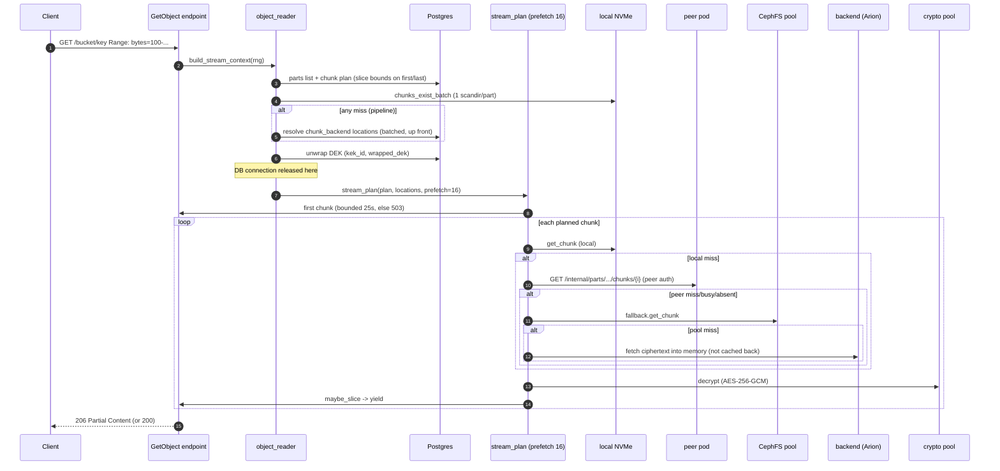

# 03 — Data plane: write pipeline, read/streaming pipeline, multi-tier cache

> **⚠️ The multi-tier cache described here is the LIVE Python data plane — the rewrite does NOT keep it.**
> Greenfield reads go **straight to HCFS** (no read cache, no peer/`/internal/parts` tier, no CephFS
> pool, no janitor/hydrate). The write path is **SSD-staging → forwarder → HCFS** (doc 10), and the
> cold-range gap this doc flags is **closed** by the framed single-ranged-GET model (docs 16/23/25), not
> left open. The per-version DEK / object-identity AAD invariants here are the OLD format (migration
> decrypt only). Read §0–§6 as current-system behavior; the rewrite's data plane is docs 12/16 +
> IMPLEMENTATION-PLAN §2.

**Scope.** This section specifies the **current Python** object-storage **data plane** (reference):
the write pipeline (PutObject / UploadPart / append), the read/streaming pipeline (GetObject / HEAD /
Range), and the multi-tier chunk cache (node-local NVMe → peer → CephFS pool → backend).

It is written against the current Python implementation (`hippius_s3/`) and the **existing
Rust drain** (`crates/hippius-drain-*`), which the new data plane must interoperate with
unchanged. The drain reads the API's on-disk part layout and its Redis announcements; the API
reads the drain's Postgres tables and the uploader's `chunk_backend` rows. **These formats are
hard contracts** — see the callout at the end of this document. Where a format is a contract,
this section quotes the real code on both sides.

Everything here is a *specification of observed behaviour*, not a proposal. Design choices that
look arbitrary almost always encode a production incident; those are preserved and cited.

---

## 0. Vocabulary and invariants

| Term | Meaning |
|---|---|
| **object_id** | Version-4 UUID, authoritative from the DB reserve, not the client candidate. |
| **object_version** | Monotonic per-object version. Numbering is **sparse** (aborted MPU rows, migrator out-of-band inserts). |
| **part_number** | 1-based. Simple PUT is always `part_number=1`. |
| **chunk_index** | 0-based, **global across the object's plaintext** for a simple PUT (AAD binds it). |
| **plaintext size** | What `size_bytes` means everywhere in DB/meta.json/FileMetadata. |
| **ciphertext size** | Per-chunk on-disk size = plaintext + AEAD overhead (nonce+tag). Stored in `part_chunks.cipher_size_bytes` and carried on the fresh-part Redis hint. |
| **node** | An ingest pod's node identity (`NODE_NAME`). A part lives on the SSD of the node that ingested it. |

**Cross-cutting invariants** (violating any is a production incident this code already had):

1. **`meta.json` is written last** (ingest) and is the sole *part-complete* readiness gate. A reader
   or the drain that sees `meta.json` may assume every declared chunk is on disk. (Promotion is the one
   exception — it writes meta first so partial fills read chunk-by-chunk; see §4.2.)
2. **A version is invisible to reads until `object_versions.size_bytes>0 AND md5_hash<>''`.** The reserve
   writes placeholders (`size=0, md5=''`); the tail transaction makes it serveable.
3. **The envelope (`kek_id`, `wrapped_dek`) is written in the same transaction as the reserve**, before any
   body byte, or a concurrent GET 500s with `v5_missing_envelope_metadata`.
4. **The API never writes the drain's tables** (`cephor_replication_status`, `cephor_ssd_residency` for
   commit). It announces over Redis and lets the drain record. Mirror-image: the drain is the sole
   producer of backend upload requests.
5. **All FS writes are atomic** (unique-tmp → `os.replace`, `fsync` file, `fsync` parent dir).
6. **The response body does ZERO DB work.** Everything the stream needs is resolved up front and
   closed over by value; the pooled connection is released before the first byte.

---

## 1. Write path (PUT / UploadPart / append)

### 1.1 Entry points

| Operation | Writer method (`hippius_s3/writer/object_writer.py`) | Chunk discipline |
|---|---|---|
| Simple PUT | `put_simple_stream_full` (line 191) | `set_chunk` (publish-immediately) |
| MPU UploadPart | `mpu_upload_part_stream` | `stage_chunk` + `publish_part` |
| Append (S4) | `append_stream` (reuses the MPU staging path) | `stage_chunk` + `publish_part` |

The two chunk disciplines exist because their **failure semantics differ**
(`fs_store.py:270-275`): a simple PUT writes to a per-object-version directory that no other
attempt shares, so a chunk that lands out of order or after a disconnect corrupts nothing and
can be published immediately. Two UploadPart *attempts* of the **same** `(object, version,
part)` carry **different ciphertext** but share a directory, so publishing chunk-by-chunk would
let one attempt overwrite another's already-acknowledged bytes — they must stage privately and
promote the whole set atomically.

### 1.2 Simple PUT, step by step

Source: `put_simple_stream_full` (`object_writer.py:191-581`), endpoint tail
(`api/s3/objects/put_object_endpoint.py:253-283`).

**A. HEAD transaction — reserve + envelope (one pooled connection, one transaction).**

1. `upsert_object_basic` (`writer/db.py:37`) inserts/bumps `object_versions` with placeholder
   `size_bytes=0, md5_hash=''`, allocating the next version as
   `GREATEST(current_object_version, MAX(object_version)) + 1`. **Trust the DB-returned
   `object_id`** — a concurrent create on the same `(bucket, key)` may override the client
   candidate (`object_writer.py:291-301`).
2. A version-collision retry (`retry_on_object_version_conflict`) wraps the reserve: a concurrent
   `create_migration_version` inserts a version without bumping `current_object_version`, so under
   READ COMMITTED the `MAX()` floor is snapshot-stale and can collide. A fresh transaction re-reads
   the committed `MAX`.
3. **Generate DEK, wrap with the bucket KEK, write the envelope in the same transaction**
   (`object_writer.py:305-321`). AAD = `f"hippius-dek:{bucket_id}:{object_id}:{object_version}"`.
   KEK lookup/DEK generation run **outside** the transaction (keystore pool / possible KMS
   round-trip must not pin a main-pool connection).

**B. Streaming producer/consumer pipeline** (no DB connection held).

The pipeline has **three** stages, not two:

- **Producer** (`object_writer.py:404-427`): drains `body_iter`, accumulates into `pt_buf`,
  cuts full `chunk_size` plaintext buffers (default 4 MiB), and calls
  `pipeline.push(buf, chunk_index)`.
- **Encrypt/hash fan-out** (`_ChunkEncryptPipeline`, `object_writer.py:~90-143`): a bounded
  look-ahead window (`write_pipeline_lookahead`, default **4**) of concurrent encrypts on the
  crypto pool plus MD5/BLAKE3 hash updates on the hash pool. Because the **AEAD AAD binds the
  explicit `chunk_index`** and the nonce is random per call, encrypts may *complete* out of order
  — but the pipeline drains oldest-first, so the `_sink` receives chunks **in index order**
  (`_drain_oldest`, line 138). Order is load-bearing for the hash digest and for the consumer.
- **Consumer** (`_consumer`, `object_writer.py:344-366`): one task reading an
  `asyncio.Queue(maxsize=write_queue_maxsize)` (default **16**) and calling
  `fs_store.set_chunk(...)`. **FS write failure is fatal** — it is captured into
  `consumer_error` and re-raised on the producer side.

```python
# object_writer.py:341
write_queue: asyncio.Queue[tuple[int, bytes] | None] = asyncio.Queue(maxsize=self.config.write_queue_maxsize)
```

The consumer's `set_chunk` does the atomic write (`fs_store.py:333-383`): unique tmp → write →
`replace`. The Redis mirror that once shadowed every chunk write is **gone** — FS is the sole
chunk store (`writer/CLAUDE.md` "Double FS writes (fixed)").

On any exit the producer's `finally` cancels a still-blocked consumer
(`object_writer.py:447-456`) — a mid-stream client disconnect would otherwise leak one task and
up to `write_queue_maxsize` chunks per failed PUT.

**C. Content-MD5 gate.** If `Content-MD5` was supplied and the rolling MD5 disagrees, raise
`BadDigest` **before** writing meta or making the version visible (`object_writer.py:461-462`) —
the version stays an inert placeholder that reads resolve past and the orphan sweep reclaims.

**D. Write FS meta** (`writer.write_meta`, `write_through_writer.py:33-100`), which:

1. `fs_store.set_meta` writes `meta.json` **atomically and last** (§2). This is the "part
   complete" signal.
2. Stamps read-recency on `cephor_ssd_residency.last_read_at` **before** announcing
   (`read_recency.py`). Rationale: a *rewrite* of an already-replicated part is momentarily the
   only copy of the new bytes; if it ranked as the evictor's LRU-coldest during the announce
   window it could be evicted before the drain's divergence check ran. Stamping first makes it
   LRU-hottest. No-op for a first-time part (no residency row yet). Best-effort.
3. `registry.remember_part` writes the **fresh-part Redis hint**
   `hippius:fresh-part:{object_id}:{version}:{part}` = `{"n": node, "s": [cipher_sizes...]}`,
   TTL 60s (`peers.py:335-362`). Lets a GET that lands on a *different* pod peer-fetch the part
   before the drain has claimed `cephor_replication_status`. Best-effort.
4. `publisher.publish` **LPUSHes the landed announcement** to the drain (§5). Best-effort.

For staging paths (MPU/append) the same recency+hint+announce block hangs off
`publish_part` (`write_through_writer.py:102-152`) — publishing IS the meta write there, so the
announcement must live on that method too. **There are two choke points, not one.**

**E. TAIL transaction — make serveable (one pooled connection, one transaction).**
(`object_writer.py:495-563`)

1. `update_object_version_metadata` sets final `size_bytes`, `md5_hash`, `content_type`,
   `metadata`, `blake3`. **Until this commits the version is invisible.**
2. `ensure_upload_row` links a `multipart_uploads` row (structural even for simple PUT).
3. `upsert_part_placeholder` (`parts_service.py:11`) writes the `parts` row (with
   `chunk_size_bytes`) **and bulk-inserts `part_chunks` placeholders carrying each chunk's
   `cipher_size_bytes`** — these are what the peer tier and the uploader join on later.
4. `fs_cache_inventory.record_cached` records the part for the janitor's SQL discovery (run
   **after** the txn commits, autocommit, to avoid poisoning it).

Lock order matters: take the `objects` row **first** (`lock_object_row_by_id`) so the implicit
`FOR KEY SHARE` from the FK inserts does not deadlock against a concurrent same-key reserve.

**F. Persist the version address (endpoint, not writer).**
`set_object_version_address` (`writer/db.py:12`, called from
`put_object_endpoint.py:262`) writes `object_versions.address = main_account_id`. **This
replaces the old PUT-time backend enqueue.** Since the drain-direct cutover the API enqueues
nothing; the drain rebuilds the `UploadChainRequest` by `object_id` and enqueues once the part
replicates (§5). If the address write fails, the endpoint **rolls the version back to the
unserveable placeholder shape** (`size=0, md5=''`) and raises (B4,
`put_object_endpoint.py:268-283`) — a served-but-address-less object could never be backed or
evicted.

### 1.3 What is fatal vs best-effort

| Step | Failure semantics |
|---|---|
| Reserve + envelope write | Fatal (request fails, nothing visible). |
| `set_chunk` (each chunk) | **Fatal.** Captured in `consumer_error`, re-raised. |
| `set_meta` / `publish_part` | **Fatal** (the part-complete gate must be real). |
| Content-MD5 mismatch | Fatal (`BadDigest`), before visibility. |
| Tail txn (size/md5, parts, part_chunks) | Fatal. |
| Read-recency stamp | Best-effort (swallowed; logged). |
| Fresh-part Redis hint | Best-effort. |
| Landed announcement | Best-effort — but **loud (WARNING + counted)** on timeout, because a lost announcement for a *rewritten* part is not recovered by the reconciler (§5.4). |
| `set_object_version_address` | Fatal to the request, with placeholder rollback. |

### 1.4 PUT sequence diagram

```mermaid
sequenceDiagram
    autonumber
    participant C as Client
    participant EP as PutObject endpoint
    participant W as ObjectWriter
    participant CP as crypto/hash pools
    participant Q as write_queue (max 16)
    participant FS as FileSystemPartsStore (NVMe)
    participant PG as Postgres
    participant R as Redis
    participant DR as drain-agent (this node)

    C->>EP: PUT /bucket/key (SigV4, body stream)
    EP->>W: put_simple_stream_full(body_iter)
    Note over W,PG: HEAD txn (1 conn)
    W->>PG: upsert_object_basic (reserve, size=0/md5='')
    W->>PG: UPDATE object_versions SET kek_id, wrapped_dek (envelope)
    Note over W,FS: streaming (no DB conn held)
    loop each 4 MiB plaintext chunk
        W->>CP: encrypt (AAD binds chunk_index) + MD5/BLAKE3
        CP-->>Q: (chunk_index, ciphertext) in order
        Q->>FS: set_chunk -> chunk_<i>.bin (atomic)
    end
    W->>FS: set_meta -> meta.json (LAST, atomic, fsync dir)
    W-->>R: LPUSH cephor:landed:<node> {object_id,version,part_number} (best-effort)
    W-->>R: SET fresh-part hint (best-effort)
    Note over W,PG: TAIL txn (1 conn)
    W->>PG: update_object_version_metadata (size/md5 -> serveable)
    W->>PG: parts + part_chunks(cipher_size_bytes)
    W-->>EP: PutResult
    EP->>PG: set_object_version_address (main account)
    EP-->>C: 200 OK (ETag)
    DR->>R: RPOP cephor:landed:<node> (async, later)
    DR->>FS: read meta.json, list chunk_<i>.bin, hash
    DR->>PG: mark uploading; LPUSH {backend}_upload_requests:<node>
```

---

## 2. FS cache on-disk layout (a drain contract)

Source of truth: `cache/fs_store.py`, mirrored on the drain side by
`crates/hippius-drain-agent/src/localfs.rs` and `crates/hippius-drain-core` (`META_FILE_NAME`,
`chunk_file_name`, `parse_part_dir`).

### 2.1 Directory structure and file naming

```
<HIPPIUS_OBJECT_CACHE_DIR>/                 # default /var/lib/hippius/object_cache;
└── <object_id>/                            #   on an ingest node this IS the drain's CEPHOR_SSD_ROOT
    └── v<object_version>/                   # literal 'v' + integer, e.g. v5
        └── part_<part_number>/              # literal 'part_' + integer, e.g. part_1
            ├── chunk_0.bin                  # ciphertext of chunk 0
            ├── chunk_1.bin
            ├── ...
            ├── meta.json                    # presence = part complete (readiness gate)
            ├── <name>.tmp.<uuid4hex>        # in-flight atomic write; swept as write-temp
            └── chunk_<i>.bin.staged.<attempt>   # one UploadPart attempt's unpublished chunk
```

Path builder (`fs_store.py:303-315`):

```python
def part_path(self, object_id, object_version, part_number) -> str:
    safe_id = self._safe_object_id(object_id)   # UUID-validated (path-traversal + type guard)
    return str(self.root / safe_id / f"v{int(object_version)}" / f"part_{int(part_number)}")
```

The drain builds the **identical** path from a validated `PartKey`
(`localfs.rs` `part_dir` → `PartKey::relative_dir`), and the layout is asserted by
`chunk_and_meta_source_render_the_part_layout` (`localfs.rs:1050`):
`/<root>/<uuid>/v5/part_1/chunk_3.bin` and `.../meta.json`.

### 2.2 File-name grammar (both sides parse this)

- **Published chunk:** exactly `chunk_<u32>.bin`. The drain's `parse_chunk_index`
  (`localfs.rs:413`) accepts **only** `strip_prefix("chunk_").strip_suffix(".bin").parse::<u32>()`.
  The API's read-path scanner round-trips the parsed index back through the filename so that
  `chunk_007.bin` does **not** count as index 7 (`fs_store.py:730-737`). **Emit only the canonical
  form.**
- **`meta.json`:** the literal name; `META_FILE_NAME` on the drain side.
- **Write temp:** `<name>.tmp.<uuid4hex>`. Both sweepers treat `*.tmp.*` (and the drain's own
  `.tmp-<name>`) as a crash orphan after a short grace (drain `CEPHOR_RECLAIM_GRACE_SECS` ≈ 1h;
  janitor `TMP_FILE_MAX_AGE_SECONDS` ≈ 30m).
- **Staged chunk:** `chunk_<i>.bin.staged.<attempt>` where `<attempt>` is a uuid4 hex (validated
  `.isalnum()`, `fs_store.py:385-391`). **Deliberately does NOT contain `.tmp.`** so no write-temp
  sweeper deletes a multi-GB upload mid-flight. The drain recognises it via `is_staged_name`
  (`localfs.rs:335`) and gives it the longer orphan grace (`OrphanGrace`, ~24h). It never counts
  toward the completeness gate (fails `parse_chunk_index`).

> **Trap:** the staged-vs-tmp distinction is a *type-level* invariant on the drain side —
> `FailedGrace` vs `OrphanGrace` are distinct newtypes precisely because transposing the two
> `Duration`s was "a silent one-word edit that no test could see" (`localfs.rs:107-131`). The Rust
> data plane must keep the two graces distinct types.

### 2.3 `meta.json` byte format (a drain contract)

Written atomically by `_write_meta_file` (`fs_store.py:243-256`): unique tmp → `json.dump` →
`flush` → `fsync(fileno)` → `replace`, then `fsync` the parent directory.

The payload is **exactly** three integer keys (`fs_store.py:502-506`, `877-881`):

```json
{"chunk_size": 4194304, "num_chunks": 3, "size_bytes": 10485760}
```

| Key | Meaning |
|---|---|
| `chunk_size` | **Plaintext** bytes per chunk (range math source). |
| `num_chunks` | Number of published chunks. The drain's completeness gate reads only this. |
| `size_bytes` | **Plaintext** size of the whole part. |

The drain deserialises it into a struct that **fails closed on schema drift**
(`localfs.rs:468-500`):

```rust
#[derive(serde::Deserialize)]
struct MetaJson { chunk_size: u64, num_chunks: u32, size_bytes: u64 }
// a malformed meta -> io::ErrorKind::InvalidData (corruption, not not-ready)
```

**Contract:** these three keys, these types, no extras that change meaning. Adding a key is safe
(serde ignores unknown fields on the current struct only if it does not use `deny_unknown_fields`
— it does not); *removing or renaming* one breaks the drain.

### 2.4 Completeness gate (drain side)

The drain replicates a part only when the on-disk chunk set is **exactly** `{0 .. num_chunks-1}`
(`partdrain.rs`, `IncompleteSource`). Consequences the writer already honours:

- Meta is written **after** all chunks (so meta-present ⇒ chunks present).
- `publish_part` trims any stale tail from a *larger* earlier attempt **before** writing the new
  meta (`_trim_chunk_tail`, `fs_store.py:194-240`), so the published `(meta, chunk set)` pair is
  exact from the instant it becomes visible. A surviving larger tail would strand the part as
  `IncompleteSource` forever.

### 2.5 Read gating (API side)

`get_chunk` returns `None` unless **`meta.json` exists AND the specific `chunk_<i>.bin` exists**
(`fs_store.py:620-627`). The batch form `chunks_exist_batch` (`fs_store.py:667-790`) answers per
part with **one `os.scandir`** (not a stat per chunk) — on the CephFS pool tier every stat is an
MDS round trip (~6ms), so per-chunk stats made TTFB O(total_chunks) (≈10s before first byte on a
5 GB object). Scans run on a dedicated `fs-scan` thread pool
(`HIPPIUS_FS_STORE_SCAN_CONCURRENCY`, default 64) with a per-request cap of `pool_size // 4`,
because the local and pool tiers share the executor and one stalled request must not own every
worker.

### 2.6 Atomicity

`os.replace` is atomic on NVMe and CephFS. No `flock` on the shared pool (unreliable on CephFS);
`flock` **is** used on the node-local ingest SSD for part publish (`_part_dir_flock`,
`fs_store.py:160-188`), and the drain takes the **same** `flock(2)` on the part-dir fd before
`remove_dir_all` (`localfs.rs:287-311` `remove_part_dir_exclusive`) so eviction can never
interleave with a publish's set-rename.

---

## 3. Read path (GET / HEAD / Range)

Orchestration: `services/object_reader.py`. Mechanics: `reader/planner.py`,
`reader/streamer.py`, `reader/decrypter.py`, `reader/backend_fetch.py`.

### 3.1 Range → chunk planning

`api/s3/range_utils.parse_range_header` parses `bytes=…` (suffix, open-ended, closed;
AWS quirk: `start>end` ⇒ whole object). `reader/planner.build_chunk_plan`
(`planner.py:21-98`) maps a plaintext byte range to `ChunkPlanItem(part_number, chunk_index,
slice_start?, slice_end_excl?)`:

- Parts are ordered and given cumulative plaintext offsets.
- **Chunk size is per-part from the DB** (`parts.chunk_size_bytes`), never from config — legacy
  objects have variable chunk sizes. A6 fallback: a part with `size>0` but `chunk_size=0` uses a
  **4 MiB** fallback (must match the writer/downloader), logged as an inconsistency
  (`planner.py:56-68`).
- Only chunks intersecting the range are emitted; the first/last get `slice_start` /
  `slice_end_excl` so the plaintext is trimmed **after** decryption (`decrypter.maybe_slice`).
- The GET path already carries `size_bytes`+`chunk_size_bytes` on each part (from the parts
  catalog), so the planner sizes from them and skips the query (RD-3, `planner.py:36-39`).

`planning/range_planner.py` is a pure, IO-free variant (`build_part_offsets` +
`plan_indices_for_range`) used by callers that only need indices.

### 3.2 Building the stream context (`build_stream_context`, `object_reader.py:143-255`)

1. Read parts list (reuse the endpoint's catalog if present).
2. Build the chunk plan.
3. `chunks_exist_batch` over the plan → `source = "cache"` if all present else `"pipeline"`.
4. **Resolve backend locations up front** when `source=="pipeline"` **or** the plan is long
   (`> _RESOLVE_LOCATIONS_MIN_CHUNKS = 64`, `object_reader.py:79-83`): one batched
   `get_chunk_backend_identifiers_by_part` query per download backend, keyed
   `(part_number, chunk_index) -> tuple[(backend, identifier), ...]` in download-backend order.
   A long *warm* read resolves them too because the body runs for minutes and a chunk can be
   evicted mid-stream — **the body may not touch the DB** (see the `db` LIFETIME banner at the top
   of `object_reader.py`).
5. **Unwrap the DEK** (`kek_id`, `wrapped_dek`, AAD
   `hippius-dek:{bucket_id}:{object_id}:{object_version}`). If the current version is mid-write
   (envelope columns NULL), fall back to `get_prev_serveable_version` (**not** `version-1` —
   numbering is sparse) and resolve *that* version's plan and locations.

The pooled DB connection is released here, before the first-chunk wait.

### 3.3 Cache lookup order (per chunk)

`stream_plan` (`streamer.py:203-292`) resolves each chunk through `obj_cache.get_chunk`, whose
tiers are (via `DualFileSystemPartsStore`, §4.1):

1. **local NVMe** (`super().get_chunk`)
2. **peer NVMe** (`_fetch_from_peer`, only in `get_chunk`)
3. **CephFS pool** (`self.fallback.get_chunk`)

On a miss on all three, `_fetch` calls `fetch_missing` (the backend tier). `fetch_missing=None`
(a bare store, e.g. tests) turns a miss into `ChunkUnavailableError`.

### 3.4 Backend fetch — the lowest tier (`backend_fetch.py`, `object_reader.make_fetch_missing`)

`make_fetch_missing` (`object_reader.py:110-140`) closes over the **resolved locations** (never
`db`):

- Locations present → `BackendChunkFetcher.fetch(locations, address)` (`backend_fetch.py:90-127`):
  try each location in order; a **transient** error (429/5xx) is retried on the same location with
  exponential backoff + jitter (`HIPPIUS_READ_BACKEND_FETCH_ATTEMPTS`, default 3), a **permanent**
  one (404 — stale identifier) moves to the next. One `ArionClient` per process; a per-process
  semaphore (`HIPPIUS_READ_BACKEND_FETCH_CONCURRENCY`, default 32) bounds the pod's backend
  concurrency, with a queue timeout that sheds a saturated budget as a fast `ChunkUnavailableError`
  rather than letting every queued read time out in lockstep.
- **No location yet** (the part is inside its upload window on another node) → re-poll the local
  tiers for `HIPPIUS_READ_MISSING_CHUNK_WAIT_SECONDS` (default 10s), then `ChunkUnavailableError`.

> **Backend bytes are decrypted in-process and yielded, and written NOWHERE.** A cold read of an
> object nobody else is reading warms no cache: the pool copy is gone with the pool era, and
> promoting Arion-served bytes onto NVMe would put cache-fill write amplification on every cold
> read, competing with ingest for the ingest disk (`backend_fetch.py:1-18`). **Peer-served bytes
> DO promote** (§4.2) — that decision is unchanged.

### 3.5 Prefetch / overlap streamer

`stream_plan` runs a pipelined scheduler (`_emit`, `streamer.py:110-200`):

- `prefetch = HTTP_STREAM_PREFETCH_CHUNKS` (runtime default **16**; the function-param default is
  0, exercised only by sequential tests). On a cold read this is **also the per-request backend
  parallelism**.
- Schedule ≥1 chunk fetch as `asyncio.Task`, then up to `prefetch` more. Pop oldest, await it,
  schedule one more to refill, decrypt, `maybe_slice`, yield.
- On client disconnect / early exit the `finally` cancels every pending task (releasing their
  backend-budget slots and HTTP streams) and `gather(..., return_exceptions=True)`.

Timeouts (`read_response`, `object_reader.py:279-347`):

- **First chunk** bounded by `HIPPIUS_STREAM_FIRST_CHUNK_TIMEOUT_SECONDS` (default 25). A cold
  read whose chunk cannot be served surfaces as a retryable **503** (`DownloadNotReadyError`)
  *before* the 200/206 headers are committed.
- **Each later chunk** bounded by `HIPPIUS_STREAM_CHUNK_TIMEOUT_SECONDS` (default 300) — a
  mid-stream permanent failure ends the stream in minutes instead of hanging the open response for
  the cache TTL.

### 3.6 Decrypt + assemble

`decrypt_chunk_if_needed` (`decrypter.py:20-52`) offloads AES-256-GCM to a dedicated crypto pool
(`run_crypto`) — a ~4 MiB decrypt must not head-of-line-block the worker. Emit order is preserved
(the streamer awaits in plan order). `key_bytes=None` (legacy unencrypted) passes ciphertext
through. `maybe_slice` trims for Range.

**AEAD-failure recovery** (`_decrypt_reloading_once`, `streamer.py:49-107`): on `InvalidTag` or a
too-short body (`CIPHERTEXT_UNUSABLE`), drop THIS node's copy (`invalidate_local_chunk`, §4.5),
re-fetch from the next tier, decrypt **exactly once** more. Gated on a durable copy existing
elsewhere; straight-line, not a loop (a DEK fault would otherwise wipe the cache fleet-wide).
Counted as `chunk_aead_failures_total{tier,outcome}`.

### 3.7 Cold-range behaviour — the documented gap

A Range request that misses the cache fetches **whole chunks** from the backend, not byte ranges.
`ArionClient.download_file` (`arion_service.py:435-469`) streams the entire object/chunk; there is
no `download_range`. The planner trims plaintext after decryption, so correctness holds, but a
1-byte Range on a cold 4 MiB chunk transfers and decrypts the full 4 MiB. Called out in
`reader/CLAUDE.md` ("Range requests still fetch full chunks from Arion") and the top-level
`CLAUDE.md §3.3`. **The Rust rewrite should preserve behaviour but is the natural place to close
this** (range-aware backend fetch) — see Open questions.

### 3.8 Range GET sequence diagram



---

## 4. Multi-tier cache

### 4.1 `DualFileSystemPartsStore` (`cache/dual_fs_store.py`)

Extends `FileSystemPartsStore`. Writes/deletes/paths are the primary (node-local NVMe); reads try
**local → peer → pool** and record the serving tier in
`chunk_reads_by_tier_total{tier=local|peer|pool}` (`_record_tier`). Metadata lookups
(`get_meta`, `chunk_exists`, `chunks_exist_batch`) walk **local → pool only** (never the peer) —
they gate the cache-vs-pipeline decision, and a false "present" would leave the stream with no
location (`dual_fs_store.py:357-391`).

The single-store factory (`cache/__init__.create_fs_store`) picks the dual store only when
`HIPPIUS_OBJECT_CACHE_FALLBACK_DIR` is set; otherwise the single store's root **is** the pool and
promotion/invalidation are disabled.

### 4.2 Promotion (peer/pool → local flash)

`_promote_chunk` (`dual_fs_store.py:169-274`), gated by `HIPPIUS_OBJECT_CACHE_PROMOTE_ON_READ`:

1. **Yield to ingest first.** `FreeSpaceGate.allows()` (`fs_pressure.py:55-159`) — `await` is
   load-bearing (a dropped `await` makes `not <coroutine>` always false and silently disables the
   gate). Skipped as `promotion_skipped_total{reason=disk_pressure}`.
2. **In-flight guard** (`self._promoting` set): concurrent readers of the same cold chunk promote
   once. Holds only in-flight keys, so it self-drains and needs no TTL — a memo would be
   invalidated by the out-of-process evictor.
3. **Claim residency BEFORE writing** (`on_promote` → `ResidencyRecorder.__call__`,
   `residency.py:69-118`): an accumulating upsert of the chunk's bytes into `cephor_ssd_residency`.
   A failed claim **cancels** the copy (`residency_failed`). Rationale: an unclaimed copy has no
   owner in either process (the evictor is scoped to that table; `ssd_reclaim` skips replicated
   parts), so writing first would leak an unreclaimable copy per chunk for a whole residency-DB
   outage, onto the disk whose filling 503s every PUT. Fail-closed on the optimisation.
4. **Write meta first, then the chunk** (matching the downloader): meta-first makes each promoted
   chunk readable as it lands.
5. On disk-write failure, `release` the claim (`residency.py:120-162`) — the upsert *accumulates*,
   so without a give-back a persistently failing disk would re-add the phantom bytes on every
   retry.

The free-space floor sits **strictly inside** the evictor's hysteresis band
(`fs_cache_min_free < evict_reserve < promote_floor < evict_reserve + headroom`;
`validate_promotion_band`, `fs_pressure.py:185-238`). The band is not fixed — the drain allocator
publishes a per-node reserve at runtime, and `FreeSpaceGate` prefers the published floor over the
static `HIPPIUS_PROMOTE_MIN_FREE_RATIO` (default 0.175).

### 4.3 Peer fetch protocol — the internal parts API (a cross-node contract)

**Server** (`api/internal_parts.py`):

```
GET /internal/parts/{object_id}/{object_version}/{part_number}/chunks/{chunk_index}
Header: <PEER_AUTH_HEADER>: <shared secret>       # hippius_s3/peer_auth.py
```

| Response | Meaning |
|---|---|
| `200`, `application/octet-stream`, raw **ciphertext** | Hit on this node's **local tier only** (`read_local_chunk`, never the pool/peer). |
| `404` | Miss, **or** bad/absent auth, **or** route unmounted, **or** non-numeric segment. Deliberately indistinguishable — a 403/422 would be an existence oracle. Auth is checked *before* any FS work so timing cannot separate them. |
| `503` | Serve-side in-flight cap hit (`peer_serve_limiter`, `HIPPIUS_PEER_SERVE_MAX_INFLIGHT`, default 16) — shed to protect this pod's own ingest. |

The route is not mounted unless **both** `HIPPIUS_PEER_SERVE_ENABLED` and a secret are set. It
reads the local tier only (never proxies onward) — proxying would let a lookup race turn into an
inter-node fetch loop. Ciphertext is safe to hand over: it is useless without the per-version DEK,
which never leaves the KMS path — but that is defence-in-depth, **not** the authorization; the
shared secret is (`internal_parts.py:1-33`).

**Client** (`cache/peers.py`, `PeerChunkFetcher.__call__`):

1. **Resolve the owner per part** (`_resolve_part`, `peers.py:427-518`), memoised in a `PartMemo`
   (positive TTL 30s, negative TTL 0.25s). Ground truth is **residency**, not
   `cephor_replication_status.node_id`. The SQL unions:
   - the read tier proper: any node with a **replicated** copy in `cephor_ssd_residency` (excl.
     self), ordered by `resident_at`;
   - the fresh-part fallback: `cephor_replication_status` in
     `('pending','draining','uploading','corrupt')` with a non-null `node_id` (the ingest node,
     the only holder before/at replication; the SSD copy is undeletable and, during a redrive, is
     the source the drain re-copies from).
   - It also returns each chunk's `cipher_size_bytes` (LATERAL join on `part_chunks`).
2. If Postgres finds no owner, consult the **fresh-part Redis hint** (`lookup_fresh_part`).
3. `PeerRegistry.resolve(node)` validates the peer URL through `_is_peer_address`
   (`peers.py:74-106`): `http`, exact port `PEER_PORT=8000`, **literal pod-network IP**
   (`10/8`, `172.16/12`; `192.168/16` only under `HIPPIUS_PEER_ALLOW_NODE_NETWORK`), nothing after
   the authority. A URL that fails this was not written by an API pod.
4. Bound per `(pod, peer)` by `HIPPIUS_PEER_FETCH_MAX_INFLIGHT` (default 16, floored at the
   prefetch depth by `effective_max_inflight` — every chunk of one part resolves to the same peer,
   so a lower cap makes one reader shed its own prefetch window). A locked semaphore **sheds to the
   pool**, never queues.
5. `_fetch_verified` (`peers.py:652-701`) streams the body and accepts it **only if its length ==
   the recorded `cipher_size_bytes`** (exact, not an upper bound — the last chunk is legitimately
   short, and a rolled-back peer answers 200 with a truncated body). Over-long bodies are abandoned
   mid-stream. The auth header rides on the stream call (a dropped header would 404 → look like an
   eviction storm).

Registration: each pod `SET hippius:peer:<node> {"url": "http://<POD_IP>:8000"}` with a TTL it
refreshes; a dead pod ages out (`PeerRegistry.register`/`run_refresh`).

### 4.4 Read-recency / access tracking

Two independent, sampled recency signals — reads no longer `os.utime` (dead on read-only mounts,
an MDS write elsewhere):

- **`cephor_ssd_residency.last_read_at`** (`read_recency.py`): stamped on a local hit and on a
  (re)write, so the **drain evictor** orders on `COALESCE(last_read_at, resident_at)` (LRU, not
  FIFO). Node-scoped; sampled at most once per part per 300s window via a `PartMemo`; best-effort.
- **`fs_cache_inventory.last_access_at`** (`access_tracker.py`): the **janitor's** hot-retention
  signal. `note_read` is sync and allocation-light (one dict probe per chunk read, sampled per
  `hot_window/4`), buffered and flushed as one batched `UPDATE … FROM unnest(...)` every 30s. The
  flush sorts keys so every pod locks rows in one canonical order (avoiding cross-pod deadlock).

Both are module-singletons initialised only in the API lifespan; workers get `None` and the hooks
are no-ops. `part_memo.PartMemo` (bounded, TTL'd, drop-on-read expiry) backs both — a permanent
"already did it" memo would be wrong across the out-of-process evictor.

### 4.5 Invalidation (`invalidate_local_chunk`, `dual_fs_store.py:276-355`)

Drops **one** local `chunk_<i>.bin` (never the part, never `meta.json` — a part with meta and a
hole is a normal partial-promotion state that falls through a tier). **Gated on a durable copy
existing elsewhere** (`durable_elsewhere`: a live `chunk_backend` row via `has_backend_copy`, or a
pool copy) — a freshly ingested part is SSD-only until the backend acks, and a DEK fault fails
those chunks too, so an ungated unlink would be data loss. Only on the dual store (the single
store's root is the authoritative pool).

### 4.6 FS pressure signals (`fs_pressure.py`, `api/middlewares/fs_cache_pressure.py`)

- **PUT admission:** `fs_cache_pressure` middleware runs before the body is read and returns
  `503 + Retry-After` (jittered ±25%, floored 1s) when local free space ≤
  `HIPPIUS_FS_CACHE_MIN_FREE_BYTES` (10 GiB) or ≤ `HIPPIUS_FS_CACHE_MIN_FREE_RATIO` (0.08), **or**
  the janitor's published pool signal (`fs_cache:pressure` mode 2) says stop
  (`should_reject_fs_cache_write`). The local `statvfs` alone missed a full backing Ceph pool
  (2026-07-24) while the node NVMe stayed green — hence the published pool signal.
- **Promotion admission:** `FreeSpaceGate` (§4.2), memoised 5s, fails **open**.
- **Eviction** is the drain-agent's job in a separate process; nothing here may cache state across
  that boundary.

---

## 5. The interface to the drain

### 5.1 What the API writes that the drain consumes

1. **Landed parts on the node SSD** — the `part_<n>/` directory with `chunk_<i>.bin` files and a
   final `meta.json`, in the exact layout of §2. The drain reads it via `PartSource`/`PartScan`
   (`localfs.rs`): `list_chunks`, `part_meta` (parses `meta.json`), `chunk_hash` (streaming
   SHA-256), `scan_parts` (reconciler backstop). **Absent-dir semantics are load-bearing**:
   `list_chunks` maps a missing dir to `NotFound`, never an empty listing — the old lenient mapping
   is how an evicted part once digested as a valid empty set and silenced the reland alarm
   (`localfs.rs:411-438`, test `listing_an_absent_part_dir_surfaces_not_found`).
2. **The landed announcement** — `LPUSH cephor:landed:<node>` of a JSON object:

   ```json
   {"object_id": "<uuid>", "version": 7, "part_number": 3}
   ```

   Producer `LandedPartPublisher.publish` (`writer/landed.py:89-139`): `LPUSH` + `LTRIM` to
   `_DEFAULT_MAX_QUEUE_DEPTH` (200k) in one pipeline, bounded by a 5s timeout on the client PUT
   path. Consumer `LandedQueue.pop` (`landed.rs:116-128`): `RPOP key count` (FIFO — oldest first),
   parsing `LandedMessage { object_id, version, part_number }`; an unparseable or non-UUID message
   is **dropped, not retried** (the reconciler backstop still finds the part on disk). The queue
   key builders must match exactly: `cephor:landed:<node>` on both sides
   (`landed.py:42` / `landed.rs:44`).
3. **`object_versions.address`** — written by the endpoint (`set_object_version_address`). This is
   what lets the drain rebuild the `UploadChainRequest`; a part whose version has no address (an
   in-flight MPU before CompleteMultipartUpload) is **deferred** by the drain
   (`enqueue.rs:153-166`, `EnqueueOutcome::NotReady`).
4. **`parts` + `part_chunks`** rows (with `cipher_size_bytes`) — the peer tier and the uploader
   join on these; the drain's `load_upload_context` reads bucket/key/address/upload_id.

### 5.2 What the drain (and uploader) write back

**The drain-agent** (`crates/hippius-drain-agent`) owns and writes:

- `cephor_replication_status` (the row the API must **never** insert): claims a part, transitions
  `pending → draining → uploading → replicated`, and records `node_id`.
- `cephor_ssd_residency` at commit (`mark_resident`) — though promotion-time claims come from the
  API's `ResidencyRecorder`.
- The **`UploadChainRequest`** onto `{backend}_upload_requests:<node>` (drain is the **sole
  producer**; `enqueue.rs`). Wire shape (`enqueue.rs:64-84`, pinned by a golden fixture asserted
  on both sides — `tests/fixtures/upload_chain_request.golden.json`):

  ```jsonc
  { "address","bucket_name","object_key","object_id","object_version",
    "chunks":[{"id": <part_number>}], "upload_id", "upload_backends",
    "node_id", "request_id":null, "attempts":0, "first_enqueued_at", "bypass_billing":false }
  ```

  Queue name: `{backend}_upload_requests:<node>` when node-scoped (SSD bytes), bare
  `{backend}_upload_requests` for pool-era (`upload_queue_name`, `enqueue.rs:90-95`). Enqueue is
  at-least-once (before `mark_uploading`); the uploader is idempotent.

**The node-local Arion uploader** (Python worker, `hippius_s3/workers/uploader.py`) — **not the
drain** — writes the actual backend rows after the POST:

- **`chunk_backend` rows** (`insert_chunk_backend`, idempotent `ON CONFLICT`,
  `uploader.py:594`): `(chunk_id, backend, backend_identifier)`. These are exactly what the read
  path resolves in `_resolve_chunk_locations` (`get_chunk_backend_identifiers_by_part`).
- **CIDs** on `parts`/`cids` (surfaced by `parts_catalog.build_initial_download_chunks`).
- Flips the drain row to `replicated` (`confirm_replication_status_uploaded.sql`).

> **Correction to the task framing:** `chunk_backend` rows and CIDs are written by the **uploader
> worker**, not the drain. The drain confirms replication by *reading* `chunk_backend` in its
> upload sweep (`runtime.rs:1018`, "confirm `uploading` parts whose every chunk has a live
> `chunk_backend` row"). The Rust rewrite must keep this producer split: drain enqueues, uploader
> records, drain confirms. (The uploader itself is out of this section's scope but is the consumer
> of the drain's queue and the writer of `chunk_backend`.)

### 5.3 Deploy ordering (from `docs/drain-direct-rollout.md`)

Hard cutover, no feature flag. Deploy the **drain first**, then the API that stops enqueuing.
Overlap is harmless (uploader idempotent); the reverse order gaps parts the *old* drain marks
`replicated` during the window. Backends are pinned in code on both sides (`STORAGE_BACKENDS` in
`config.py` and `config.rs`), not env-driven.

### 5.4 Why the announcement is loud on failure

Best-effort for **discovery** (the reconciler finds a new part on disk), but a lost announcement
for a **re-uploaded** part is *not* recovered: the reconciler tallies an already-`replicated` part
as an orphan and deliberately does not content-check it, so the announcement is the only trigger
for the divergence check (`landed.py:118-134`, `crates/hippius-drain-core/src/redrive.rs`).
Timeout ⇒ WARNING + `landed_announce_failures_total`.

---

## 6. Concurrency model, backpressure, budgets, timeouts

| Mechanism | Where | Default | Purpose |
|---|---|---|---|
| `write_queue` | `object_writer.py:341` | maxsize **16** (`HIPPIUS_WRITE_QUEUE_MAXSIZE`) | Backpressure between encrypt and the single FS consumer. |
| encrypt/hash look-ahead | `_ChunkEncryptPipeline` | **4** (`HIPPIUS_WRITE_PIPELINE_LOOKAHEAD`) | Concurrent encrypts/hashes; drained in index order. |
| crypto pool | `services/crypto_pool.run_crypto` | — | AES off the event loop / default executor, both PUT and GET. |
| hash pool | `submit_hash` | — | MD5/BLAKE3 off the loop. |
| `fs-scan` pool | `fs_store.py:52-80` | **64** (`HIPPIUS_FS_STORE_SCAN_CONCURRENCY`); per-request cap `//4` | Presence scans off the default executor; fault isolation. |
| stream prefetch | `streamer.py` | **16** (`HTTP_STREAM_PREFETCH_CHUNKS`) | Overlap fetch/decrypt/IO; = backend parallelism on cold reads. |
| backend fetch semaphore | `backend_fetch.py` | **32** (`HIPPIUS_READ_BACKEND_FETCH_CONCURRENCY`) | Per-pod backend concurrency, with a queue timeout that sheds. |
| backend retries | `backend_fetch.py` | **3** (`HIPPIUS_READ_BACKEND_FETCH_ATTEMPTS`) | Per-location, transient only, exp backoff + jitter. |
| peer client cap | `peers.py` | **16** (`HIPPIUS_PEER_FETCH_MAX_INFLIGHT`, floored to prefetch) | Per `(pod, peer)`; sheds to pool. |
| peer serve cap | `internal_parts.py` | **16** (`HIPPIUS_PEER_SERVE_MAX_INFLIGHT`) | Per serving pod; sheds 503. |
| first-chunk timeout | `object_reader.py` | **25s** (`HIPPIUS_STREAM_FIRST_CHUNK_TIMEOUT_SECONDS`) | Cold TTFB → retryable 503 before headers. |
| per-chunk timeout | `object_reader.py` | **300s** (`HIPPIUS_STREAM_CHUNK_TIMEOUT_SECONDS`) | Bound each later chunk. |
| missing-chunk wait | `object_reader.py` | **10s** (`HIPPIUS_READ_MISSING_CHUNK_WAIT_SECONDS`) | Re-poll local tiers for a not-yet-backed chunk. |
| landed publish timeout | `landed.py` | **5s** | Bound the one PUT-path Redis await. |
| chunk size | `config.py:575` | **4 MiB** (`HIPPIUS_CHUNK_SIZE_BYTES`) | Plaintext chunk unit (per-part in DB for reads). |

**No semaphores, rate limiters, or artificial throughput caps in the DB path** — the budgets
above are on *scarce external resources* (backend concurrency, peer fanout, disk) or are
backpressure, not throttles. The pooled DB connection is held only for the reserve/tail
transactions and `build_stream_context`, never across streaming.

---

## 7. Rust implementation notes

### 7.1 Streaming types

- Model the body as `impl Stream<Item = Result<Bytes, _>>` (request ingest) and the response as a
  `Stream<Item = Result<Bytes, _>>` fed to the HTTP layer (axum `Body::from_stream` /
  `StreamBody`). `Bytes` gives cheap clones and slices — use `Bytes::slice` for `maybe_slice`
  (Range trim) instead of copying.
- The PUT pipeline maps naturally onto a bounded `tokio::sync::mpsc` channel (capacity 16) between
  the encrypt fan-out and the single FS consumer task. Keep the **single consumer** — it is what
  serialises FS writes for one part and matches `set_chunk` semantics.
- The encrypt fan-out (look-ahead 4) is a `FuturesOrdered` (or a small `JoinSet` drained oldest-
  first): completions may be out of order, but the sink must receive chunks **in `chunk_index`
  order** (hash digest + AAD determinism depend on it).

### 7.2 Zero-copy / offload

- Encryption and decryption of ~4 MiB chunks must run on `spawn_blocking` (or a dedicated rayon
  pool), never on a runtime worker — mirrors `crypto_pool`. `ring`/`aws-lc-rs` AES-256-GCM releases
  no GIL concern but still CPU-blocks a worker.
- **All FS I/O and directory scans go through `spawn_blocking`** (or `tokio::fs`, which dispatches
  to the blocking pool). Size a *dedicated* blocking pool for scans, separate from chunk read/write
  I/O — `fs_store.py:52-80` sizes the scan pool process-wide precisely so a fan-out of stalled pool
  scans cannot starve `get_chunk`/`set_chunk`. `statvfs` (free-space probe) also blocks.
- Keep one process-wide backend HTTP client and one process-wide peer HTTP client (connection
  reuse); a client per chunk is a TLS handshake per 4 MiB.

### 7.3 Reproducing the `meta.json` protocol (traps)

- Write the three keys `{chunk_size, num_chunks, size_bytes}` as integers, nothing else that
  changes meaning. The drain's `MetaJson` fails **closed** on schema drift.
- Write `meta.json` **atomically and last**: unique-tmp → write → `fsync(file)` → `rename` →
  `fsync(parent dir)`. Skipping the parent-dir fsync loses the rename under a hard pod kill.
- `chunk_<i>.bin` must be **canonical** (`chunk_0.bin`, not `chunk_00.bin`) — the drain parses with
  a strict `u32`, and the API scanner round-trips the index through the name.
- Staged chunks must be named `chunk_<i>.bin.staged.<attempt>` and must **not** contain `.tmp.`.
  Keep the write-temp grace and staged grace as **distinct types** so they cannot be transposed.
- `publish_part` must: take the part-dir `flock`, verify the whole staged set is present *before*
  any rename, rename the set, trim any tail `>= num_chunks`, write meta — and on any error
  **remove `meta.json`** to un-publish (leak-beats-loss; never serve a mixed set). The Rust drain
  contends on the same `flock` for eviction, so eviction and publish are mutually exclusive.
- The write path must record recency **before** the landed announce (evict-vs-reland race).

### 7.4 Reproducing the peer API (traps)

- Route path exactly `/internal/parts/{object_id}/{object_version}/{part_number}/chunks/{chunk_index}`;
  parse the segments **after** the auth check (a framework that 422s a bad segment before auth is an
  existence oracle). Emit **only 200 / 404 / 503**.
- `404` for miss, bad auth, and unmounted route alike; check auth in constant time before any FS
  work.
- Serve the **local tier only** (never pool/peer). Return raw ciphertext, `application/octet-stream`.
- Client side: verify the body length **exactly equals** the recorded `cipher_size_bytes` (stream
  and abort over-long); an upper bound accepts the truncated-body failure mode. Send the auth
  header on the streaming request. Validate peer URLs (scheme/port/literal-pod-IP) at the single
  resolve chokepoint. Memoise the owner per part with a short negative TTL. Shed (never queue) at
  the per-peer cap; a peer that errors/times-out poisons the memo (except fresh-hinted parts).
- Owner resolution SQL must union the replicated read tier with the
  `pending/draining/uploading/corrupt` ingest-node fallback and return per-chunk cipher sizes in
  one round trip (memoised per part).

### 7.5 Cache-fill discipline

- Backend-served chunks are **never** written back to any cache. Peer/pool-served chunks promote to
  local flash **only** with residency claimed first and the free-space band respected.
- Nothing may cache "already recorded/wrote this" across the drain-evictor process boundary — the
  evictor deletes the dir and row out from under you. Use on-disk state and in-flight-only guards.

---

## Formats that are contracts with the drain / other nodes

> **Do not change any of these unilaterally. Each has a live consumer in a different process or
> service (the Rust drain, the uploader, or a peer pod), and most break silently.**

| # | Format | Producer | Consumer | Break mode |
|---|---|---|---|---|
| C1 | **Part dir layout** `<root>/<object_id>/v<version>/part_<n>/` | API `fs_store.part_path` | drain `localfs.rs part_dir` | Wrong path ⇒ drain never finds the part. |
| C2 | **`chunk_<u32>.bin`** canonical name | API `set_chunk`/`publish_part` | drain `parse_chunk_index`; API scanner | Non-canonical ⇒ excluded from completeness gate / read presence. |
| C3 | **`meta.json`** = `{chunk_size,num_chunks,size_bytes}` (ints), written last & atomically | API `_write_meta_file` | drain `MetaJson` (fail-closed) | Rename/remove a key ⇒ drain `InvalidData`; write-before-chunks ⇒ served holes. |
| C4 | **Staged name** `chunk_<i>.bin.staged.<attempt>` (no `.tmp.`) | API `stage_chunk` | drain `is_staged_name` sweeper | `.tmp.`-shaped ⇒ live upload swept mid-flight. |
| C5 | **Write-temp** `<name>.tmp.<uuid>` on short grace | API `_unique_tmp` | drain/janitor tmp sweep | Long-lived temp ⇒ leak or premature delete. |
| C6 | **Landed queue** `cephor:landed:<node>` = `{object_id,version,part_number}` (LPUSH/RPOP FIFO) | API `LandedPartPublisher` | drain `LandedQueue` | Rename a field ⇒ every message silently dropped. |
| C7 | **`object_versions.address`** written before drain enqueue | API endpoint | drain `load_upload_context` | Missing ⇒ part deferred forever. |
| C8 | **`part_chunks.cipher_size_bytes`** | API `upsert_part_placeholder` | peer client length check; uploader | Wrong ⇒ peer bodies rejected as bad-length. |
| C9 | **Peer API** `GET /internal/parts/.../chunks/{i}` + auth header, 200/404/503, exact-length ciphertext | serving pod `internal_parts.py` | fetching pod `PeerChunkFetcher` | Extra status codes ⇒ existence oracle; length mismatch ⇒ silent tier collapse. |
| C10 | **`UploadChainRequest`** wire shape + `{backend}_upload_requests:<node>` queue name | drain `enqueue.rs` (golden fixture) | uploader `UploadChainRequest.model_validate` | Drift ⇒ requests stranded / rejected (pinned by dual golden test). |
| C11 | **`chunk_backend(chunk_id,backend,backend_identifier)`** rows | uploader | read path `_resolve_chunk_locations`; drain confirm sweep | Missing ⇒ cold reads 503; drain never confirms. |
| C12 | **Peer registration** `hippius:peer:<node> = {"url":"http://<POD_IP>:8000"}` TTL'd | API `PeerRegistry.register` | peer resolvers | Non-pod-IP URL ⇒ refused; stale ⇒ ages out (safe). |

---

## Open questions

1. **Range-aware backend fetch.** The current design fetches whole chunks from Arion even for a
   1-byte Range (§3.7). The rewrite is the natural place to add a `download_range` and thread
   `slice_start/slice_end_excl` down to the backend fetch — but only if Arion/HCFS `GET /download`
   supports HTTP Range on the ciphertext object (unverified; AEAD chunk boundaries would still force
   whole-chunk granularity at minimum). Needs confirmation of backend capability before committing.
2. **`meta.json` unknown-field policy.** The drain's `MetaJson` does not use
   `deny_unknown_fields`, so *adding* a key is tolerated today — but this is not asserted by a test
   on either side. Should the rewrite pin "extra keys ignored" as part of C3, or forbid extras to
   fail loud? (Recommend: keep additive-safe, add a test.)
3. **`cache_writer.py` is dead code** (`writer/CLAUDE.md`): `CacheWriter` is referenced nowhere.
   Confirmed unused — the rewrite should omit it. Flagged only so it is not resurrected from the
   Python surface.
4. **Pool tier lifetime.** `enqueue.rs` and the dual store still carry a "pool era" path
   (`RedisEnqueuer::pool`, bare `{backend}_upload_requests`) marked `TODO: delete with the pool
   (PR 2)`. Is the CephFS pool tier in scope for the rewrite, or is the target a two-tier
   (local NVMe + backend, with peer) system? The peer/pool/promotion logic (§4) assumes the pool
   is authoritative and always present; removing it changes the invalidation and promotion gates.
5. **`upload_id` semantics for simple PUT.** Simple PUT still creates a structural
   `multipart_uploads` row and passes `upload_id=""` to crypto AAD but a real `upload_id` in
   `parts`. The AAD uses `""` for simple PUT and the real id for MPU (`object_writer.py:371-381`).
   Confirm the rewrite preserves the empty-string AAD binding for simple PUT exactly (decryption
   fails otherwise).
6. **`fs_cache_inventory` vs `cephor_ssd_residency` ownership.** Two recency tables with two
   evictors (janitor age-based on `fs_cache_inventory`, drain LRU on `cephor_ssd_residency`). The
   rewrite inherits both; whether they can be unified is a data-plane/drain co-design question
   outside this section's authority.
