# 12 — Greenfield Postgres Schema (Rust `hippius-s3` reimplementation)

**Status:** first draft for review. Not final — every ⚑ marks a decision that needs input.

> **Write-path resolved (2026-09-15): SSD-staging chosen** ([`10-write-path-decision.md`](./10-write-path-decision.md)). So the `staged_blobs` "SSD-only addendum" sketched in the fork note is now **in-scope core**, not optional — it's the per-node landing/replication-state table (the `cephor_replication_status` analogue), tracking a chunk's `landed → replicated` state on local SSD until HCFS confirms. The serveable/read path must also account for **not-yet-drained** objects being served from local SSD (default buckets) vs. sync-before-ack (WORM buckets) — reflect that in the serveable predicate / read resolution.

> **Q2 (AAD/dedup) — FROZEN by the crypto verification (2026-09-15)** ([`25-crypto-verification.md`](./25-crypto-verification.md), suite `hip-enc/aes256gcm-ctx-frames-v1`). The chunk AEAD is a **CTX-over-frames committing AEAD** (CMT-4), so key-commitment is intrinsic to the wire (`N‖ct‖T‖CT` per 256 KiB frame) — there is **no** separate `PRF(DEK, blob_id)` column. Dedup is **per-owner, copy-oriented** (random per-blob DEK, encrypt once, refcount references, re-wrap the DEK per owner under their KEK → O(1) CopyObject); **reject** cross-tenant convergent/MLE. **Three distinct blob identities — never conflate (doc 25 §5.5/T3):**
> 1. **`blob_id`** — an **opaque, server-assigned, random, DEK-independent** id, known *at seal time* and bound into the frame AAD (`blob_id‖frame_index‖suite_id`). NOT `blake3(ciphertext)` (circular — doesn't exist until after sealing) and NOT `blake3(plaintext)` (a confirmation oracle).
> 2. **`content_hash` = `blake3(ciphertext)`** — the HCFS storage address only.
> 3. **owner-scoped `blake3(plaintext)`** — the *private* dedup key, held only in our DB, never exposed (distinct from the client-visible `body_blake3`).

**What this is.** A fresh, **separate** Postgres schema for the Rust reimplementation of
`hippius-s3`. This is **not** the live database and carries **no in-place ciphertext- or
schema-compat constraint** (existing data is re-encrypted/migrated later — see
[`10-write-path-decision.md`](./10-write-path-decision.md)). We are therefore free to redesign
for throughput and to **fix the Python schema's warts by construction** rather than inheriting
them.

**What must still hold (semantics, not layout):**

- Full vanilla-S3 parity: versioning, multipart, tagging, ACLs, bucket policy (incl. per-prefix),
  object lock / retention / legal-hold, lifecycle, CORS.
- The crypto envelope: a **per-blob** DEK wrapped under the owner's per-bucket KEK
  (frozen by [`25-crypto-verification.md`](./25-crypto-verification.md); this supersedes doc 01's
  per-object-version `wrapped_dek` — the DEK now lives with the blob, §2.9, so copies/dedup share it).
- The chosen storage model: **durable bytes live in HCFS as content-hash-addressed ciphertext
  blobs**, refcounted and dedup-able ([`10-write-path-decision.md`](./10-write-path-decision.md)).

**What we deliberately drop vs. Python** (from [`02-storage-engine-schema.md`](./02-storage-engine-schema.md)):
`cids`/`ipfs_cid`/`cid_id` legacy side-tables, `chunk_backend` (replaced by content-addressed
`blobs`), `object_names` aliases (replaced by metadata-only copy — §9 Q2), vestigial
`object_versions.status`, the `files` table, the read cache / janitor / `fs_cache_inventory`, and
the 6×-copied serveable predicate.

---

## 1. ER overview

```mermaid
erDiagram
    accounts        ||--o{ buckets            : owns
    accounts        ||--o{ api_credentials    : "sub-tokens"
    buckets         ||--o{ objects            : contains
    buckets         ||--o{ bucket_keks        : "KEKs (v5)"
    buckets         ||--o{ bucket_acl_grants  : "ACL grants"
    buckets         ||--|| bucket_usage       : "1:1 rollup"
    buckets         ||--o{ multipart_uploads  : "in-progress MPU"
    objects         ||--o{ object_versions    : "1..N versions"
    objects         ||--|| object_versions    : "current_version (deferred FK)"
    objects         ||--o{ object_acl_grants  : "ACL grants"
    objects         ||--o{ object_tags        : "tags (current)"
    object_versions ||--o{ parts              : "(object_id,version_id)"
    bucket_keks     ||--o{ blobs              : "kek_id (per-blob DEK wrap)"
    accounts        ||--o{ blob_dedup         : "owner-scoped plaintext→blob map"
    parts           ||--o{ chunks             : ""
    chunks          ||--o{ chunk_blobs        : "blob-ref (N per chunk)"
    blobs           ||--o{ chunk_blobs        : "content-hash blob (refcounted)"
    multipart_uploads ||--o{ upload_parts     : ""
    upload_parts    ||--o{ upload_part_chunks : ""
    blobs           ||--o{ upload_part_chunks : "staged blob-ref"

    accounts {
        text account_id PK
        timestamptz created_at
        timestamptz terminated_at
    }
    buckets {
        uuid bucket_id PK
        text bucket_name
        text account_id FK
        text versioning_status
        boolean object_lock_enabled
        jsonb object_lock_default
        jsonb policy
        jsonb cors
        jsonb lifecycle
        jsonb tags
        timestamptz deleted_at
    }
    objects {
        uuid object_id PK
        uuid bucket_id FK
        text object_key
        bigint version_seq
        bigint current_version
        timestamptz deleted_at
    }
    object_versions {
        uuid object_id PK
        bigint version_id PK
        text state
        boolean is_delete_marker
        smallint storage_version
        bigint size_bytes
        text etag
        text body_blake3
        jsonb user_metadata
        text enc_suite_id
        int enc_chunk_size
        int enc_frame_size
        text lock_mode
        timestamptz lock_retain_until
        boolean legal_hold
        timestamptz deleted_at
        boolean is_admissible
    }
    parts {
        uuid part_id PK
        uuid object_id FK
        bigint version_id FK
        int part_number
        bigint size_bytes
        text etag
        int chunk_size
    }
    chunks {
        bigint chunk_id PK
        uuid part_id FK
        int chunk_index
        bigint cipher_size
        bigint plain_size
    }
    chunk_blobs {
        bigint chunk_id PK
        text content_hash PK
        text role
    }
    blobs {
        text content_hash PK
        uuid blob_id UK
        text hcfs_file_id
        bigint cipher_size
        uuid kek_id FK
        bytea wrapped_dek
        bigint refcount
        timestamptz zero_refcount_at
        text replication_state
    }
    blob_dedup {
        text account_id PK
        bytea plaintext_hash PK
        text content_hash FK
    }
    multipart_uploads {
        uuid upload_id PK
        uuid bucket_id FK
        text object_key
        text enc_suite_id
        int enc_chunk_size
        int enc_frame_size
    }
    upload_parts {
        uuid upload_id PK
        int part_number PK
        bigint size_bytes
        text etag
    }
```



**Read-path spine (GET/HEAD/LIST):** `buckets → objects → serveable_versions (§3) → parts →
chunks → chunk_blobs → blobs (HCFS content hash + file id)`. There is exactly one visibility
gate (the `serveable_versions` view), and one durable-byte identity (`blobs.content_hash`).

---

## 2. Per-table DDL

Conventions: all timestamps `timestamptz`; UUID PKs default `gen_random_uuid()` (`pgcrypto`);
text + `CHECK` in preference to native enums (cheaper to evolve in migrations — ⚑ could switch
the two or three stable ones to native enums). Column order is not contractual.

### 2.1 `accounts` (was Python `users`)

```sql
CREATE TABLE accounts (
    account_id    text PRIMARY KEY,                  -- SS58 main account address
    created_at    timestamptz NOT NULL DEFAULT now(),
    terminated_at timestamptz,                        -- object-lock escape hatch (doc 18 §0.1);
                                                      -- NULL = live; set = every version this account
                                                      -- owns becomes reapable, in one audited place
    CONSTRAINT accounts_id_not_sentinel CHECK (
        btrim(account_id) <> ''
        AND lower(account_id) NOT IN ('anonymous','none','null','undefined')
    )
);
```

- Fixes the Python `ck_buckets_owner_not_sentinel` being `NOT VALID` — here it is validated from
  day one because there are no legacy rows.
- **`terminated_at`** is the single object-lock escape hatch (doc 18 §0.1/§3.4): the `protected()`
  predicate reads it, and it is the *only* thing that lifts COMPLIANCE / legal hold. No worker or ops
  path takes a `force`/`bypass` argument — termination works by making the predicate false, once.

### 2.2 `api_credentials` (sub-tokens / R2-style keys)

```sql
CREATE TABLE api_credentials (
    access_key_id text PRIMARY KEY CHECK (access_key_id ~ '^hip_[A-Za-z0-9_-]{1,240}$'),
    account_id    text NOT NULL REFERENCES accounts(account_id) ON DELETE CASCADE,
    permission    text NOT NULL CHECK (permission IN
                    ('admin_read_write','admin_read','object_read_write','object_read')),
    bucket_scope  text NOT NULL CHECK (bucket_scope IN ('all','specific')),
    bucket_ids    uuid[] NOT NULL DEFAULT '{}',
    created_at    timestamptz NOT NULL DEFAULT now(),
    updated_at    timestamptz NOT NULL DEFAULT now(),
    CONSTRAINT specific_needs_buckets CHECK (bucket_scope = 'all' OR array_length(bucket_ids,1) > 0),
    CONSTRAINT bucket_ids_max         CHECK (COALESCE(array_length(bucket_ids,1),0) <= 1000)
);
CREATE INDEX idx_api_credentials_account ON api_credentials(account_id);
```

### 2.3 `bucket_keks` (v5 KEK store)

Holds the per-bucket KEK, wrapped by the KMS master key (or the local wrap key in dev). This is
what `blobs.kek_id` points at (the per-blob DEK is wrapped under the owner's bucket KEK — §2.9).

```sql
CREATE TABLE bucket_keks (
    kek_id      uuid PRIMARY KEY DEFAULT gen_random_uuid(),
    bucket_id   uuid NOT NULL REFERENCES buckets(bucket_id) ON DELETE CASCADE,
    wrapped_kek bytea NOT NULL,                       -- JWE-UTF8 (KMS) or nonce‖ct‖tag (local)
    kms_key_id  text  NOT NULL CHECK (kms_key_id <> ''),  -- 'local' or KMS key id
    status      text  NOT NULL DEFAULT 'active' CHECK (status IN ('active','retired')),
    created_at  timestamptz NOT NULL DEFAULT now()
);
CREATE UNIQUE INDEX uq_bucket_active_kek ON bucket_keks(bucket_id) WHERE status = 'active';
CREATE INDEX idx_bucket_keks_bucket ON bucket_keks(bucket_id, status, created_at DESC);
```

- ⚑ **Keystore blast-radius.** Python keeps `bucket_keks` in a **separate** database
  (`HIPPIUS_KEYSTORE_DATABASE_URL`, C13). Here it is shown in the same DB with a real FK for
  simplicity. Decide whether to (a) keep it here (one DB, real FK, simplest), or (b) split it to a
  keystore DB for key/metadata isolation (drop the FK, enforce the relationship in app code). The
  rest of the schema does not depend on the choice.

### 2.4 `buckets`

```sql
CREATE TABLE buckets (
    bucket_id           uuid PRIMARY KEY DEFAULT gen_random_uuid(),
    bucket_name         text NOT NULL,
    account_id          text NOT NULL REFERENCES accounts(account_id) ON DELETE RESTRICT,
    created_at          timestamptz NOT NULL DEFAULT now(),
    deleted_at          timestamptz,                 -- soft delete; name reusable once set
    versioning_status   text NOT NULL DEFAULT 'Disabled'
                          CHECK (versioning_status IN ('Disabled','Enabled','Suspended')),
    object_lock_enabled boolean NOT NULL DEFAULT false,
    object_lock_default jsonb,                        -- {"mode":"GOVERNANCE|COMPLIANCE","days"|"years":N}
    policy              jsonb,                        -- full S3 policy doc (per-principal, per-prefix)
    cors                jsonb,                        -- CORS rules (persisted AND enforced)
    lifecycle           jsonb,                        -- lifecycle rules (persisted; enforcement = worker)
    tags                jsonb NOT NULL DEFAULT '{}'::jsonb,
    CONSTRAINT bucket_name_len   CHECK (char_length(bucket_name) BETWEEN 3 AND 63),
    CONSTRAINT lock_needs_ver    CHECK (NOT object_lock_enabled OR versioning_status = 'Enabled')
);
CREATE UNIQUE INDEX uq_buckets_name_live ON buckets(bucket_name) WHERE deleted_at IS NULL;
CREATE INDEX idx_buckets_account_live ON buckets(account_id) WHERE deleted_at IS NULL;
```

- **Full-parity gains over Python:** `policy` stores an **arbitrary** S3 policy document (Python
  only supports a canned public-read helper — per-prefix policy is *entirely absent* per
  [`06`](./06-s3-protocol-conformance.md) §9.2); `cors` and `lifecycle` are persisted as first-class
  JSON (Python acks-and-discards CORS/lifecycle); `versioning_status` admits `Suspended` (Python
  501s). Enforcement is app-side; the schema just stores the config faithfully.
- ⚑ **Bucket tags** are `jsonb` here (small set, ≤ 50 tags). Object tags are normalized (§2.11).
  Could normalize bucket tags too for symmetry; jsonb chosen for fewer joins on the bucket read.

### 2.5 `objects` — key → object pointer, version-native

```sql
CREATE TABLE objects (
    object_id       uuid PRIMARY KEY DEFAULT gen_random_uuid(),
    bucket_id       uuid NOT NULL REFERENCES buckets(bucket_id) ON DELETE CASCADE,
    object_key      text NOT NULL,
    version_seq     bigint NOT NULL DEFAULT 0,        -- monotonic allocator (see §5.2)
    current_version bigint NOT NULL,                  -- resolution ceiling (points into object_versions)
    created_at      timestamptz NOT NULL DEFAULT now(),
    deleted_at      timestamptz,                      -- whole-object soft delete
    CONSTRAINT uq_objects_bucket_key UNIQUE (bucket_id, object_key)
);

-- deferred so a PUT can insert objects + its first version in one statement
ALTER TABLE objects
    ADD CONSTRAINT fk_objects_current_version
    FOREIGN KEY (object_id, current_version)
    REFERENCES object_versions(object_id, version_id)
    DEFERRABLE INITIALLY DEFERRED;

CREATE INDEX idx_objects_bucket_key_live     ON objects(bucket_id, object_key)     WHERE deleted_at IS NULL;
CREATE INDEX idx_objects_bucket_created_live ON objects(bucket_id, created_at DESC) WHERE deleted_at IS NULL;
CREATE INDEX idx_objects_deleted             ON objects(deleted_at)                 WHERE deleted_at IS NOT NULL;
```

- `version_seq` is the **new** allocator (§5.2) — it replaces Python's racy
  `GREATEST(current, MAX(object_version))+1` ON-CONFLICT dance.
- `UNIQUE (bucket_id, object_key)` spans live + soft-deleted rows (S3 name held until reaped). A
  PUT over a soft-deleted key revives it (`deleted_at = NULL`) — but **MPU initiate never does**
  (§2.13), which kills the Python "aborted MPU resurrects a deleted key" wart.

### 2.6 `object_versions` — the heart of the engine

```sql
CREATE TABLE object_versions (
    object_id         uuid   NOT NULL REFERENCES objects(object_id) ON DELETE CASCADE,
    version_id        bigint NOT NULL,               -- decimal S3 version id, monotonic per object
    state             text   NOT NULL DEFAULT 'pending'
                        CHECK (state IN ('pending','committed')),
    is_delete_marker  boolean NOT NULL DEFAULT false,
    storage_version   smallint NOT NULL DEFAULT 5,
    size_bytes        bigint NOT NULL DEFAULT 0,      -- PLAINTEXT size
    part_count        integer NOT NULL DEFAULT 0,
    content_type      text NOT NULL DEFAULT 'application/octet-stream',
    etag              text,                           -- md5 (single) or "<md5>-<N>" (multipart)
    body_blake3       text,                           -- blake3(plaintext); the "Arion hash" surface
    user_metadata     jsonb NOT NULL DEFAULT '{}'::jsonb,

    -- crypto suite marker (per-version). The DEK/KEK envelope now lives PER-BLOB (§2.9),
    -- not per-version — enables per-owner dedup + O(1) copy (doc 25). This column only
    -- records which suite the version's blobs were sealed under (legacy vs current).
    enc_suite_id      text,                           -- 'hip-enc/aes256gcm-ctx-frames-v1' | legacy
    enc_chunk_size    integer,                        -- plaintext chunk (blob) size for this version
    enc_frame_size    integer,                        -- plaintext frame size (256 KiB default, doc 25)

    -- object lock (per-version WORM state)
    lock_mode         text CHECK (lock_mode IS NULL OR lock_mode IN ('GOVERNANCE','COMPLIANCE')),
    lock_retain_until timestamptz,
    legal_hold        boolean NOT NULL DEFAULT false,

    created_at        timestamptz NOT NULL DEFAULT now(),
    last_modified     timestamptz NOT NULL DEFAULT now(),
    deleted_at        timestamptz,                    -- per-version (versioned DELETE) soft delete

    -- ONE per-row half of the serveable predicate (§3), reused by index + view
    is_admissible     boolean GENERATED ALWAYS AS (state = 'committed' AND deleted_at IS NULL) STORED,

    PRIMARY KEY (object_id, version_id),

    -- WART FIX (P0 NULL-envelope): a committed content version MUST name its suite.
    -- The DEK/KEK invariant moved to the blob level: a blob is only referenceable once it
    -- carries blob_id + kek_id + wrapped_dek (§2.9 NOT NULL), so the "no NULL envelope" P0
    -- is fixed by construction there. Here we only require the per-version suite marker.
    CONSTRAINT committed_names_suite CHECK (
        is_delete_marker
        OR enc_suite_id IS NOT NULL
    ),
    -- mode and retain-until travel together
    CONSTRAINT lock_pair CHECK ((lock_mode IS NULL) = (lock_retain_until IS NULL)),
    -- a delete marker has no bytes and no parts
    CONSTRAINT marker_no_bytes CHECK (NOT is_delete_marker OR (size_bytes = 0 AND part_count = 0)),
    -- a committed content version has an ETag (0-byte object stores md5 of empty string)
    CONSTRAINT committed_has_etag CHECK (state <> 'committed' OR is_delete_marker OR etag IS NOT NULL)
);

CREATE INDEX idx_ov_serveable ON object_versions(object_id, version_id DESC) WHERE is_admissible;
CREATE INDEX idx_ov_locked    ON object_versions(object_id, version_id)
                                 WHERE lock_retain_until IS NOT NULL OR legal_hold;
CREATE INDEX idx_ov_deleted   ON object_versions(deleted_at) WHERE deleted_at IS NOT NULL;
```

Key differences from Python `object_versions`:

- **`state` replaces the vestigial `status`.** Python's `status`
  (`publishing/pinning/uploaded/failed`) is dead on the happy path ([`02`](./02-storage-engine-schema.md)
  §3.5). Here `state` has exactly two live values with a real meaning: `pending` (reserved, **not**
  serveable) → `committed` (finalized, serveable). Replication progress lives on `blobs` (§2.9),
  not here.
- **`is_admissible` is a stored generated column** = the per-row half of the serveable predicate.
  It is the *only* place the `state='committed' AND deleted_at IS NULL` logic is written (§3).
- Each blob's envelope is written with the blob (§2.9, `NOT NULL` DEK/KEK), and a version references
  only committed blobs, so the ~200k-row NULL-envelope bug class ([`02`](./02-storage-engine-schema.md)
  §6.1 P0) **cannot occur**; the per-version `committed_names_suite` CHECK (§2.6) is the version-level
  half.
- `ipfs_cid` / `cid_id` are gone; byte identity is `blobs.content_hash` (§2.9), so the
  "BLAKE3-written-into-ipfs_cid" misuse is structurally impossible.

### 2.7 `parts`

Finalized parts of a committed (or committing) version. **In-progress MPU parts do NOT live here**
— they live in `upload_parts` (§2.12) and are promoted on Complete.

```sql
CREATE TABLE parts (
    part_id      uuid PRIMARY KEY DEFAULT gen_random_uuid(),
    object_id    uuid   NOT NULL,
    version_id   bigint NOT NULL,
    part_number  integer NOT NULL CHECK (part_number BETWEEN 1 AND 10000),
    size_bytes   bigint  NOT NULL CHECK (size_bytes >= 0),   -- plaintext
    etag         text    NOT NULL,                            -- per-part md5
    chunk_size   integer NOT NULL CHECK (chunk_size > 0),     -- plaintext chunk size (reader authority)
    created_at   timestamptz NOT NULL DEFAULT now(),
    FOREIGN KEY (object_id, version_id)
        REFERENCES object_versions(object_id, version_id) ON DELETE CASCADE,
    UNIQUE (object_id, version_id, part_number)
);
CREATE INDEX idx_parts_version ON parts(object_id, version_id, part_number);
```

- Simple PUT = one part (`part_number = 1`); multipart = N parts. `chunk_size` per part is the
  reader's authority (doc 01 C8) — never fall back to config for a part with `size_bytes > 0`.

### 2.8 `chunks` — one row per ciphertext chunk (per part)

```sql
CREATE TABLE chunks (
    chunk_id    bigint GENERATED ALWAYS AS IDENTITY PRIMARY KEY,
    part_id     uuid    NOT NULL REFERENCES parts(part_id) ON DELETE CASCADE,
    chunk_index integer NOT NULL CHECK (chunk_index >= 0),    -- per-part, 0-based (doc 01 C9)
    cipher_size bigint  NOT NULL CHECK (cipher_size >= 0),    -- = plain_size + frames×60 (CTX-framed, doc 25)
    plain_size  bigint  NOT NULL CHECK (plain_size  >= 0),
    UNIQUE (part_id, chunk_index)
);
CREATE INDEX idx_chunks_part ON chunks(part_id);
```

- The chunk is the unit of AEAD (doc 01 §3). It does **not** store the blob address — that is the
  blob-reference mapping (§2.10), so one chunk can point at multiple blobs (future erasure
  coding / multi-region redundancy) exactly as Python's `chunk_backend` was a (chunk, backend)
  matrix.

### 2.9 `blobs` — content-hash-addressed HCFS ciphertext (the durable bytes)

```sql
CREATE TABLE blobs (
    content_hash      text PRIMARY KEY,              -- blake3(ciphertext): the HCFS content address (identity #2)
    blob_id           uuid NOT NULL UNIQUE,          -- opaque, pre-assigned, DEK-INDEPENDENT (identity #1);
                                                     -- bound into the frame AAD (doc 25 T3). Known at SEAL time,
                                                     -- BEFORE content_hash exists. NEVER blake3(ct)/blake3(pt).
    hcfs_file_id      text,                          -- HCFS handle for GET/DELETE (path hash); NULL until landed
    cipher_size       bigint NOT NULL CHECK (cipher_size >= 0),
    -- per-blob envelope (moved here from object_versions): one random DEK seals this blob's
    -- frames once, wrapped under the owner's per-bucket KEK; copies/dedup share this wrapping.
    kek_id            uuid NOT NULL REFERENCES bucket_keks(kek_id),
    wrapped_dek       bytea NOT NULL,                -- the sealed per-blob DEK
    refcount          bigint NOT NULL DEFAULT 0 CHECK (refcount >= 0),
    replication_state text   NOT NULL DEFAULT 'pending'
                        CHECK (replication_state IN ('pending','durable','failed')),
    created_at        timestamptz NOT NULL DEFAULT now(),
    durable_at        timestamptz,
    zero_refcount_at  timestamptz                    -- set when refcount→0; GC honors a grace window (§6)
);
CREATE INDEX idx_blobs_gc      ON blobs(zero_refcount_at) WHERE refcount = 0;   -- GC candidates (grace-gated)
CREATE INDEX idx_blobs_pending ON blobs(replication_state) WHERE replication_state <> 'durable';
```

- **This is the dedup + refcount + envelope point.** Identical ciphertext (same `content_hash`) is
  stored once and shared across chunks/versions/objects; the DEK travels with it. `refcount` is
  maintained by trigger from `chunk_blobs` + `upload_part_chunks` (§6). A dedup/versioned delete
  decrements; a blob at `refcount = 0` is a GC candidate — this is the HCFS "blob refcounting"
  prerequisite from [`10`](./10-write-path-decision.md) made explicit.
- **RESURRECTION-RACE GUARD (top-tier risk):** GC must **not** delete a blob the instant its
  refcount hits zero — a concurrent CopyObject/PUT-dedup could be taking a new reference. Record
  `zero_refcount_at` on the 1→0 transition and only issue the HCFS delete after a grace window
  (and re-check `refcount = 0` under a row lock inside the single-flight GC worker). Any new
  reference clears `zero_refcount_at`.
- **Three separate columns on purpose (doc 25 §5.5):** `blob_id` (opaque AAD identity, identity #1)
  ≠ `content_hash` = blake3(ciphertext) (HCFS address, identity #2) ≠ the private owner-scoped
  `blake3(plaintext)` dedup key (identity #3, in `blob_dedup` below). `hcfs_file_id` is our
  `/download`+`/delete` handle. Never conflate any of them (mirrors Python's hard-won
  `arion_hash` ≠ `backend_identifier` distinction, [`02`](./02-storage-engine-schema.md) §2.7).

### 2.9a `blob_dedup` — the private, owner-scoped plaintext→blob map (identity #3)

```sql
CREATE TABLE blob_dedup (
    account_id      text NOT NULL REFERENCES accounts(account_id) ON DELETE CASCADE,
    plaintext_hash  bytea NOT NULL,                  -- blake3(plaintext of the blob); PRIVATE, never exposed
    content_hash    text NOT NULL REFERENCES blobs(content_hash) ON DELETE CASCADE,
    PRIMARY KEY (account_id, plaintext_hash)
);
```

- **Per-owner, copy-oriented dedup key.** On write: compute `blake3(plaintext)` per blob, look up
  `(account_id, plaintext_hash)`; a hit references the existing blob (bump refcount, re-use its
  `blob_id`/DEK/`content_hash`); a miss assigns a fresh `blob_id` + random DEK, seals, stores, and
  records the map row. This is why re-encryption is non-deterministic across owners yet dedup still
  works *within* an owner — the ciphertext hash is never a cross-object dedup key.
- **Scoped per `account_id`** so it can never become a cross-tenant confirmation oracle. It is
  distinct from the client-visible `object_versions.body_blake3` ("Arion hash" surface).

### 2.9b The blob write algorithm (dedup → seal → refcount)

The single authoritative per-blob write sequence, so the implementer doesn't reinvent it. A PUT /
UploadPart body is split into 4 MiB plaintext chunks; **for each chunk (= one blob's worth of
plaintext), owned by `owner` = the bucket owner's `account_id`:**

1. `pt_hash = blake3(plaintext_of_blob)`.
2. **Dedup lookup:** `SELECT content_hash FROM blob_dedup WHERE account_id = :owner AND plaintext_hash = :pt_hash`.
   - **Hit** → reference the existing blob: add the `chunk_blobs` (PUT) or `upload_part_chunks`
     (MPU) edge to that `content_hash`. The §6 trigger bumps `refcount` and clears `zero_refcount_at`.
     **No seal, no store, no HCFS traffic** — O(1). This is also exactly what CopyObject does.
   - **Miss** → new blob:
     1. assign a fresh **opaque `blob_id`** (random 16 bytes / uuid) — the DEK-independent AAD identity;
     2. generate a random per-blob **DEK**; wrap it under the owner's current bucket KEK → `wrapped_dek`;
     3. **seal** each 256 KiB frame (CTX; AAD = `blob_id‖LE32(frame_index)‖suite_id`; STREAM nonce);
     4. `content_hash = blake3(framed ciphertext)`;
     5. `INSERT INTO blobs (content_hash, blob_id, kek_id, wrapped_dek, cipher_size, replication_state='pending') ON CONFLICT (content_hash) DO NOTHING`;
     6. land ciphertext on SSD staging (`staged_blobs`) → forwarder drains to HCFS (write path, §7);
     7. `INSERT INTO blob_dedup (account_id, plaintext_hash, content_hash) ON CONFLICT DO NOTHING`;
     8. add the `chunk_blobs` / `upload_part_chunks` edge.

**Concurrency (same owner PUTs identical plaintext twice at once).** Both miss step 2, both seal
(different random DEKs ⇒ different `content_hash` ⇒ two distinct blobs), then both race step 7 on the
`(account_id, plaintext_hash)` PK: one wins, one hits `ON CONFLICT`. **The loser MUST, on conflict,
re-SELECT the winning `content_hash`, reference *that*, and drop the edge to its own just-sealed
blob** — whose `refcount` then stays 0 and is reclaimed by the grace-gated GC (§2.9). This keeps
dedup correct and avoids a permanent orphan. (The alternative — leave both live — is also safe but
silently loses the dedup for that pair; prefer the re-lookup.) The `blob_dedup` row is the single
serialization point; `blobs` rows never collide because random DEKs never converge.

### 2.10 `chunk_blobs` — the blob-reference mapping (chunk → HCFS blob)

```sql
CREATE TABLE chunk_blobs (
    chunk_id     bigint NOT NULL REFERENCES chunks(chunk_id) ON DELETE CASCADE,
    content_hash text   NOT NULL REFERENCES blobs(content_hash) ON DELETE RESTRICT,
    role         text   NOT NULL DEFAULT 'primary'
                    CHECK (role IN ('primary','replica','parity')),
    PRIMARY KEY (chunk_id, content_hash)
);
CREATE INDEX idx_chunk_blobs_blob ON chunk_blobs(content_hash);
```

- This is the requested **object-version/part/chunk → HCFS content-hash blob** mapping. It is the
  edge set that carries `blobs.refcount` (trigger in §6). `ON DELETE RESTRICT` on the blob side
  means you cannot orphan a live reference; `ON DELETE CASCADE` on the chunk side means dropping a
  chunk cleanly decrefs. `role` reserves N-blobs-per-chunk for erasure coding without a schema
  change.

### 2.11 ACL grants + object tags (normalized)

Python stores ACLs as an opaque `acl_json` blob and object tags on the current version only. We
normalize both — queryable, indexable, and CHECK-constrained.

```sql
CREATE TABLE bucket_acl_grants (
    bucket_id    uuid NOT NULL REFERENCES buckets(bucket_id) ON DELETE CASCADE,
    grantee_type text NOT NULL CHECK (grantee_type IN ('CanonicalUser','Group','Email')),
    grantee_id   text NOT NULL,                        -- account id, group URI, or email
    permission   text NOT NULL CHECK (permission IN
                    ('FULL_CONTROL','READ','WRITE','READ_ACP','WRITE_ACP')),
    PRIMARY KEY (bucket_id, grantee_type, grantee_id, permission)
);

CREATE TABLE object_acl_grants (
    object_id    uuid NOT NULL REFERENCES objects(object_id) ON DELETE CASCADE,
    grantee_type text NOT NULL CHECK (grantee_type IN ('CanonicalUser','Group','Email')),
    grantee_id   text NOT NULL,
    permission   text NOT NULL CHECK (permission IN
                    ('FULL_CONTROL','READ','WRITE','READ_ACP','WRITE_ACP')),
    PRIMARY KEY (object_id, grantee_type, grantee_id, permission)
);
CREATE INDEX idx_object_acl_object ON object_acl_grants(object_id);

CREATE TABLE object_tags (
    object_id uuid NOT NULL REFERENCES objects(object_id) ON DELETE CASCADE,
    tag_key   text NOT NULL CHECK (char_length(tag_key)   BETWEEN 1 AND 128),
    tag_value text NOT NULL CHECK (char_length(tag_value) <= 256),
    PRIMARY KEY (object_id, tag_key)
);
```

- **Owner** is not a grant row: the object/bucket owner is `buckets.account_id` (Python attributes
  all storage and ownership to the bucket owner, [`06`](./06-s3-protocol-conformance.md) §9.3). If a
  distinct object owner is ever needed, add `objects.owner_id` — ⚑ flag.
- S3 caps object tags at 10; enforce app-side (or a `BEFORE INSERT` count trigger — ⚑).
- Tags/ACLs are **current-object scoped** (matches Python `?versionId` → 501 for tags/ACL,
  [`06`](./06-s3-protocol-conformance.md) §0.3). Keeping them on `object_id` (not `version_id`)
  makes that the natural, enforced behavior.

### 2.12 Object lock — retention & legal-hold (per-version columns)

⚑ **Design decision: object lock lives as columns on `object_versions` (§2.6), not a separate
table.** Rationale: S3 object lock is exactly one `(mode, retain_until)` pair plus one boolean
legal-hold per **version** — there is no cardinality that a child table would model, and every
enforcement site (delete guard, reaper, unpinner, GET/HEAD echo) already has the version row in
hand, so a join would be pure overhead. The relevant DDL is the `lock_mode` / `lock_retain_until`
/ `legal_hold` columns, the `lock_pair` CHECK, and `idx_ov_locked` in §2.6.

Bucket-default lock config lives in `buckets.object_lock_default` (§2.4); it is materialized onto
each new version at write time (doc 06 §6.2), so enforcement never has to consult the bucket.

If review prefers a table (e.g. to keep an audit trail of retention changes), the shape would be
`object_lock_state(object_id, version_id) PK → mode, retain_until, legal_hold, updated_at` with a
1:1 FK — noted as the alternative, not the recommendation.

### 2.13 Multipart uploads (in-progress) + upload parts

Fully **separate** from the finalized `objects`/`object_versions`/`parts` tree. An MPU touches
those tables **only at CompleteMultipartUpload** (the promote-on-complete flow below). This is what kills the aborted-MPU
resurrection and orphan-version warts by construction.

```sql
CREATE TABLE multipart_uploads (
    upload_id     uuid PRIMARY KEY DEFAULT gen_random_uuid(),
    bucket_id     uuid NOT NULL REFERENCES buckets(bucket_id) ON DELETE CASCADE,
    object_key    text NOT NULL,
    content_type  text NOT NULL DEFAULT 'application/octet-stream',
    user_metadata jsonb NOT NULL DEFAULT '{}'::jsonb,

    -- crypto encoding for this upload's parts. NO provisional/re-wrap dance any more: each part's
    -- chunks seal into per-blob-DEK blobs (§2.9) whose AAD binds the opaque blob_id, NOT object
    -- identity (doc 25 §5.2) — so Complete just references those blobs; nothing is re-wrapped.
    enc_suite_id  text NOT NULL,
    enc_chunk_size integer NOT NULL CHECK (enc_chunk_size > 0),
    enc_frame_size integer NOT NULL CHECK (enc_frame_size > 0),

    -- object-lock intent captured at initiate (applied to the version at Complete)
    lock_mode         text CHECK (lock_mode IS NULL OR lock_mode IN ('GOVERNANCE','COMPLIANCE')),
    lock_retain_until timestamptz,
    legal_hold        boolean NOT NULL DEFAULT false,

    key_existed_at_initiate boolean NOT NULL DEFAULT false,  -- If-None-Match:* baseline (doc 06 §2.1)
    initiated_at  timestamptz NOT NULL DEFAULT now()
);
CREATE INDEX idx_mpu_bucket_key  ON multipart_uploads(bucket_id, object_key);
CREATE INDEX idx_mpu_initiated   ON multipart_uploads(initiated_at);   -- reaper age gate

CREATE TABLE upload_parts (
    upload_id   uuid    NOT NULL REFERENCES multipart_uploads(upload_id) ON DELETE CASCADE,
    part_number integer NOT NULL CHECK (part_number BETWEEN 1 AND 10000),
    size_bytes  bigint  NOT NULL CHECK (size_bytes >= 0),
    etag        text    NOT NULL,
    chunk_size  integer NOT NULL CHECK (chunk_size > 0),
    uploaded_at timestamptz NOT NULL DEFAULT now(),
    PRIMARY KEY (upload_id, part_number)
);

-- staged chunk → blob refs (protect blobs during the upload; promoted to chunk_blobs on Complete)
CREATE TABLE upload_part_chunks (
    upload_id    uuid    NOT NULL,
    part_number  integer NOT NULL,
    chunk_index  integer NOT NULL CHECK (chunk_index >= 0),
    content_hash text    NOT NULL REFERENCES blobs(content_hash) ON DELETE RESTRICT,
    cipher_size  bigint  NOT NULL CHECK (cipher_size >= 0),
    plain_size   bigint  NOT NULL CHECK (plain_size  >= 0),
    PRIMARY KEY (upload_id, part_number, chunk_index),
    FOREIGN KEY (upload_id, part_number)
        REFERENCES upload_parts(upload_id, part_number) ON DELETE CASCADE
);
CREATE INDEX idx_upc_blob ON upload_part_chunks(content_hash);
```

- `upload_part_chunks` carries a blob refcount edge during the upload (§6), so an in-flight
  MPU's blobs are never GC'd. Abort just `DELETE FROM multipart_uploads` → cascades to
  `upload_parts` → `upload_part_chunks`, decrefs blobs, and **never touches `objects`**.
- ⚑ Staging assumes 1 blob per staged chunk (no erasure coding at ingest). If EC is wanted at
  ingest, `upload_part_chunks` grows a `role` column mirroring `chunk_blobs`.

**Promote-on-complete flow (metadata-only; blobs already durable):** in one transaction —
(1) allocate the version via `objects.version_seq` (§5.2); (2) insert the `object_versions` row
(`state='pending'` first, then `committed` after ETag/size are computed from the named parts);
(3) `INSERT INTO parts` + `chunks` + `chunk_blobs` selected from the staging tables (this bumps
`blobs.refcount` via the §6 trigger); (4) CAS `objects.current_version`; (5) `DELETE FROM
multipart_uploads` (cascades staging; the staged refcount edges are replaced by the finalized ones —
net-neutral for shared blobs). **No DEK re-wrap:** each staged blob already carries its own per-blob
DEK (sealed at UploadPart), and the frame AAD binds the opaque `blob_id`, not object identity
(doc 25 §5.2) — so promotion is pure reference-swapping, no crypto touch. No byte movement either
(blobs were made durable at UploadPart time). **Abort** is just step (5) with no promotion: staging
cascades, blobs decref, `objects` untouched.

### 2.14 Usage / rollup

A maintained per-bucket counter so "bytes stored by account" is not an O(objects) scan.

```sql
CREATE TABLE bucket_usage (
    bucket_id    uuid PRIMARY KEY REFERENCES buckets(bucket_id) ON DELETE CASCADE,
    bytes_used   bigint NOT NULL DEFAULT 0,           -- plaintext bytes of current serveable content
    object_count bigint NOT NULL DEFAULT 0,
    updated_at   timestamptz NOT NULL DEFAULT now()
) WITH (fillfactor = 70);
```

- Maintained by triggers (§6) that fire when a version's contribution changes (becomes/ceases
  to be the current committed content version, or its size changes). **Account total = SUM over
  the account's live buckets** — computed at read time (no trigger on `buckets`, matching Python's
  rationale that liveness/ownership is applied at read time, [`02`](./02-storage-engine-schema.md)
  §4.2).
- ⚑ Simplified from Python's four-table apparatus (`storage_delta_ledger` +
  `bucket_storage_usage` + `storage_usage_rollup_state` + `bucket_storage_verify_state`). For a
  greenfield DB with no backfill, a single counter + a periodic reconciler against the O(objects)
  oracle is enough. If write contention on the counter row is observed, reintroduce the
  append-only `usage_delta_ledger` + compactor pattern — flagged, not built.

---

## 3. The serveable-version predicate — ONE definition

Python copy-pastes this predicate into ≥ 6 queries ([`02`](./02-storage-engine-schema.md) §3.2,
§6.1). We define it **once**, in two layers:

**Layer 1 — the per-row half is the generated column `object_versions.is_admissible`** (§2.6):

```sql
is_admissible = (state = 'committed' AND deleted_at IS NULL)
```

This subsumes Python's fragile `(is_delete_marker OR size_bytes > 0 OR md5 <> '')` heuristic: a
`pending` reserve (no bytes yet) is not admissible; a committed delete marker **is** admissible
(it is `state='committed'`, `is_delete_marker=true`); a never-finalized row can never be
`committed` because the `committed_has_etag` CHECK forbids it. No size/md5 sniffing.

**Layer 2 — the argmax (which admissible version a GET/HEAD/LIST resolves) is the view
`serveable_versions`:**

```sql
CREATE VIEW serveable_versions AS
SELECT DISTINCT ON (ov.object_id)
       ov.object_id,
       ov.version_id,
       ov.is_delete_marker,
       ov.size_bytes,
       ov.part_count,
       ov.content_type,
       ov.etag,
       ov.body_blake3,
       ov.storage_version,
       ov.enc_suite_id,
       ov.enc_chunk_size,
       ov.enc_frame_size,
       ov.user_metadata,
       ov.last_modified,
       o.bucket_id
FROM   objects o
JOIN   object_versions ov
       ON  ov.object_id  = o.object_id
       AND ov.version_id <= o.current_version   -- skip out-of-band versions above the pointer
       AND ov.is_admissible                      -- the shared per-row predicate
WHERE  o.deleted_at IS NULL
ORDER  BY ov.object_id, ov.version_id DESC;      -- highest admissible ≤ pointer wins
```

- Every read path joins/reads `serveable_versions` — **never re-expresses the predicate**. The
  view is index-backed by `idx_ov_serveable` (partial on `is_admissible`, ordered
  `version_id DESC`), so the `DISTINCT ON` is a per-object index skip, not a scan.
- **The view carries no DEK.** With per-blob envelopes (§2.9) a version's chunks may reference many
  blobs, each with its own `kek_id`/`wrapped_dek`; the reader unwraps each blob's DEK as it fetches
  that blob (`chunk_blobs → blobs`), not from a single version-level column. The view carries only
  the suite/frame encoding so the reader knows how to open the frames.
- Callers that then **serve bytes** (GET/HEAD/Copy) reject `is_delete_marker = true` explicitly
  (404/405) — the view returns markers on purpose so DELETE/list can see them, exactly as Python
  intends but without the duplication.
- ListObjectVersions ignores the view and reads `object_versions` directly with
  `is_admissible` + `version_id DESC` (it wants *all* admissible versions, markers included).
- ⚑ If a materialized read is ever needed, this is where a `current_serveable` denormalization
  (a pointer column on `objects` maintained by trigger) would go — deferred; the partial index is
  expected to be enough.

---

## 4. How each Python wart is fixed by construction

| # | Python wart (source) | Fix in this schema |
|---|---|---|
| W1 | **NULL-envelope v5 rows** — ~200k rows with `storage_version≥5` but `kek_id/wrapped_dek NULL`; every GET 500s ([`02`](./02-storage-engine-schema.md) §6.1 P0) | Envelope moved to the **blob** (§2.9): `blobs.kek_id`/`wrapped_dek` are `NOT NULL`, so a blob with no DEK is **unrepresentable**, and a version references only committed blobs. The `committed_names_suite` CHECK (§2.6) additionally requires the per-version suite marker. A never-finalized version stays `pending` → invisible, never 500s. |
| W2 | **Serveable predicate duplicated 6×** ([`02`](./02-storage-engine-schema.md) §6.1) | One `is_admissible` generated column + one `serveable_versions` view (§3). Zero copies. |
| W3 | **Aborted MPU resurrects a soft-deleted key** — initiate sets `deleted_at=NULL` ([`02`](./02-storage-engine-schema.md) §6.1) | MPU initiate writes only `multipart_uploads` (§2.13); it **never touches `objects`/`object_versions`**. Nothing to resurrect. `key_existed_at_initiate` still captured for If-None-Match:*. |
| W4 | **PUT `object_id` / version race** — concurrent same-key PUTs collide on `object_versions_pkey`; app retries ([`02`](./02-storage-engine-schema.md) §3.1, §6.1) | Version allocation via the monotonic `objects.version_seq` counter under the objects row lock (§5.2) — no `MAX()` subquery, no pkey collision, no retry loop. The DB-returned `object_id` is authoritative. |
| W5 | **Orphaned `object_versions` never deleted / SSD leak** + **version-reuse poison** ([`02`](./02-storage-engine-schema.md) §6.1 P1, invariant 2) | Byte identity is `blobs.content_hash` (refcounted), **not** `(object_id, version_id, part)`. So version numbers are **not load-bearing for unpin** — reusing or deleting a version number is safe. Aborted/abandoned MPUs never create versions at all (W3); blob GC is driven by `refcount=0`, not by version reachability. |
| W6 | **`ipfs_cid`/`cid_id` misuse** — a BLAKE3 written into `ipfs_cid` looks like a pin ([`02`](./02-storage-engine-schema.md) §6.1) | No overloaded columns. `blobs.content_hash` (address) and `blobs.hcfs_file_id` (handle) are distinct and single-purpose; `body_blake3` is its own column on the version. |
| W7 | **Delete marker silently serves deleted data** if the predicate falls through ([`02`](./02-storage-engine-schema.md) §3.2/§3.3) | Markers are `state='committed'`, `is_admissible=true`, `is_delete_marker=true`; the view returns them as the resolved version; byte-callers reject them. Centralized, so it cannot regress in one of six copies. |
| W8 | **Soft-deleted stale reads** — `chunk_backend.deleted_at` set but FS copy remains; queries must carry `deleted_at IS NULL` ([`02`](./02-storage-engine-schema.md) §6.1) | No per-placement soft-delete flag. A decref removes the `chunk_blobs` edge; the blob is either still referenced (live) or `refcount=0` (GC-eligible). Reads resolve only via `serveable_versions` + durable blobs. |
| W9 | **Vestigial `status`** relied on for completion ([`02`](./02-storage-engine-schema.md) §3.5) | Two-value `state` with a real `pending→committed` transition; replication progress is on `blobs.replication_state`, distinct from serveability. |
| W10 | **`buckets` owner sentinel CHECK is `NOT VALID`**; unique name index bolted on late | Validated `accounts_id_not_sentinel` (§2.1) and the partial `uq_buckets_name_live` (§2.4) from the initial migration. |

---

## 5. Performance choices

### 5.1 Index strategy per hot path

| Hot path | Index used | Notes |
|---|---|---|
| **Get bucket by name** | `uq_buckets_name_live (bucket_name) WHERE deleted_at IS NULL` | partial unique = one probe; also serves the create-time uniqueness check |
| **Resolve serveable version (GET/HEAD)** | `idx_ov_serveable (object_id, version_id DESC) WHERE is_admissible` | the `DISTINCT ON`/`ORDER BY version_id DESC LIMIT 1` is an index skip; `version_id <= current_version` is a cheap bound on the same order |
| **ListObjectsV2 (keyset)** | `idx_objects_bucket_key_live (bucket_id, object_key) WHERE deleted_at IS NULL` | keyset pagination on `object_key`; the LATERAL join to `serveable_versions` uses `idx_ov_serveable`; delete-marker filter applied outside the lateral |
| **ListObjectVersions** | `idx_objects_bucket_key_live` + PK `(object_id, version_id DESC)` | two-part keyset cursor (key, then version); reads `object_versions` directly, admits markers |
| **Multipart complete** | `upload_parts` PK `(upload_id, part_number)` + `upload_part_chunks` PK | ordered scan of a single upload's parts/chunks; no cross-bucket contention |
| **Blob GC** | `idx_blobs_gc (zero_refcount_at) WHERE refcount = 0` | grace-gated scan of unreferenced blobs (skip rows younger than the grace window) |
| **Object-lock enforcement** | `idx_ov_locked … WHERE lock_retain_until IS NOT NULL OR legal_hold` | delete guard / reaper only touch locked rows |
| **Account usage** | `bucket_usage` PK + `idx_buckets_account_live` | SUM over a handful of buckets, not O(objects) |

### 5.2 Version allocation (kills the ON-CONFLICT-retry race, W4)

Allocate with a monotonic per-object counter under the objects row lock — one statement, no
`MAX()` subquery, no `object_versions_pkey` collision:

```sql
-- PutObject reserve (revives a soft-deleted key; NOT used by MPU initiate)
WITH up AS (
    INSERT INTO objects (object_id, bucket_id, object_key, version_seq, current_version, created_at)
    VALUES ($object_id, $bucket_id, $object_key, 1, 1, now())
    ON CONFLICT (bucket_id, object_key) DO UPDATE
        SET version_seq = objects.version_seq + 1,   -- atomic, monotonic, no MAX()
            current_version = objects.version_seq + 1,
            deleted_at = NULL
    RETURNING object_id, version_seq AS new_version
)
INSERT INTO object_versions
    (object_id, version_id, state, storage_version, content_type,
     enc_suite_id, enc_chunk_size, enc_frame_size)   -- suite marker only; DEK is per-blob (§2.9)
SELECT object_id, new_version, 'pending', 5, $content_type,
       $suite, $chunk_size, $frame_size
FROM up
RETURNING object_id, version_id;
```

- `version_seq` only ever increases, so numbers are monotonic and never collide even under
  concurrent same-key PUTs (the `ON CONFLICT DO UPDATE` serializes on the objects row lock).
- Because byte identity is content-addressed (W5), **reusing** a version number is harmless, so
  even an out-of-band migration writer that bumps `version_seq` without minting a row is safe.
- Finalize is a second transaction: set `state='committed'`, `size_bytes`, `etag`, `body_blake3`,
  `part_count`, then CAS `current_version` if needed. Lock order is always **objects → object_versions**
  (§6) to match the usage triggers and avoid deadlock.

### 5.3 Partitioning ⚑

Default: **no partitioning** — the partial indexes above keep the hot paths O(log n) and a
greenfield DB starts empty. Revisit at scale:

- `object_versions`, `parts`, `chunks`, `chunk_blobs` are the unbounded-growth tables. If/when
  they dominate, **hash-partition by `object_id`** (co-locating a version's whole subtree) — it
  keeps every per-object read/list on one partition and makes `DROP PARTITION`-style bulk cleanup
  feasible. `blobs` would hash-partition by `content_hash` prefix.
- Do **not** partition by `bucket_id` — bucket size is wildly skewed (the Python schema even sets
  a manual `n_distinct` override on `objects.bucket_id`), so hash-by-object_id spreads load evenly.
- Flag: pick the partition key before first prod load; changing it later is a full rewrite.

### 5.4 Denormalization for throughput

- `object_versions.etag`, `size_bytes`, `part_count`, `body_blake3` are stored, not recomputed —
  HEAD/GET/list answer from the version row without touching `parts`/`chunks`.
- `bucket_usage` is a maintained counter (§2.14).
- `blobs.refcount` is a maintained counter (avoids counting edges at delete time).
- `is_admissible` is `STORED` (materialized) so the partial index is maintained on write, not
  evaluated on read.

---

## 6. Trigger set (concise)

Kept deliberately small; all documented so a future contributor does not "fix" a load-bearing
absence.

1. **`chunk_blobs` / `upload_part_chunks` AFTER INSERT/DELETE → `blobs.refcount`** (§2.9–§2.10). Adjusts
   the refcount; `SECURITY DEFINER`-free, must never raise on the write path (blob row is created
   first, `ON CONFLICT DO NOTHING`). **Also maintains `zero_refcount_at`:** set it on the 1→0
   transition and clear it (to NULL) on any 0→1, so the GC worker's grace window (§2.9
   resurrection-race guard) has a durable timestamp to gate on.
2. **`object_versions` AFTER UPDATE (of `state`/`size_bytes`/`deleted_at`) + `objects` AFTER
   UPDATE (of `current_version`/`deleted_at`) → `bucket_usage`** (§2.14). Counts a version only
   while it is the current committed content version. **Lock order objects → object_versions** is
   mandatory (same invariant as Python, [`02`](./02-storage-engine-schema.md) §4.2). ⚑ Confirm the
   exact trigger split in review against the Python five-trigger contract before relying on it.
3. `updated_at` touch triggers on `api_credentials` (cosmetic).

Everything else (blob GC, MPU reaping, version reaping, lifecycle) is an **async worker** driven
by the indexes in §5.1 — not a trigger.

---

## 7. Staging state (SSD-staging is the decided write path)

The write-path is **DECIDED: SSD-staging** ([`10`](./10-write-path-decision.md)); the inline-to-HCFS
alternative is superseded. The object-metadata core is unchanged by that decision:

> `accounts`, `api_credentials`, `buckets`, `bucket_keks`, `objects`, `object_versions`, `parts`,
> `chunks`, `chunk_blobs`, `blobs`, `blob_dedup`, `bucket_acl_grants`, `object_acl_grants`, `object_tags`,
> `multipart_uploads`, `upload_parts`, `upload_part_chunks`, `bucket_usage`, plus the
> `serveable_versions` view and the refcount/usage triggers.

`blobs.replication_state` models "bytes accepted by HCFS vs not" — a blob flips `pending → durable`
when HCFS confirms. On the SSD-staging path the PUT fast-acks on the durable local-SSD write (default
buckets) or waits for HCFS `durable` (WORM buckets, sync-before-ack).

**`staged_blobs` is CORE (not optional).** The per-node landing/upload state machine — the analogue
of Python's drain-owned `cephor_replication_status`. Rows are transient (deleted after a blob is
confirmed durable in HCFS):

```sql
-- Core (SSD-staging). Transient; rows are deleted after a blob is confirmed durable in HCFS.
CREATE TABLE staged_blobs (
    content_hash text NOT NULL REFERENCES blobs(content_hash) ON DELETE CASCADE,
    node_id      text NOT NULL,                       -- which ingest node holds the SSD copy
    ssd_path     text NOT NULL,
    state        text NOT NULL DEFAULT 'landed'
                    CHECK (state IN ('landed','uploading','uploaded','failed')),
    landed_at    timestamptz NOT NULL DEFAULT now(),
    updated_at   timestamptz NOT NULL DEFAULT now(),
    claimed_at   timestamptz,                          -- uploader lease
    attempts     integer NOT NULL DEFAULT 0,
    last_error   text,
    PRIMARY KEY (content_hash, node_id)
);
CREATE INDEX idx_staged_blobs_work ON staged_blobs(state, landed_at)
    WHERE state IN ('landed','failed');               -- uploader work queue
```

- In Option 1 the PUT `200`s after the SSD write + `staged_blobs (state='landed')`; the node-local
  uploader claims work, POSTs the blob to HCFS, and on confirm flips `blobs.replication_state →
  durable` and deletes the `staged_blobs` row. This is exactly the durability window the write-path
  doc calls out — the schema makes it explicit and reap-able.
- ⚑ Keep this table under a separate (sqlx) migration module if the uploader is a separate crate,
  mirroring how Python keeps `cephor_*` under the drain's own migrator — but since this is a single
  new DB, one migrator owning everything is also fine (§8).

---

## 8. Migrations tooling

- **Use `sqlx` migrations** (`sqlx migrate add` / `sqlx migrate run`), ordered `NNNN_name.sql`
  files under `migrations/`, applied by `sqlx::migrate!()` at startup. This matches the drain
  crate, which already uses sqlx ([`02`](./02-storage-engine-schema.md) §0), so the team has one
  toolchain and the Rust service can use `query!`/`query_as!` compile-time checking against the
  same schema.
- **Coexistence is a non-issue.** This is a **separate database** with no Python pods and no
  dbmate ledger. There is no mixed-fleet `schema_migrations` to honor, no `transaction:false`
  out-of-band "pre-record and skip" dance, no `cephor_*`-owned-by-another-migrator split to
  preserve. A single sqlx migrator owns the whole schema.
- Use `-- no-transaction` (sqlx) for any `CREATE INDEX CONCURRENTLY` migration once the table has
  real traffic; greenfield initial creation can be plain in-transaction DDL.
- Keep hand-written hot-path SQL as loadable constants (mirrors Python's `get_query`) rather than
  scattering it, so the `serveable_versions` join and the allocator CTE are reviewed in one place.

---

## 9. Open questions (need input)

1. **Keystore placement (§2.3).** One DB with a real FK, or a separate keystore DB for
   key/metadata isolation (drop the FK)? Affects blast radius and backup policy, nothing else.
2. **DEK-wrap / chunk AAD rebinding — RESOLVED & FROZEN** (doc 25). The frame AAD binds the
   **opaque `blob_id`** (`blob_id‖frame_index‖suite_id`), *not* object identity and *not*
   `content_hash` (the earlier "bind to `content_hash`" idea was circular — the ciphertext hash
   isn't known until after sealing). This makes CopyObject/dedup pure-metadata (new `object_id`,
   same blobs, refcount bump) and per-owner dedup sound, and it dissolves the old `object_names`
   alias requirement. No further sign-off on the *binding* — only the code review of the committing
   wrapper (doc 25 §0) remains.
3. **Version-id reuse policy (§5.2, W5).** Content-addressing makes reuse *safe*, but S3 clients
   may cache version ids; confirm we still want strictly monotonic (never-reused) ids for
   client-facing sanity even though the DB no longer requires it.
4. **Partition key & threshold (§5.3).** Commit to hash-by-`object_id` now (empty DB, cheap) or
   stay unpartitioned and revisit? Changing later is a rewrite.
5. **Usage rollup depth (§2.14).** Single `bucket_usage` counter + periodic reconciler, or port
   Python's ledger+compactor+verify apparatus up front? Depends on expected write concurrency per
   bucket.
6. **Object lock as columns vs. table (§2.12).** Columns recommended; a table only if an audit
   trail of retention changes is required.
7. **Object tag / grant caps.** Enforce S3's 10-tags-per-object and grant limits via app code or
   count triggers?
8. **Object owner (§2.11).** Is object owner always the bucket owner (Python's model), or do we
   need `objects.owner_id` for cross-account grants?
9. **Trigger vs. app-maintained `blobs.refcount` / `bucket_usage`.** Triggers are shown (§6);
   some teams prefer app-side maintenance for testability. Triggers are safer against
   out-of-band SQL; confirm the preference.
10. **`storage_version` enumeration — RESOLVED (register E1).** New writes are always the current
    suite; the new DB need not represent legacy 1/2. Migration re-encrypts to the current suite, and
    pre-v5 rows (not serveable on the old read path) are counted then skip-and-reported, not carried.
```
