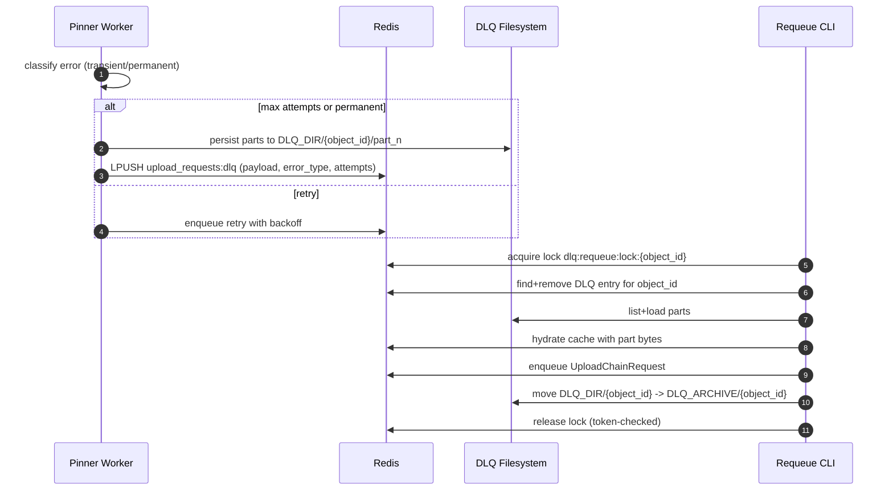

## DLQ Requeue Sequence

```mermaid
sequenceDiagram
    autonumber
    participant Pinner as Pinner Worker
    participant Redis as Redis
    participant FS as DLQ Filesystem
    participant CLI as Requeue CLI

    Pinner->>Pinner: classify error (transient/permanent)
    alt max attempts or permanent
        Pinner->>FS: persist parts to DLQ_DIR/{object_id}/part_n
        Pinner->>Redis: LPUSH upload_requests:dlq (payload, error_type, attempts)
    else retry
        Pinner->>Redis: enqueue retry with backoff
    end

    CLI->>Redis: acquire lock dlq:requeue:lock:{object_id}
    CLI->>Redis: find+remove DLQ entry for object_id
    CLI->>FS: list+load parts
    CLI->>Redis: hydrate cache with part bytes
    CLI->>Redis: enqueue UploadChainRequest
    CLI->>FS: move DLQ_DIR/{object_id} -> DLQ_ARCHIVE/{object_id}
    CLI->>Redis: release lock (token-checked)
```
