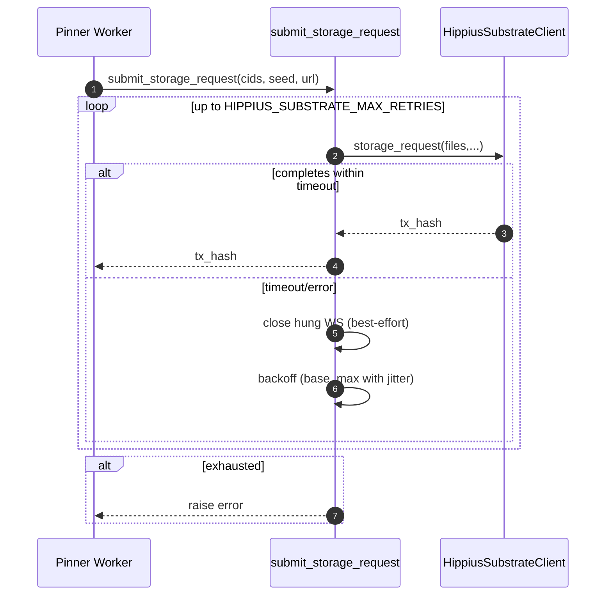

## Substrate Submit with Timeouts and Retries

```mermaid
sequenceDiagram
    autonumber
    participant Worker as Pinner Worker
    participant Wrapper as submit_storage_request
    participant SDK as HippiusSubstrateClient

    Worker->>Wrapper: submit_storage_request(cids, seed, url)
    loop up to HIPPIUS_SUBSTRATE_MAX_RETRIES
        Wrapper->>SDK: storage_request(files,...)
        alt completes within timeout
            SDK-->>Wrapper: tx_hash
            Wrapper-->>Worker: tx_hash
        else timeout/error
            Wrapper->>Wrapper: close hung WS (best-effort)
            Wrapper->>Wrapper: backoff (base..max with jitter)
        end
    end
    alt exhausted
        Wrapper-->>Worker: raise error
    end
```
