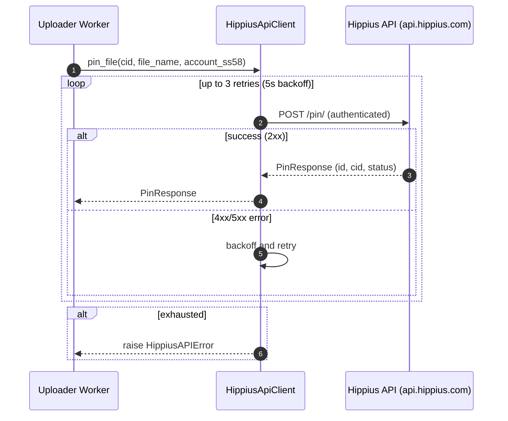

## Hippius API Requests with Retries

The system interacts with the Hippius blockchain via the Hippius HTTP API (`hippius_api_service.py`),
not via direct Substrate node connections. All chain-related operations (pinning, account checks,
file status) go through this API layer with automatic retries.

