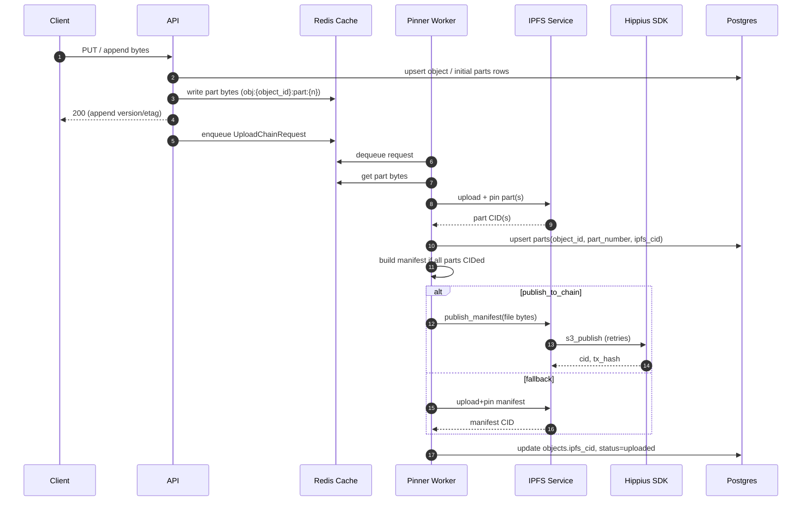

## Upload/Publish Sequence (PUT or Multipart Append)

```mermaid
sequenceDiagram
    autonumber
    participant Client
    participant API
    participant Redis as Redis Cache
    participant Pinner as Pinner Worker
    participant IPFS as IPFS Service
    participant SDK as Hippius SDK
    participant DB as Postgres

    Client->>API: PUT / append bytes
    API->>DB: upsert object / initial parts rows
    API->>Redis: write part bytes (obj:{object_id}:part:{n})
    API-->>Client: 200 (append version/etag)
    API->>Redis: enqueue UploadChainRequest

    Pinner->>Redis: dequeue request
    Pinner->>Redis: get part bytes
    Pinner->>IPFS: upload + pin part(s)
    IPFS-->>Pinner: part CID(s)
    Pinner->>DB: upsert parts(object_id, part_number, ipfs_cid)
    Pinner->>Pinner: build manifest if all parts CIDed
    alt publish_to_chain
        Pinner->>IPFS: publish_manifest(file bytes)
        IPFS->>SDK: s3_publish (retries)
        SDK-->>IPFS: cid, tx_hash
    else fallback
        Pinner->>IPFS: upload+pin manifest
        IPFS-->>Pinner: manifest CID
    end
    Pinner->>DB: update objects.ipfs_cid, status=uploaded
```
