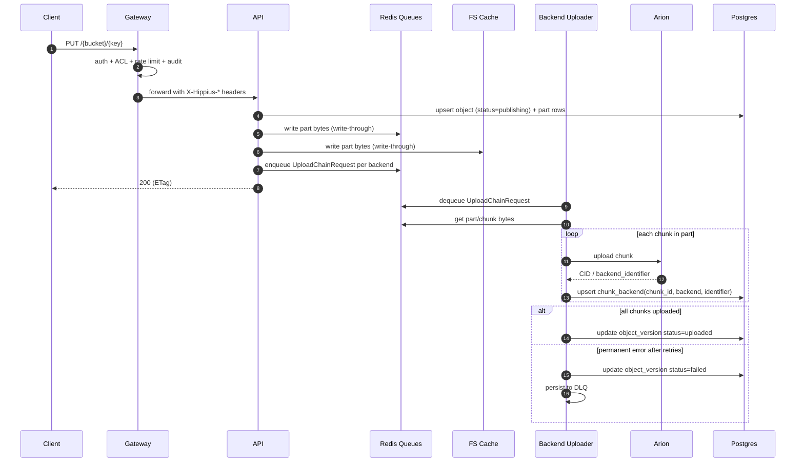

## Upload Sequence (PUT or Multipart Complete)

```mermaid
sequenceDiagram
    autonumber
    participant Client
    participant Gateway
    participant API
    participant Redis as Redis Queues
    participant FSCache as FS Cache
    participant Worker as Backend Uploader
    participant Backend as Arion
    participant DB as Postgres

    Client->>Gateway: PUT /{bucket}/{key}
    Gateway->>Gateway: auth + ACL + rate limit + audit
    Gateway->>API: forward with X-Hippius-* headers
    API->>DB: upsert object (status=publishing) + part rows
    API->>Redis: write part bytes (write-through)
    API->>FSCache: write part bytes (write-through)
    API->>Redis: enqueue UploadChainRequest per backend
    API-->>Client: 200 (ETag)

    Worker->>Redis: dequeue UploadChainRequest
    Worker->>Redis: get part/chunk bytes
    loop each chunk in part
        Worker->>Backend: upload chunk
        Backend-->>Worker: CID / backend_identifier
        Worker->>DB: upsert chunk_backend(chunk_id, backend, identifier)
    end
    alt all chunks uploaded
        Worker->>DB: update object_version status=uploaded
    else permanent error after retries
        Worker->>DB: update object_version status=failed
        Worker->>Worker: persist to DLQ
    end
```
