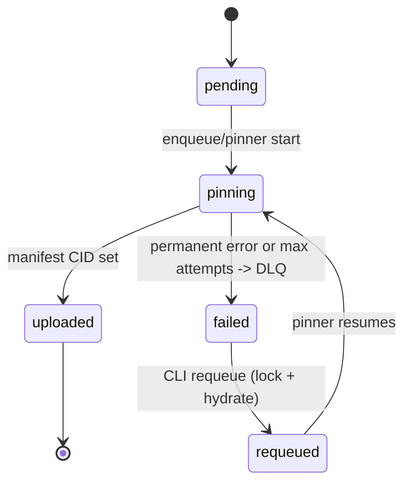

## Object Lifecycle State Machine

```mermaid
stateDiagram-v2
    [*] --> pending
    pending --> pinning: enqueue/pinner start
    pinning --> uploaded: manifest CID set
    pinning --> failed: permanent error or max attempts -> DLQ
    failed --> requeued: CLI requeue (lock + hydrate)
    requeued --> pinning: pinner resumes
    uploaded --> [*]
```
