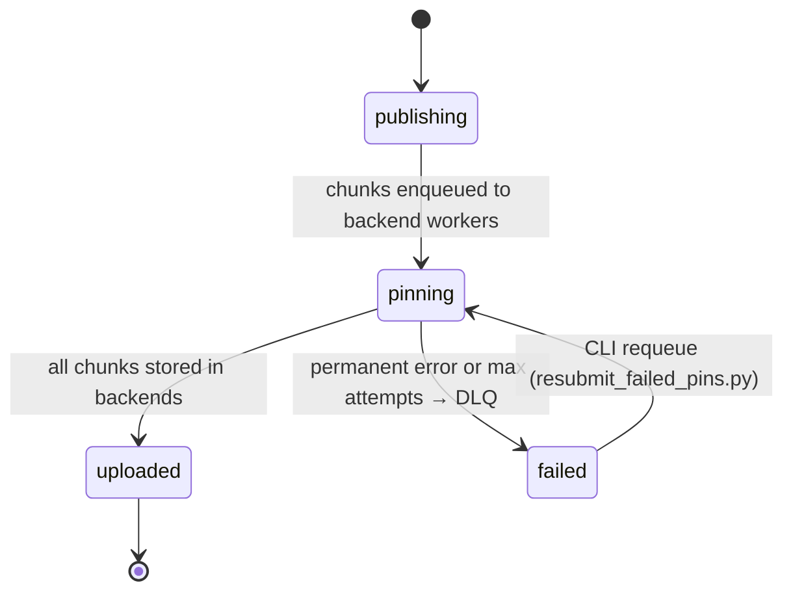

## Object Lifecycle State Machine

Valid states (enforced by DB constraint): `publishing`, `pinning`, `uploaded`, `failed`.

- **publishing** — default state on object creation; object metadata written to DB, chunks queued in Redis
- **pinning** — backend uploader workers are processing chunks (Arion)
- **uploaded** — all chunks confirmed stored; object is fully available
- **failed** — permanent error after max retries; chunks persisted to DLQ for manual requeue
