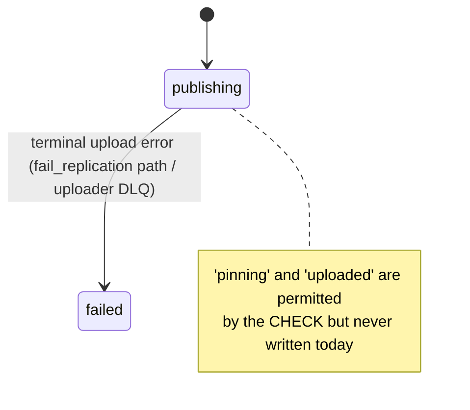
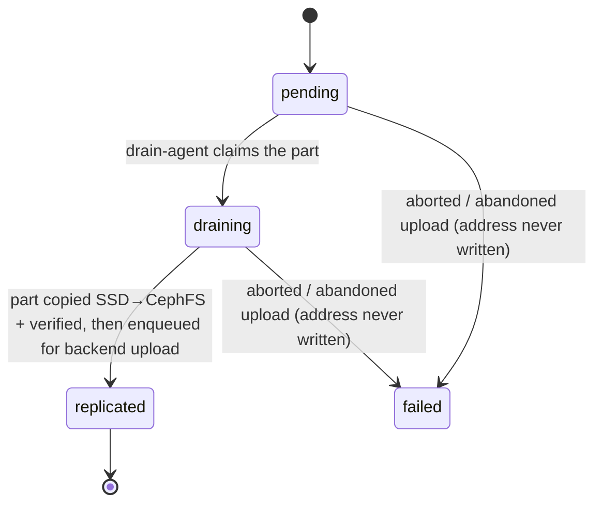

# Object Lifecycle State Machine

Two status columns exist. Only one is a live state machine post-drain-direct (s3-2.1).

## `object_versions.status` — now largely vestigial

The DB CHECK still allows `publishing`, `pinning`, `uploaded`, `failed`, but the transitions
between them are effectively dead: a new version is written once as `publishing` and, on the
happy path, never advanced. Nothing in the code sets `pinning` or `uploaded`. Do **not** rely on
this column to reason about upload completion.

```mermaid
stateDiagram-v2
    [*] --> publishing
    publishing --> failed: terminal upload error (fail_replication path / uploader DLQ)
    note right of publishing
        'pinning' and 'uploaded' are permitted
        by the CHECK but never written today
    end note
```

Note: `resubmit_failed_pins.py` operates on `objects.status`, **not** `object_versions.status`,
so it does not drive this column (see the failed-pin recovery gotcha).

## `cephor_replication_status` — the real completion/failure state machine

Since drain-direct, the drain owns the state machine that actually tracks whether an object's
parts have replicated to Ceph and been handed off for backend upload. The drain is the sole
producer of `arion_upload_requests`.

```mermaid
stateDiagram-v2
    [*] --> pending
    pending --> draining: drain-agent claims the part
    draining --> replicated: part copied SSD→CephFS + verified, then enqueued for backend upload
    pending --> failed: aborted / abandoned upload (address never written)
    draining --> failed: aborted / abandoned upload (address never written)
    replicated --> [*]
```

- **pending** — a landed part awaiting drain.
- **draining** — the drain-agent has claimed the part and is copying SSD→CephFS.
- **replicated** — the part is durably on the Ceph pool; the drain `LPUSH`es an `UploadChainRequest`
  per part as it replicates.
- **failed** — terminal. Set by `hippius_s3/sql/queries/fail_replication_status_for_version.sql`
  for aborted/abandoned uploads (address never written). A `failed` row is skipped by the reconciler
  and by `claim_part` on every node, so the per-node drain stops re-copying/re-deferring the parts;
  the node-local SSD copies remain for the orphan GC to reclaim.
