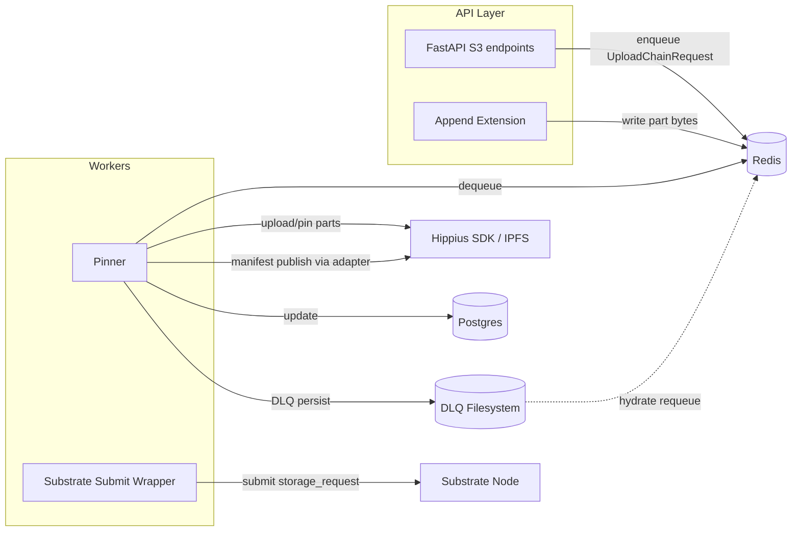

## Component Architecture

```mermaid
flowchart LR
    subgraph API Layer
        API[FastAPI S3 endpoints]
        Append[Append Extension]
    end

    subgraph Workers
        Pinner
        ChainRetry[Substrate Submit Wrapper]
    end

    Redis[(Redis)]
    DLQFS[(DLQ Filesystem)]
    DB[(Postgres)]
    IPFS[Hippius SDK / IPFS]
    Substrate[Substrate Node]

    API -->|enqueue UploadChainRequest| Redis
    Append -->|write part bytes| Redis
    Pinner -->|dequeue| Redis
    Pinner -->|upload/pin parts| IPFS
    Pinner -->|manifest publish via adapter| IPFS
    Pinner -->|update| DB
    Pinner -->|DLQ persist| DLQFS
    ChainRetry -->|submit storage_request| Substrate
    DLQFS -.->|hydrate requeue| Redis
```
