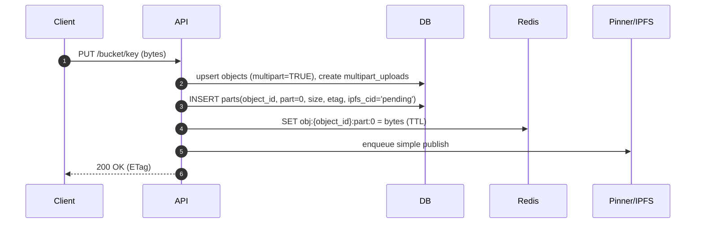
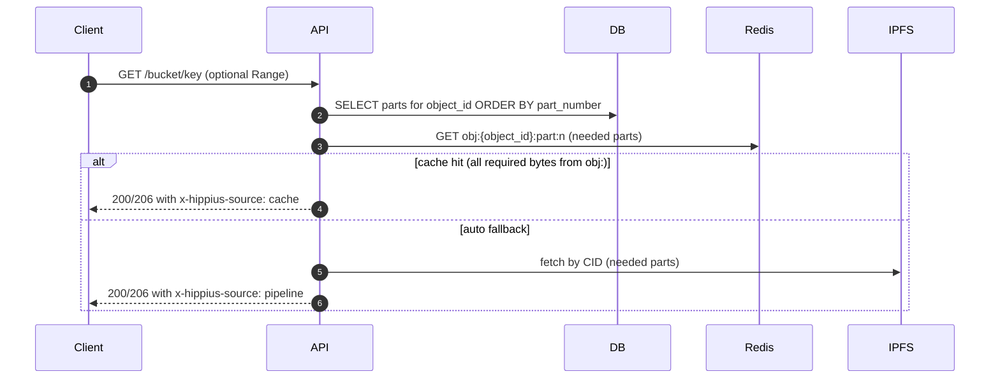

## Hippius S3 Immediate-Consistency Refactor Plan

### Objectives

- Immediate read-after-write consistency with cache-first semantics
- Uniform chunked object model (no special first part)
- Database is the only canonical manifest (durable, auditable)
- Simplified code paths, clear invariants, predictable performance
- Strict test-only mode for pipeline readiness checks

### Core Principles

- Every object is chunked into parts; a single-chunk object is part_number=0.
- Redis stores bytes for speed; the manifest (structure) lives only in the database.
- GET/HEAD always derive structure only from DB; remove Redis-derived manifest logic.
- PUT/APPEND are write-through: bytes go to Redis immediately to ensure instant reads.
- pipeline_only is strict (no cache); returns 503 until CIDs exist for required parts.

---

### Data Model (Canonical)

Tables (new/normalized intent):

- objects

  - object_id UUID PRIMARY KEY
  - bucket_id UUID NOT NULL
  - object_key TEXT NOT NULL
  - size_bytes BIGINT NOT NULL
  - md5_hash TEXT NOT NULL
  - content_type TEXT
  - metadata JSONB
  - cid_id UUID NULL REFERENCES cids(id) // optional top-level CID if retained
  - multipart BOOLEAN NOT NULL DEFAULT TRUE // deprecated; keep for transition/telemetry
  - append_version BIGINT NOT NULL DEFAULT 0
  - created_at TIMESTAMPTZ NOT NULL
  - UNIQUE(bucket_id, object_key)

- multipart_uploads (S3 MPU session metadata; compatibility surface)

  - upload_id UUID PRIMARY KEY
  - bucket_id UUID NOT NULL
  - object_key TEXT NOT NULL
  - initiated_at TIMESTAMPTZ NOT NULL
  - is_completed BOOLEAN NOT NULL DEFAULT FALSE
  - content_type TEXT
  - metadata JSONB
  - file_mtime TIMESTAMPTZ
  - UNIQUE(bucket_id, object_key, upload_id)

- parts (canonical chunk manifest; DB is the sole source of truth)

  - object_id UUID NOT NULL
  - part_number INTEGER NOT NULL // zero-based (0..N-1)
  - size_bytes BIGINT NOT NULL
  - etag TEXT NOT NULL // MD5 of part bytes
  - cid_id UUID NULL REFERENCES cids(id)
  - ipfs_cid TEXT NULL
  - uploaded_at TIMESTAMPTZ NOT NULL
  - PRIMARY KEY (object_id, part_number)

- cids
  - id UUID PRIMARY KEY
  - cid TEXT UNIQUE NOT NULL

Notes:

- Key `parts` by `(object_id, part_number)` for the canonical manifest.
- Keep `multipart_uploads` only for S3-compatible client APIs (Create/List/Abort/Complete MPU). Translate between sessions and `parts` as needed at API boundaries.

---

### Redis Keyspace (Rename for Clarity)

- obj:{object_id}:part:{n} → chunk bytes (write-through, TTL)
- dl:{object_id}:{request_uuid}:{n} → ephemeral, request-scoped chunk cache (optional, TTL)
- idemp:append:{bucket_id}:{object_key}:{append_id} → idempotency results (TTL)

Avoid “multipart:” prefix; it’s misleading when all objects are chunked.

---

### API Flows

#### PUT (single-chunk create; 0-based part)



#### APPEND (two-phase with CAS)

```mermaid
sequenceDiagram
  autonumber
  participant C as Client
  participant API
  participant DB
  participant R as Redis
  participant IPFS

  C->>API: PUT /bucket/key (append bytes + CAS header)
  API->>DB: SELECT append_version; compare vs header
  alt mismatch
    API-->>C: 412 PreconditionFailed + x-amz-meta-append-version
  else reserve
    API->>DB: INSERT parts(next_part, size, etag, ipfs_cid='pending')
    API->>DB: UPDATE objects(size, md5, append_version+1)
    API->>R: SET obj:{object_id}:part:{next} = bytes (TTL)
    par publish
      API->>IPFS: store + pin
      IPFS-->>API: cid
      API->>DB: UPDATE parts SET cid/cid_id
    end
    API-->>C: 200 OK (ETag)
  end
```

#### GET (auto)



#### GET (pipeline_only)

```mermaid
sequenceDiagram
  autonumber
  C->>API: GET /bucket/key (x-hippius-read-mode: pipeline_only)
  API->>DB: SELECT parts; verify all required parts have CIDs
  alt any missing CID
    API-->>C: 503 ServiceUnavailable (not ready)
  else ready
    API->>IPFS: fetch by CID
    API-->>C: 200/206 x-hippius-source: pipeline
  end
```

---

### Components & Responsibilities

- Manifest builder

  - `build_manifest(object_id, db) -> list[{part_number, size_bytes, cid?}]`
  - DB-only; no Redis probing.

- Cache assembler

  - `assemble_from_cache(redis, object_id, manifest, range?) -> AsyncIterator[bytes]`
  - Reads `obj:{object_id}:part:{n}`; range-aware slicing; stream results.

- Downloader

  - Given `(part_number, cid)` list, retry with backoff; write to ephemeral `dl:` only if needed.
  - No special handling for empty CIDs; callers enforce readiness.

- Pinner

  - After pin completes: set CID for any parts with `pending` CID; EXPIRE `obj:*` keys (never immediate deletes).

- Header helpers
  - `add_source_header(redis, object_id, required_parts, headers)` sets x-hippius-source.
  - `add_user_metadata(object_info, headers)` mirrors user metadata to `x-amz-meta-*`.

---

### Repositories

- Database repositories (encapsulate SQL; simplify testing and evolution):

  - ObjectsRepository

    - get_by_path(bucket_id, object_key)
    - upsert_basic(object_id, bucket_id, object_key, content_type, metadata, md5, size_bytes, created_at)
    - mark_multipart(object_id)
    - update_status(object_id, status)

  - PartsRepository

    - insert_placeholder(object_id, upload_id, part_number, size_bytes, etag, cid='pending')
    - update_cid(object_id, part_number, cid)
    - list_for_object(object_id) -> [{part_number, size_bytes, cid?}]
    - count_for_object(object_id) -> int
    - delete_for_object(object_id)

  - MultipartUploadsRepository (compat shim)
    - create_or_get_latest(object_id, bucket_id, object_key, content_type, metadata)
    - list(bucket_id, prefix?)
    - mark_completed(upload_id)

- Cache repositories (already introduced):
  - ObjectPartsCache: obj:{object_id}:part:{n}
  - DownloadChunksCache: dl:{object_id}:{request_uuid}:{n}

---

### Behavior Details

- Read modes

  - auto: try cache; if any required chunk missing, fall back to pipeline
  - cache_only: serve only from cache; 503 on miss
  - pipeline_only: strictly require CIDs; no cache fallback; 503 until ready (used by tests)
    - Rule: In pipeline_only mode, the system must not read from or write to Redis object caches
      for object data (no cache hydration, no unified cache access). This ensures tests validate
      that bytes are durably persisted and retrievable via the pipeline (IPFS) beyond any in-memory
      cache state. The only acceptable behavior is to consult the DB manifest and fetch via the
      pipeline once CIDs exist; otherwise return 503 until ready.

- Range handling

  - Use DB manifest to compute needed parts.
  - In cache path, fetch only those `obj:` entries and slice correctly; stream.

- Integrity (optional)
  - Verify chunk MD5 vs `parts.etag` when enabled; abort on mismatch with 503.

---

### Config Knobs

- cache_ttl_seconds for `obj:*` (default 1800)
- http_redis_get_retries, http_download_sleep_loop
- downloader_chunk_retries, downloader_retry_base_seconds, downloader_retry_jitter_seconds
- pipeline_only_delay_seconds (small; for test environments only)

---

### Migration Notes

- Adopt zero-based `part_number`:

  - For existing “first-part-as-1” data, a background migration can remap 1→0 (or maintain a compatibility layer temporarily).
  - Ensure constraints allow `part_number=0` (INTEGER OK).

- Remove reliance on `upload_id` in `parts` manifest; keep `multipart_uploads` for S3 session APIs.

- Deprecate `objects.multipart`:
  - Set `multipart=TRUE` on all new/updated objects.
  - Remove references in code paths; rely solely on `parts` existence for manifest.

---

### Rollout Plan

1. Keyspace rename

   - Switch writers/readers to `obj:{object_id}:part:{n}`.
   - Keep old keys readable for one cycle if needed; prefer not to mix when tests allow.

2. PUT stabilization

   - Always insert `parts(object_id, 0, size, etag, cid='pending')`.
   - Mark `objects.multipart=TRUE` and write-through to `obj:{...}:part:0`.

3. GET/HEAD simplification

   - Remove Redis-derived manifest paths; DB-only manifest.
   - Factor header helpers; ensure metadata and x-hippius-source are consistent.

4. APPEND two-phase CAS

   - Ensure Phase 1 only touches DB; Phase 2 publishes and finalizes CID.
   - Return 412 with `x-amz-meta-append-version` on CAS mismatch.

5. pipeline_only strictness

   - No cache hydration; return 503 until DB manifest has CIDs for required chunks.

6. Pinner adjustments

   - Backfill any `pending` part CIDs after pin.
   - EXPIRE `obj:*` keys (keep caches warm for a window).

7. Testing & telemetry
   - E2E: cache-first, pipeline_only, ranges across boundaries, concurrent CAS appends.
   - Add metrics: cache hit ratio, append 412 rate, pipeline_only 503s, latencies.

---

### Testing Strategy

- E2E

  - Immediate GET after PUT and APPEND is from cache (`x-hippius-source=cache`).
  - pipeline_only: GET returns 503 until CIDs are present; then succeeds from pipeline with `x-hippius-source=pipeline`.
  - Range tests across part boundaries; range pipeline_only (after a short delay).
  - Concurrent append test validates CAS 412 handling and backoff using the returned version.

- Integration/Unit
  - build_manifest: DB-only selection correctness.
  - assemble_from_cache: range slicing and streaming.
  - Two-phase append: correctness of reservation and finalization, composite ETag updates.
  - Pinner: CID backfill for any pending parts.

---

### Open Questions / Decisions

- Keep `cid_id` on `objects`? (Useful for simple full-object CID queries.)
- Expose per-part encryption or always encrypt per object/account? (Current SDK pattern is per account/bucket.)
- Retain/translate S3 MPU APIs fully or keep minimal compatibility subset?

---

### Summary

This refactor unifies the model (all objects are chunked), makes the database the only manifest, and standardizes a clear, fast write-through cache. It removes fragile heuristics and ensures strict, testable semantics for both cache-first operation and pipeline-only verification.
